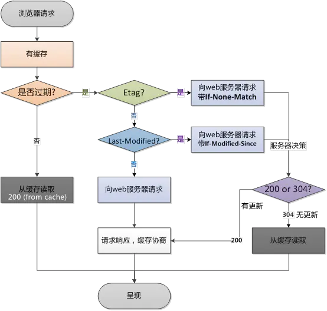

## http协议的特点

（1）http 使用的是可靠的数据传输协议（底层是tcp协议，可靠有序，不丢不传）

（2）简单快速：客户向服务器请求服务时，只需传送请求方法和路径。

请求方法常用：GET、PUT、POST、DELETE

由于HTTP协议简单，使得HTTP服务器的程序规模小，因而通信速度很快。

（3）灵活：HTTP允许传输任意类型的数据对象。

（4）无状态：HTTP不对请求和响应之间的通信状态进行保存。

## 报文格式

**请求报文：**


**响应报文：**


**常见请求头：**

cookie:

connection: 表示是否需要持久连接

host: 初始url中的主机和端口

user-agent: 浏览器类型

accept: 浏览器可接受的MIME类型

accept-charset：浏览器可接受的字符集

accept-encoding: 浏览器能够进行解码的数据编码格式

accept-language: 浏览器希望的语言种类

## cookie & session

**介绍：**

每次http请求，客户端都会发送相应的cookie到服务端

实际上用cookie来实现session，客户端需要在cookie中记录一个sessionid，以后每次请求把这个id发送到服务器。

`如果客户端禁用cookie`，会使用url重写的技术。每次http交互，url后面都会被附加上一个诸如sid=**的参数，服务端据此来识别用户。

**区别：**

（1）存储位置不同 -> 安全性不同（敏感信息建议用session）

​									-> 服务器压力不同

cookie存储在客户端 -> cookie安全性挑战

​									 -> 不占用服务器资源

session存储在服务端 -> 安全性相比较提高

​                                       -> 耗费大量服务器内存（向google并发量极高，不太可能用session）

（2）存储对象不同

cookie 只存储 ascii 字符串（存取unicode字符或者二进制数据需要进行编码）

session 可以存取任意类型的数据（String、Integer、List、Map、对象）

（3）有效期不同

cookie -> 持久

session -> 不宜过长（session超时时间过长，服务器累计的session就会越多，越容易导致内存溢出）


## Get & Post

（1）干嘛的

get -> 从服务器获取资源

post -> 向服务器发送数据

（2）形式

get -> 通过url请求，用户可见

post -> 通过请求体，用户不可见

（3）数据量

get -> 数据量小，效率高

post -> 数据量大

（4）安全性

get -> 不安全，可能泄露信息

post -> 相对安全

## 状态码

200： 正确

302：重定向

400：服务器未能理解请求

401：被请求的页面需要用户名和密码

402：此代码尚无法使用

403：访问被禁止

404：没找到

500：服务器出错

501：服务器不支持请求的功能

502：服务器从上游服务器收到一个无效相应

503：服务器暂时无法处理

504：网关超时

## socket


## http 1.0、1.1、2.0 区别

（1）1.0 

短连接（100张图，100次tcp握手挥手）

（2）1.1

长连接（100张图，1次tcp握手挥手）

（3）2.0

长连接 + io多路复用模型


## 代理

代理位于客户端和服务器之间，接收所有客户端的HTTP请求，并将这些请求转发给服务器。

**正向代理：**访问外网

**反向代理：**访问内网

## 缓存

**是什么？**

客户端请求资源，将资源缓存到客户端或者客户端到服务端中间节点的一种技术。

**好处？**

客户端：访问更快

服务端：减轻了带宽压力

**怎么设置？**

request header 和 response header

`expires`: 资源到期时间。Expires是Web服务器响应消息头字段，在响应http请求时告诉浏览器在过期时间前浏览器可以直接从浏览器缓存取数据，而无需再次请求。

不过Expires 是HTTP 1.0的东西，现在默认浏览器均默认使用HTTP 1.1，所以它的作用基本忽略。Expires 的一个缺点就是，返回的到期时间是服务器端的时间，这样存在一个问题，如果客户端的时间与服务器的时间相差很大（比如时钟不同步，或者跨时区），那么误差就很大，所以在HTTP 1.1版开始，使用Cache-Control: max-age=秒替代。

`cache-control`：缓存策略。Cache-Control与Expires的作用一致，都是指明当前资源的有效期，控制浏览器是否直接从浏览器缓存取数据还是重新发请求到服务器取数据。只不过Cache-Control的选择更多，设置更细致，如果同时设置的话，其优先级高于Expires。

1）no-store: 不允许缓存

2） max-age=xxx: 允许缓存，多少秒后到期

3）no-cache: 允许缓存，但需先向服务器验证是否过期。

4）public: 中间节点和客户端都可以

5）private: 只有客户端可以

`max-age=0 == no-cache`

`Last-Modified/If-Modified-Since：`Last-Modified/If-Modified-Since要配合Cache-Control使用。

Last-Modified：标示这个响应资源的最后修改时间。

If-Modified-Since: 当资源过期时（使用Cache-Control标识的max-age），发现资源具有Last-Modified声明，则再次向web服务器请求时带上头 If-Modified-Since，表示请求时间。web服务器收到请求后发现有头If-Modified-Since 则与被请求资源的最后修改时间进行比对。若最后修改时间较新，说明资源又被改动过，则响应整片资源内容（写在响应消息包体内），HTTP 200；若最后修改时间较旧，说明资源无新修改，则响应HTTP 304 (无需包体，节省浏览)，告知浏览器继续使用所保存的cache

```dart
Etag/If-None-Match：Etag/If-None-Match也要配合Cache-Control使用。
Etag：web服务器响应请求时，告诉浏览器当前资源在服务器的唯一标识（生成规则由服务器决定）。
Apache中，ETag的值，默认是对文件的索引节（INode），大小（Size）和最后修改时间（MTime）进行Hash后得到的。
If-None-Match：当资源过期时（使用Cache-Control标识的max-age），发现资源具有Etage声明，则再次向web服务器请求时带上头If-None-Match （Etag的值）。
```



## 系统调优

