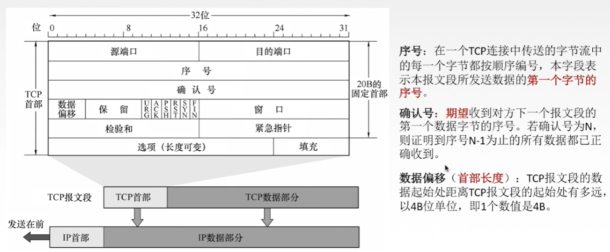
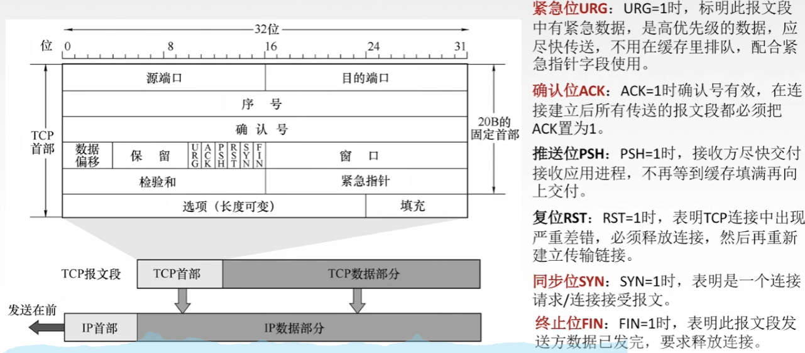
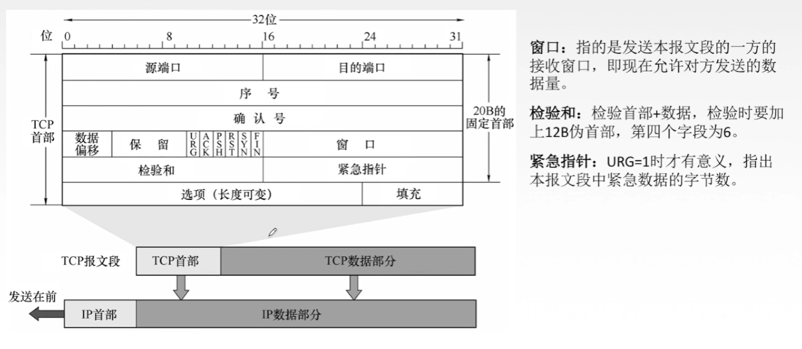

## TCP协议的特点

TCP是`面向连接`的传输层协议。

连接`点对点`。

通信`全双工通信`。

`面向字节流`

TCP`提供可靠交付的服务`，无差错、不丢失、不重复、按序到达。（`可靠有序，不丢不重`）

## TCP报文段首部格式

## TCP连接管理

**建立连接：**

**数据传送：**

**释放连接：**

## TCP可靠传输

`可靠：`保证接收方进程从缓存区读出的字节流和发送方发出的字节流是完全一样的。

TCP 实现可靠传输的机制：`校验、序号、确认、重传。`

**校验：**

与UDP校验一样，增加伪首部，通过使用二进制反码求和的计算方法来判断有没有发生错误。

**序号：**

TCP传输以字节为单位，每个字节都有一个序号。

序号字段指的是一个报文段第一个字节的序号。

有了序号机制就能保证数据有效的提交。

**确认：**

累计确认方式。

**重传：**

超时重传。在规定时间没收到确认就要重传。

冗余ACK -> 快速重传。

## TCP流量控制

流量控制：让`发送方慢点`，让接收方来得及接收。

TCP采用`滑动窗口机制`实现流量控制。

在通信过程中，接收方根据自己`接收缓存的大小`，动态地调整发送方地发送窗口大小。（接收方设置`确认报文段中窗口字段`来将rwnd通知给发送方）。

发送方地`发送窗口取接收窗口rwnd和拥塞窗口cwnd的最小值`。

## TCP拥塞控制

**出现拥塞的条件：**对资源需求的总和 > 可用资源

网络中有许多资源同时呈现供应不足 -> 网络性能变坏 -> 网络吞吐量下降

**拥塞控制：**防止过多的数据注入到网络中

`拥塞控制和流量控制的区别？`

流量控制是端到端的问题，接收方知道找谁。

拥塞控制可能有多个发送方，接收方不知道找谁。

**假设：**

数据单方向传送，而另一个方向只传送确认。

接收方总有足够大的缓存空间，因而发送窗口大小却决于拥塞程度。

`接收窗口：`接收方根据接收缓存设置的值，并告知给发送方，反映接收方的容量。

`拥塞窗口：`发送方根据自己估算的网络拥塞程度而设置的窗口值，反映网络当前容量。

**慢开始：**

**拥塞避免：**

**快重传：**

**快恢复：**

