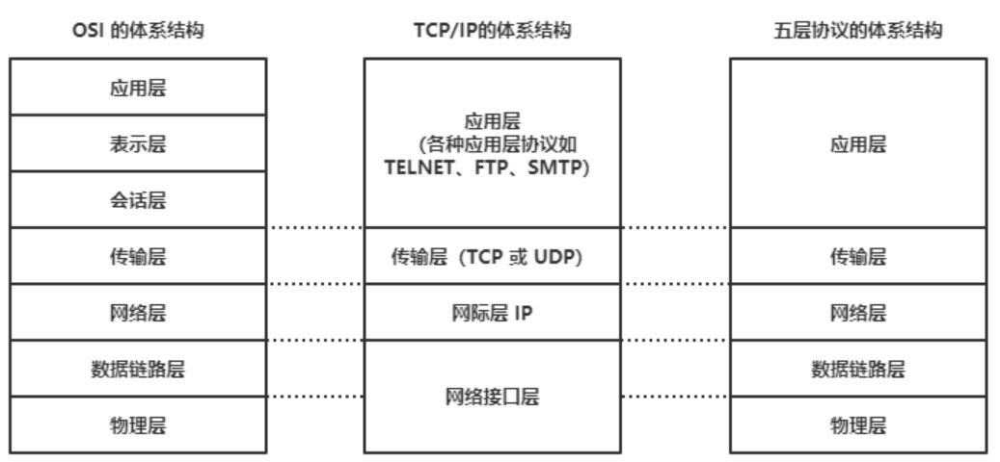
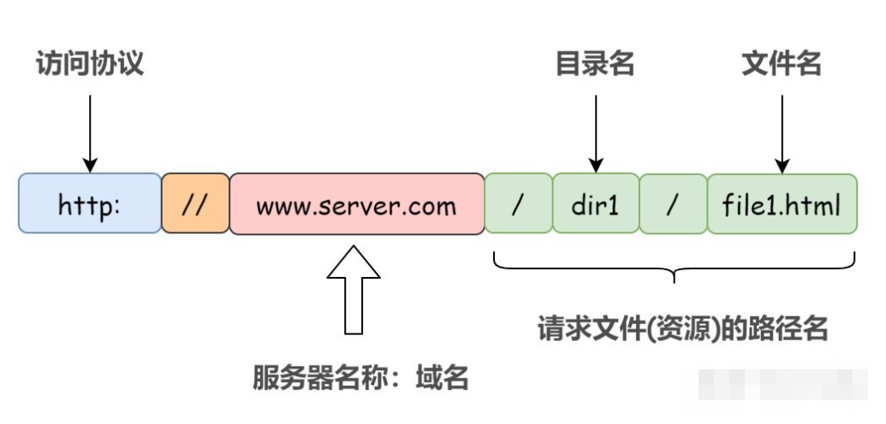
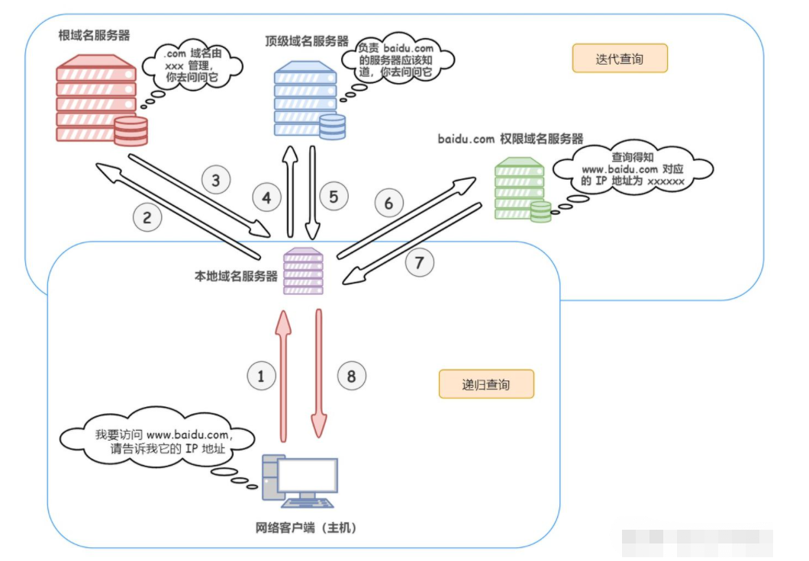
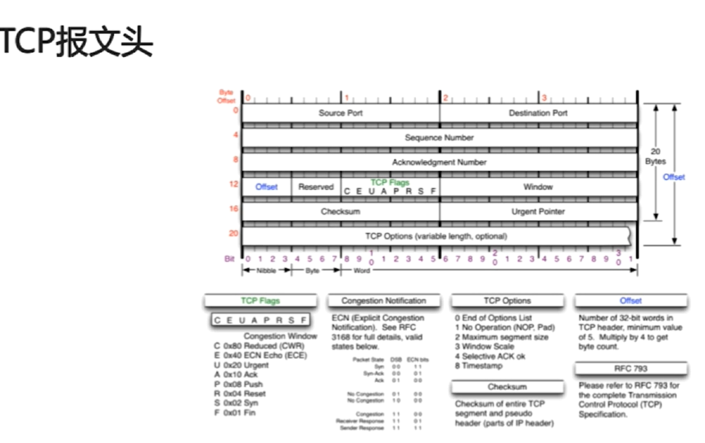
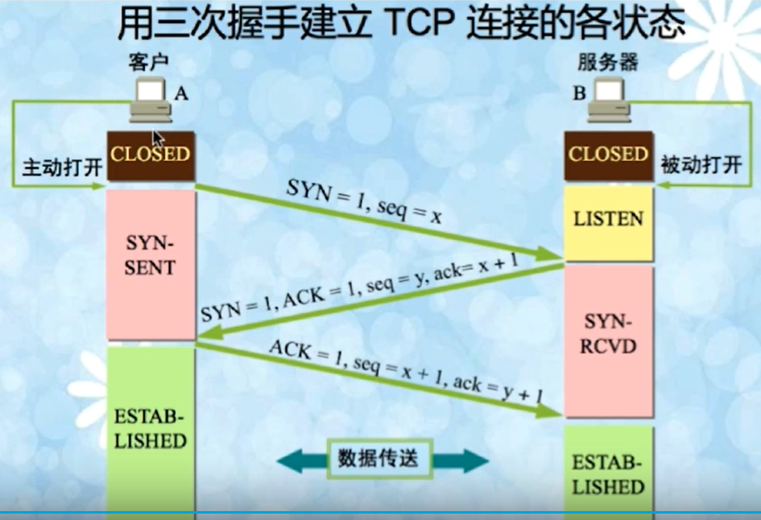
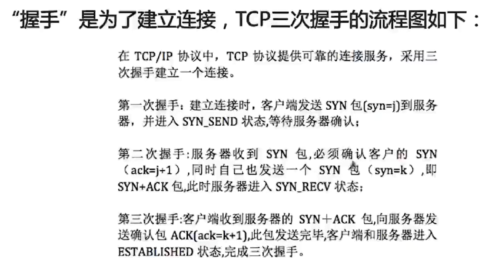
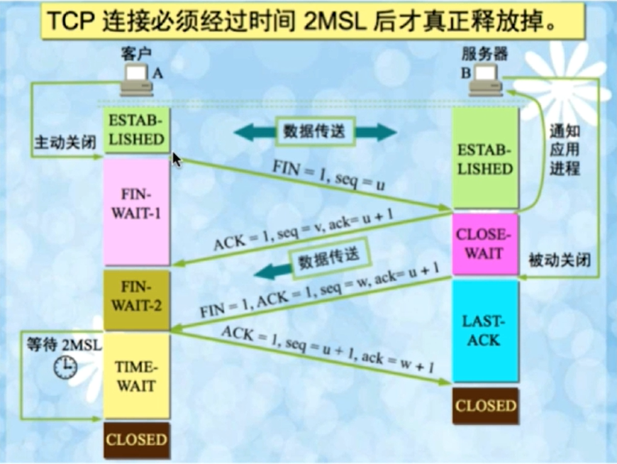
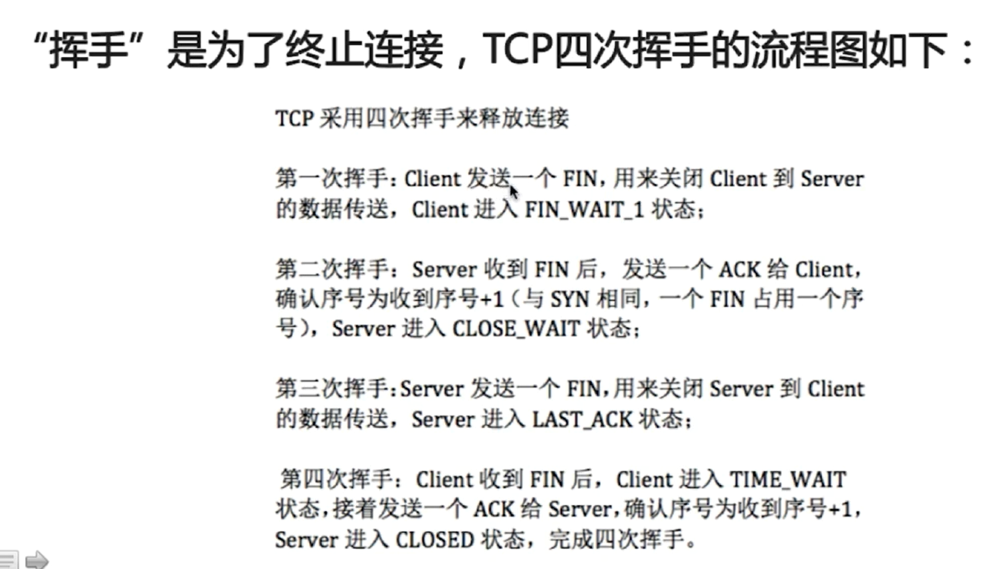

## 计算机网络模型

**模型简单描述**

**应用层：**

直接为应用程序服务。应用层协议定义的是`应用程序间通讯和交互的规则`，不同的应用有着不同的应用层协议，如HTTP协议（万维网服务）、FTP（文件传输）、SMTP协议（电子邮件）、DNS（域名查询）等。

**表示层：**

负责数据的压缩，加密等相关处理。

**会话层：**

建立、管理、终止会话。

例如我们在使用浏览器访问淘宝网，你就建立一个会话，你正在查询你的购物车里有什么东西，这时候你朋友来用你的电脑，再一次又打开了一个淘宝首页．这时候又开启了一个会话，当你朋友发送请求时候，放回的数据这时候只会在他所在的界面进行渲染，而不会影响你所打开的界面，这就是会话．

**传输层：**

负责为两台主机中的进程提供通讯服务。主要是以下两种协议：

传输控制协议（Transmission Control Protocol, TCP）：提供面向连接的、可靠的数据传输服务，数据传输的基本单位是报文段。

用户数据报协议（User Datagram Protocol, UDP）: 提供无连接的，尽最大努力的数据传输服务，不保证数据传输的可靠性，基本单位是用户数据报。

**网络层：**

负责为两台主机提供通信服务，并通过选择合适的路由将数据传递到目标主机。

**数据链路层：**

负责将网络层交下来的IP数据报封装成帧，并在链路的两个相邻节点间传送帧，每一帧都包含数据和必要的控制信息。

**物理层：**

确保数据可以在各种物理媒介上进行传输，为数据的传输提供可靠的环境。

## TCP和UDP的区别

面向连接 vs 无连接

可靠性

有序性

速度

量级

## 输入www.taobao.com会发生什么

**（1）解析URL**

浏览器做的第一步就是解析URL得到里面的参数，将域名和需要请求的资源分离开来，从而了解需要请求的是哪个服务器，请求的是服务器上什么资源等等。

**（2）DNS域名解析：将域名解析成IP地址**

- 首先搜索`浏览器DNS缓存`，缓存中维护着一张域名与IP地址的对应表

- 若没有命中，那继续搜索`操作系统的DNS缓存`。

- 若仍然没有命中，则操作系统将域名发送至`本地域名服务器`，本地域名服务器查询自己的DNS缓存，查找成功则返回结果（主机和本地域名服务器之间的查询方式是`递归查询`）

- 若本地域名服务器的DNS缓存没有命中，则本地域名服务器向上级域名服务器进行查询，通过以下方式进行`迭代查询`（注意：本地域名服务器和其他域名服务器之间的查询方式是迭代查询，防止根域名服务器压力过大）:

  1）首先本地域名服务器向`根域名服务器`发起请求，根域名服务器是最高层次的，它并不会直接指明这个域名对应的IP地址，而是返回顶级域名服务器的地址，也就是说给本地域名服务器指明一条道路，让他去这里寻找答案

  2）本地域名服务器拿到这个`顶级域名服务器`的地址后，就向其发起请求，获取`权限域名服务器`的地址

  3）本地域名服务器根据权限域名服务器的地址发起请求，最终得到该域名对应的IP地址

- 本地域名服务器将得到的IP地址返回给操作系统，同时自己将IP地址缓存起来

- 操作系统将IP地址返回给浏览器，同时自己将IP地址缓存起来

**（3）浏览器封装HTTP请求报文**

**（4）建立TCP连接**

**（5）浏览器发送HTTP请求**

**（6）负责传输的IP协议**

实际上，TCP 在三次握手建立连接、四次握手断开连接、以及连接建立过程中的收发数据（TCP 报文段）等各阶段操作时，都是通过 IP 协议进行传输的，IP 协议将这些阶段的数据添加 IP 首部封装成 IP 数据报再进行传输。

IP 数据报的首部存有**源 IP 地址**和 **目标 IP 地址**。所谓源 IP 地址 就是发送方的 IP 地址；目标 IP 地址就是通过 DNS 域名解析得到的目标服务器的 IP 地址。

（7）使用ARP协议凭借MAC地址通信

（8）服务器响应请求

（9）浏览器解析渲染渲染页面

（10）断开TCP连接

## HTTP常见状态码

100：继续。100-199用于指定客户端相应的某些动作

200： 成功。200-299用于表示请求成功。

302：重定向

400：客户端请求有语法错误

401：请求未经授权

403：服务器收到请求，但是拒绝提供服务

404：请求资源不存在

500：服务端错误

503：服务器当前不能处理客户端的请求，一段时间后可能恢复正常

## 三次握手

**序列号、确认号、标志位**

`序列号seq:`占4个字节，用来标记数据段的顺序，表示报文段中第一个字节的数据编号，每个数据字节都有一个序号。

`确认号ack:`占4个字节，期待收到对方下一个报文段的第一个数据字节的序号。

`标志位SYN:`建立连接

`标志位ACK:`确认

`标志位FIN:`释放连接

**传输控制协议TCP简介**

面向连接的、可靠的、基于字节流的传输层通信协议

将应用层的数据流分割成报文段并发送给目标节点的TCP层

数据包都有序号，对方收到则发送ACK确认，未收到则重传

使用校验和来检验数据在传输过程中是否有误

**三次握手：**

“握手”是为了建立连接，当应用程序希望通过TCP与另外一个程序通信时，它会发送一个通信请求，这个请求必须发送到一个切确的地址，在握手之后，TCP将会在双方建立一个全双工的通信，这个全双工的通信将占用两方的通信线路，直到它被一方或双方关闭为止。

**为什么需要三次握手才能建立起连接？**

为了初始化Sequence Number的初始值。

通信双方要互相通知对方自己的初始化的Sequence Number，这个号要作为以后的数据通信的序号，以保证应用层接收到的数据不会因为网络上的传输问题而乱序。

因此在服务器回发它的Sequence Number及第二次握手之后，还需要客户端向服务器确认其收到了服务器的Sequence Number。

**三次握手时ACK报文丢失会怎样？**

不断重试直至超时，Linux默认等待63秒才断开连接

**建立连接后，Client出现故障怎么办**

保活机制：

向对方发送保活探测报文，如果未收到响应则继续发送

尝试次数达到保活探测数仍未收到响应则中断连接

## 四次挥手

“挥手”是为了终止连接，流程图如下：

**为什么会有TIME_WAIT状态**

确保有足够的时间让对方收到ACK包

有足够的时间保证不会和后面的连接混在一起，有些路由器会缓存数据包

**为什么是2MSL**

在Client发送出最后的ACK回复，但该ACK可能丢失。Server如果没有收到ACK，将不断重复发送FIN片段。所以Client不能立即关闭，它必须确认Server接收到了该ACK。Client会在发送出ACK之后进入到TIME_WAIT状态。Client会设置一个计时器，等待2MSL的时间。如果在该时间内再次收到FIN，那么Client会重发ACK并再次等待2MSL。

client再发送完最后一个报文端ACK之后，再经过2MSL的时间，就可以是本次连接持续时间内的所有产生的报文段都消失，这样下一次连接中就不会出现旧的请求连接报文段。

**为什么需要四次挥手才能断开连接**

关闭连接时，当Server端收到FIN报文时，很可能并不会立即关闭SOCKET，所以只能先回复一个ACK报文，告诉Client端，"你发的FIN报文我收到了"。只有等到我Server端所有的报文都发送完了，我才能发送FIN报文，因此不能一起发送。故需要四步握手。

## HTTP 1.0 1.1