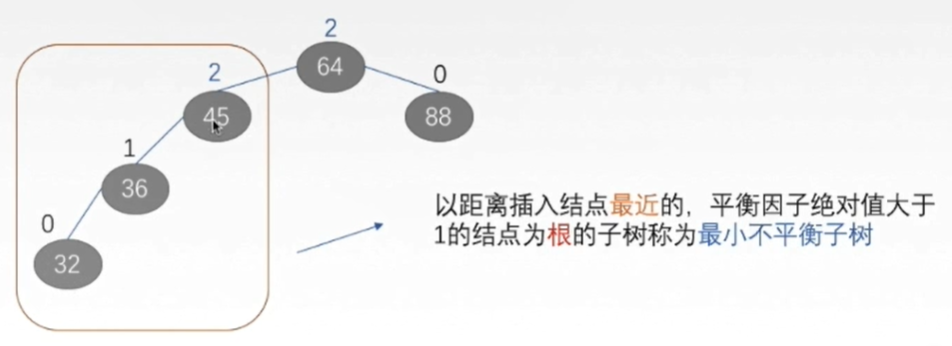

## 二叉查找树（二叉排序树，BST）：不平衡

当需要快速查找时，将数据存储在BST是一种常见的选择，因为此时查询时间取决于树高，平均时间复杂度是O(lgn)。然而，BST可能长歪而变得不平衡，此时BST退化为链表，时间复杂度退化为O(n)。

为了解决这个问题，引入了平衡二叉树。

## 平衡二叉树（AVL）：删除旋转耗时

`为了避免二叉排序树高度增长过高导致的性能降低，需要对二叉排序树做出一定的限制`。

AVL树是特殊的二叉排序树，`左右子树的高度之差绝对值不超过1`。

**先介绍：最小不平衡子树**

以距离插入节点`最近的`，平衡因子绝对值大于1的`节点为根`的子树，

例如插入32之后，以45为根的子树

**平衡调整**

LL和RR很简单，正则右旋，负则左旋。

LR和RL：先将孩子节点的平衡因子转换成和根节点正负一致，再进行调整。

**缺陷：**

AVL实现平衡的关键在于旋转操作：插入和删除可能破坏二叉树的平衡，此时需要通过一次或多次树旋转来重新平衡这个树。当插入数据时，最多只需要1次旋转(单旋转或双旋转)；但是当删除数据时，会导致树失衡，AVL需要维护从被删除节点到根节点这条路径上所有节点的平衡，旋转的量级为O(lgn)。

由于旋转的耗时，`AVL树在删除数据时效率很低`；在删除操作较多时，维护平衡所需的代价可能高于其带来的好处，因此AVL实际使用并不广泛。

## 红黑树：树太高

与AVL树相比，红黑树并不追求严格的平衡，而是`大致的平衡`：只是`确保从根到叶子的最长的可能路径不多于最短的可能路径的两倍长`。

从实现来看，红黑树最大的特点是每个节点都属于两种颜色(红色或黑色)之一，且节点颜色的划分需要满足特定的规则(具体规则略)。

与AVL树相比，`红黑树的查询效率会有所下降，这是因为树的平衡性变差，高度更高`。

`但红黑树的删除效率大大提高了`，因为红黑树同时引入了颜色，`当插入或删除数据时，只需要进行O(1)次数的旋转以及变色就能保证基本的平衡`，不需要像AVL树进行O(lgn)次数的旋转。

总的来说，红黑树的统计性能高于AVL。

对于数据在内存中的情况（如上述的TreeMap和HashMap），红黑树的表现是非常优异的。但是对于数据在磁盘等辅助存储设备中的情况（如MySQL等数据库），红黑树并不擅长，因为红黑树长得还是太高了。当数据在磁盘中时，磁盘IO会成为最大的性能瓶颈，设计的目标应该是尽量减少IO次数；而树的高度越高，增删改查所需要的IO次数也越多，会严重影响性能。

## B树：为磁盘而生

一种`平衡的多路查找树`。

B树也称B-树(其中-不是减号)，是为磁盘等辅存设备设计的多路平衡查找树，与二叉树相比，B树的每个非叶节点可以有多个子树。因此，当总节点数量相同时，B树的高度远远小于AVL树和红黑树(B树是一颗“矮胖子”)，磁盘IO次数大大减少。

`B树的优势除了树高小，还有对访问局部性原理的利用`。所谓局部性原理，是指当一个数据被使用时，其附近的数据有较大概率在短时间内被使用。B树将键相近的数据存储在同一个节点，当访问其中某个数据时，数据库会将该整个节点读到缓存中；当它临近的数据紧接着被访问时，可以直接在缓存中读取，无需进行磁盘IO；换句话说，B树的缓存命中率更高。

B树在数据库中有一些应用，如mongodb的索引使用了B树结构。但是在很多数据库应用中，使用了是B树的变种B+树。

把树中节点最大的孩子数目称为B树的阶，通常记为m。

一棵m阶B树或为空树，或为满足如下特性的m叉树：

（1）树中每个节点最多有m个孩子。

（2）若根节点不是终端节点，则根节点至少有两个孩子。

（3）除根节点外的所有非叶节点至少有m/2取上界个孩子。

（4）所有叶子节点都在同一层。

**查找操作easy**

**插入操作：**

**删除操作更复杂:**

**（1）关键字在终端节点**

a) 节点内关键字大于最小要求，直接删除

b) 节点内关键字等于最小要求，并且其左右兄弟节点中`存在`关键字数量大于最小要求的节点，则去兄弟节点中`借关键字`。

c) 节点内关键字等于最小要求，并且其左右兄弟节点中`不存在`关键字数量大于最小要求的节点，则进行`节点合并`。

**（2）关键字不在终端节点**

需要`先转换成在终端节点上`，再考虑对应的方法。

a) 存在关键字数量`大于`最小要求的左子树或者右子树，在对应子树找到该关键字的相邻关键字，然后将相邻关键字替换待删除的关键字。

**规则：**

先找到这个待删除关键字的`相邻关键字`（左子树最大或右子树最小）。

将这个待删除的关键字和某个相邻关键字`互换`。

然后直接把⑩删除！

b) 左右子树的关键字数量`均等于`最小要求，则将这两个左右子树节点合并，然后删除待删除关键字。

## B+树

**定义：**

B+树常用于数据库和操作系统的文件系统中的`一种用于查找的数据结构`。

特点

## B树与B+树的区别

（1）子树

B+树中，具有n个关键字的节点只含有n棵子树，即`每个关键字对应一棵子树`；

B树中，具有n个关键字的节点有n+1棵子树。

（2）非根节点关键字

B+树，每个非根节点关键字的范围：m/2上取整 <= n <= m

B树，每个非根节点关键字的范围：m/2上取整-1 <= n <= m-1

（3）根节点关键字

B+树，每个根节点关键字的范围：1 <= n <= m

B树，每个根节点关键字的范围：1 <= n <= m-1

（4）叶子节点

B+树中，叶节点包含信息，非叶节点仅起索引作用。

非叶节点中的每个索引项只含有对应子树的最大关键字和指向该子树的指针，不含有该关键字对应记录的存储地址。

B树中，每个关键字对应一个记录的存储地址。

（4）B+树中，有一个指针指向关键字最小的叶子节点，所有叶子节点链接成一个单链表。

## 总结

最后，总结一下各种树解决的问题以及面临的新问题：

1) 二叉查找树(BST)：解决了排序的基本问题，但是由于无法保证平衡，可能退化为链表；

2) 平衡二叉树(AVL)：通过旋转解决了平衡的问题，但是旋转操作效率太低；

3) 红黑树：通过舍弃严格的平衡和引入红黑节点，解决了AVL旋转效率过低的问题，但是在磁盘等场景下，树仍然太高，IO次数太多；

4) B树：通过将二叉树改为多路平衡查找树，解决了树过高的问题；

5) B+树：在B树的基础上，将非叶节点改造为不存储数据的纯索引节点，进一步降低了树的高度；此外将叶节点使用指针连接成链表，范围查询更加高效。

## MySQL索引数据结构

**1. 为什么不用哈希索引**

虽然查找效率很高，但是哈希表无序，所以不能进行范围查找，也不能进行排序。

**2. 为什么不用平衡二叉树**

随着树的高度增加，查找速度变慢。

范围查找也非常慢，需要回旋查找。

**3. B树？**

高度变小，查找速度变快。

但也存在回旋查找的问题。

**4. B+树？**

通过单向链表解决回旋查找的问题。

