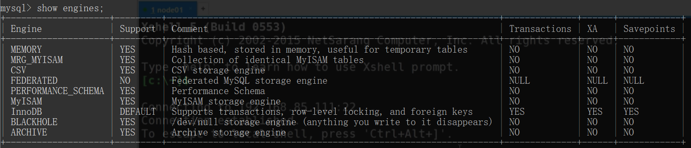

## 什么叫存储引擎？

不同的数据文件在磁盘上不同的组织形式。

## MySQL有哪几种数据存储引擎？

MySQL通过`show ENGINES`指令可以看到所有支持的数据库存储引擎。



MyISAM 和 InnoDB 用的是B+树。

MEMORY 用的是Hash索引。

**InnoDB是否支持Hash索引：**

支持自适应Hash。用户没办法干预。

## InnoDB、MyISAM区别：

（1）InnoDB索引是聚簇索引，MyISAM索引是非聚簇索引。

（2）InnoDB的主键索引的叶子节点存储着行数据，因此主键索引非常高效。
MyISAM索引的叶子节点存储的是行数据地址，需要再寻址一次才能得到数据。

（3）InnoDB非主键索引的叶子节点存储的是主键和其他带索引的列数据，因此查询时做到覆盖索引会非常高效。

（4）InnoDB要求必须有主键，会根据主键建立一个默认索引。`innodb表是要求必须有主键的，但是myisam表不要求必须有主键`。innodb存储引擎下，如果对某个非主键的字段创建个索引，那么最后那个叶子节点的值就是主键的值，因为可以用主键的值到再次查找到数据，即所谓的回表.

补充：InnoDB是通过B+树结构对主键创建索引，然后叶子节点中存储记录，如果没有主键，那么会选择唯一键，如果没有唯一键，那么会生成一个6字节的row_id来作为主键。

如果创建索引的键是其他字段，那么在叶子节点中存储的是该记录的主键，然后再通过主键索引找到对应的记录，叫做`回表`。

## 对MySQL的锁了解吗？

当数据库有并发事务的时候，可能会产生数据的不一致，这时候需要一些机制来保证访问的次序，锁机制就是这样的一个机制。

就像酒店的房间，如果大家随意进出，就会出现多人抢夺同一个房间的情况，而在房间上装上锁，申请到钥匙的人才可以入住并且将房间锁起来，其他人只有等他使用完毕才可以再次使用。

## 隔离级别与锁的关系

Read committed 只会把查出来的行加锁， 可以插入

（1）查询时使用的是`主键`，只需要在主键值对应的那一条数据加锁即可。

（2）查询使用的`唯一索引`，也是一样。

（3）查询使用的`普通索引`，只是把查出来的行加锁。

（4）如果`不用索引`，也是一样。

Repeatable read  间隙锁，插不进去

## 按照锁的粒度分数据库锁有哪些？

在关系型数据库中，可以**按照锁的粒度把数据库锁分**为行级锁(INNODB引擎)、表级锁(MYISAM引擎)和页级锁(BDB引擎 )。

- MyISAM采用表级锁(table-level locking)。
- InnoDB支持行级锁(row-level locking)和表级锁，默认为行级锁

## 行锁

行级锁是Mysql中锁定粒度最细的一种锁，表示`只针对当前操作的行进行加锁`。

行级锁能大大减少数据库操作的冲突。其加锁粒度最小，但加锁的开销也最大。`行级锁分为共享锁 和 排他锁`。

特点：开销大，加锁慢；`会出现死锁`；锁定粒度最小，发生锁冲突的概率最低，并发度也最高。

只有明确指定主键，才会执行行锁，否则执行表锁。

select * from user where id = 1 for update;

select * from user where id = 1 and name='kkk' for update;

**行锁机制：**

（1）Record Lock（普通行锁）：某个行记录上的锁

（2）Gap Lock（间隙锁）：锁定一个范围，但不包括记录本身。

（3）Next-key Lock（行&间隙）：锁定一个范围，并且锁定记录本身。`可以解决幻读问题`。

```mysql
# id 只有50

select * from user id > 49 for update;
```

## 表锁

表级锁是MySQL中锁定粒度最大的一种锁，`表示对当前操作的整张表加锁`，它`实现简单，资源消耗较少`，被大部分MySQL引擎支持。最常使用的MYISAM与INNODB都支持表级锁定。表级锁定分为表共享读锁（共享锁）与表独占写锁（排他锁）。

特点：开销小，加锁快；不会出现死锁；锁定粒度大，发出锁冲突的概率最高，并发度最低。

主键不明确

select * from user where name = 'kkk' for update;

select * from user where id <> for update;

**表锁机制：**

（1）意向锁

当一个事务带着表锁去访问一个被加了行锁的资源。那么行锁就会升级成意向锁。将表锁住。

```mysql
# 事务A
select * from user where id = 10 for update;

# 事务B
select * from user where name = 'kkk' for update;
```

（2）自增锁

事务插入自增类型的列时，获取自增锁。

如果一个事务正在往表里插入自增记录，其他事务都必须等待。

## 按照锁的类型数据库锁有哪些？

读锁：共享锁。当用户要进行数据的读取时，对数据加上共享锁。`共享锁可以同时加上多个`。

写锁：排它锁。当用户要进行数据的写入时，对数据加上排他锁。`排他锁只可以加一个`，他和其他的排他锁，共享锁都相斥。

用上面的例子来说就是用户的行为有两种，一种是来看房，多个用户一起看房是可以接受的。 一种是真正的入住一晚，在这期间，无论是想入住的还是想看房的都不可以。

## InnoDB的行锁是怎么实现的？

答：InnoDB是基于索引来完成行锁

例: select * from tab_with_index where id = 1 for update;

for update 可以根据条件来完成行锁锁定，并且 id 是有索引键的列，如果 id 不是索引键那么InnoDB将完成表锁，并发将无从谈起

## InnoDB存储引擎的锁的算法有三种

Record lock：单个行记录上的锁

Gap lock：间隙锁，锁定一个范围，不包括记录本身

Next-key lock：record+gap 锁定一个范围，包含记录本身

## 什么是死锁？怎么解决？
死锁是指两个或多个事务在同一资源上相互占用，并请求锁定对方的资源，从而导致恶性循环的现象。

常见的解决死锁的方法

1、如果不同程序会并发存取多个表，尽量约定以相同的顺序访问表，可以大大降低死锁机会。

2、在同一个事务中，尽可能做到一次锁定所需要的所有资源，减少死锁产生概率；

3、对于非常容易产生死锁的业务部分，可以尝试使用升级锁定颗粒度，通过表级锁定来减少死锁产生的概率；

如果业务处理不好可以用分布式事务锁或者使用乐观锁
