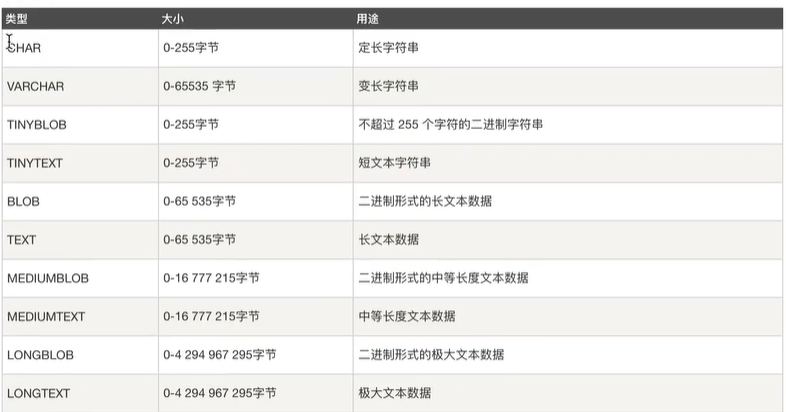

## 登录数据库服务器

`mysql -uroot -p`

## 退出

`exit;`

## 查询数据库

`show databases;`

## 选中数据库

`use database_name;`

## 创建数据库

`create database test;`

## 创建数据表

```
create table pet(
	name VARCHAR(20));
```

## 查看数据表结构

`desc pet;`

## 插入记录

`insert into pet values ("mike", "diane", "f", "2021-04-27");`

## 删除记录

`delete from pet where name="mike";`

## 修改数据

`update pet set name='往往' where owner='我';`

## MySQL常用数据类型

数值：


日期/时间：


字符串/字符：



## 主键约束

能够唯一确定一张表中的一条记录。主键不能重复也不能为空。

` create table user(
    -> id int primary key,
    -> name varchar(20)
    -> );` 

**创建表忘记创建主键？**

`alter table user4 add primary key(id);`

**那删除呢？**

`alter table user4 drop primary key;`

**那如何修改呢？**

`alter table user4 modify id int primary key;`

## 联合主键

加起来不重复就可以。

` create table user2(
    -> id int,
    -> name varchar(20),
    -> password varchar(20),
    -> primary key(id, name)
    -> );` 

## 自增约束

` create table user3(
    -> id int primary key auto_increment,
    -> name varchar(20));`

## 唯一约束

约束修饰的字段的值不可以重复

```mysql
mysql> create table user6(
    -> id int,
    -> name varchar(20),
    -> unique(name)
    -> );
Query OK, 0 rows affected (0.05 sec)
```

```mysql
mysql> create table user5(
    -> id int,
    -> name varchar(20));
Query OK, 0 rows affected (0.04 sec)

mysql> alter table user5 add unique(name); // 添加唯一约束
```

**如何删除唯一约束？**

`alter table user6 drop index name;`

**如何添加？**

` alter table user6 modify name varchar(20) unique;`

## 非空约束

```mysql
mysql> create table user9 (
    -> id int,
    -> name varchar(20) not null);
Query OK, 0 rows affected (0.06 sec)
```

## 默认约束

```mysql
mysql> create table user10(
    -> id int,
    -> name varchar(20),
    -> age int default 10);
Query OK, 0 rows affected (0.04 sec)

mysql> desc user10;
+-------+-------------+------+-----+---------+-------+
| Field | Type        | Null | Key | Default | Extra |
+-------+-------------+------+-----+---------+-------+
| id    | int         | YES  |     | NULL    |       |
| name  | varchar(20) | YES  |     | NULL    |       |
| age   | int         | YES  |     | 10      |       |
+-------+-------------+------+-----+---------+-------+
3 rows in set (0.00 sec)

mysql> insert into user10 (id, name) values (1, "xiaoming");
Query OK, 1 row affected (0.01 sec)

mysql> select * from user10;
+------+----------+------+
| id   | name     | age  |
+------+----------+------+
|    1 | xiaoming |   10 |
+------+----------+------+
```

## 外键约束

涉及到两个表：父表、子表

```mysql
mysql> create table classes(
    -> id int primary key,
    -> name varchar(20)
    -> );
Query OK, 0 rows affected (0.03 sec)
mysql> create table students(
    -> id int primary key,
    -> name varchar(20),
    -> class_id int,
    -> foreign key(class_id) references classes(id)
    -> );
Query OK, 0 rows affected (0.04 sec)

mysql> desc students;
+----------+-------------+------+-----+---------+-------+
| Field    | Type        | Null | Key | Default | Extra |
+----------+-------------+------+-----+---------+-------+
| id       | int         | NO   | PRI | NULL    |       |
| name     | varchar(20) | YES  |     | NULL    |       |
| class_id | int         | YES  | MUL | NULL    |       |
+----------+-------------+------+-----+---------+-------+
3 rows in set (0.00 sec)
```

## 三大设计范式

**第一范式：**数据表中的所有字段都是不可分割的原子值

字段值还可以继续拆分的，就不满足第一范式。

**第二范式：**满足第一范式的前提下，除了主键外的每一列都必须完全依赖主键。

```mysql
mysql> create table myorder(
    -> product_id int,
    -> customer_id int,
    -> product_name varchar(20),
    -> customer_name varchar(20),
    -> primary key(product_id, customer_id)
    -> );
```

问题？除了主键以外的其他列，只依赖于主键的部分字段。

如何做？拆表

```mysql
create table myorder (
	order_id int primary key,
	product_id int,
	customer_id int
);

create table product(
	id int primary key,
    name varchar(20)
);

create table customer(
	id int primary key,
    name varchar(20)
);
```

**第三范式：**

必须先满足第二范式，除开主键列的其他列不能有传递依赖。

```mysql
create table myorder (
	order_id int primary key,
	product_id int,
	customer_id int,
    customer_phone varchar(25) // 依赖冗余
);

create table product(
	id int primary key,
    name varchar(20)
);

create table customer(
	id int primary key,
    name varchar(20)
);
```

## 查询

**1. 只查询特定的字段**

```mysql
mysql> select * from student;
+-----+-------+------+---------------------+-------+
| sno | sname | ssex | sbirthday           | class |
+-----+-------+------+---------------------+-------+
| 108 | 曾华  | 男   | 1997-09-21 00:00:00 | 96033 |
| 109 | 小明  | 男   | 1995-03-21 00:00:00 | 96039 |
+-----+-------+------+---------------------+-------+
2 rows in set (0.01 sec)

mysql> select sname, ssex, class from student;
+-------+------+-------+
| sname | ssex | class |
+-------+------+-------+
| 曾华  | 男   | 96033 |
| 小明  | 男   | 96039 |
+-------+------+-------+
```

**2. 查询教师的所有单位即不重复的depart列**

```mysql
mysql> select * from teacher;
+-----+-------+------+---------------------+--------+----------+
| tno | tname | tsex | tbirthday           | prof   | depart   |
+-----+-------+------+---------------------+--------+----------+
| 804 | 王蒙  | 男   | 1958-03-21 00:00:00 | 副教授 | 计算机系 |
| 805 | 李铁  | 男   | 1953-03-21 00:00:00 | 教授   | 美术系   |
| 807 | 王铁  | 男   | 1953-03-21 00:00:00 | 教授   | 美术系   |
+-----+-------+------+---------------------+--------+----------+
3 rows in set (0.00 sec)

mysql> select depart from teacher;
+----------+
| depart   |
+----------+
| 计算机系 |
| 美术系   |
| 美术系   |
+----------+
3 rows in set (0.00 sec)

mysql> select distinct depart from teacher;
+----------+
| depart   |
+----------+
| 计算机系 |
| 美术系   |
+----------+
```

**3. 范围查询：**

```mysql
mysql> select * from score;
+-----+-------+--------+
| sno | cno   | degree |
+-----+-------+--------+
| 108 | 3-201 |     90 |
| 109 | 3-202 |     10 |
+-----+-------+--------+
2 rows in set (0.00 sec)

mysql> select * from score where degree between 70 and 90;
+-----+-------+--------+
| sno | cno   | degree |
+-----+-------+--------+
| 108 | 3-201 |     90 |
+-----+-------+--------+
1 row in set (0.01 sec)
```

**4. 查询score表中成绩为10或90的记录**

`select * from score where degree in(10, 90);`

**5. 以class降序查询student表的所有记录**

`select * from student order by class desc;`

**6. 以cno升序，degree降序查询score表中所有记录**

`select * from score order by cno asc, degree desc;`

**7. 统计“96033”班的学生人数**

`select count(*) from student where class="96033";`

**8. 查询score表中的最高分的学生学号和课程号**

`select sno, cno from score where degree=(select max(degree) from score);`

`select sno, cno from score order by degree desc limit 0,1;`

**9. 查询每门课的平均成绩**

`select avg(degree) from score where cno="3-201";` // 计算一门课

`select cno, avg(degree) from score group by cno;` 

**10. 查询score表中至少有1名学生选修的并以3开头的课程的平均分数**

`select cno, avg(degree) from score group by cno having count(cno)>=1 and cno like "3%"; `

**11. 查询分数大于70， 小于90的sno列**

`select sno from score where degree > 70 and degree < 90;`

**12. 查询所有学生的sname, cno 和 degree列**

`select sname, cno, degree from student, score where student.sno=score.sno;`

**13. 查询所有学生的sno, cname 和degree列**

`select sno, cname, degree from course, score where course.cno=score.cno;`

**14. 查询所有学生的sname, cname和degree列**

`select sname, cname, degree from student, course, score where student.sno=score.sno and course.cno=score.cno;`

**15. 查询“96033”班学生每门课的平均分**

`select cno, avg(degree) from score where sno in (select sno from student where class="96033" group by cno);`

## 连接查询

```mysql
mysql> select * from card;
+------+--------+
| id   | name   |
+------+--------+
|    1 | 饭卡   |
|    2 | 建行卡 |
|    3 | 农行卡 |
+------+--------+
3 rows in set (0.00 sec)

mysql> select * from person;
+------+------+--------+
| id   | name | cardId |
+------+------+--------+
|    1 | 张三 |      1 |
|    2 | 李四 |      2 |
|    3 | 王五 |    `5` |
+------+------+--------+
3 rows in set (0.00 sec)
```

**内连接：**

`inner join` 或者 `join`: 内联查询，两张表中的数据，通过某个字段相对，查询出相关记录数据。

```mysql
mysql> select * from person inner join card on person.cardId=card.id;
+------+------+--------+------+--------+
| id   | name | cardId | id   | name   |
+------+------+--------+------+--------+
|    1 | 张三 |      1 |    1 | 饭卡   |
|    2 | 李四 |      2 |    2 | 建行卡 |
+------+------+--------+------+--------+
```

**外连接：**

左连接 `left join`: 左外连接，左边表把所有数据取出来，右边表不一定

```mysql
mysql> select * from person left join card on person.cardId=card.id;
+------+------+--------+------+--------+
| id   | name | cardId | id   | name   |
+------+------+--------+------+--------+
|    1 | 张三 |      1 |    1 | 饭卡   |
|    2 | 李四 |      2 |    2 | 建行卡 |
|    3 | 王五 |      5 | NULL | NULL   |
+------+------+--------+------+--------+
```

右连接 `right join`

```mysql
mysql> select * from person right join card on person.cardId=card.id;
+------+------+--------+------+--------+
| id   | name | cardId | id   | name   |
+------+------+--------+------+--------+
|    1 | 张三 |      1 |    1 | 饭卡   |
|    2 | 李四 |      2 |    2 | 建行卡 |
| NULL | NULL |   NULL |    3 | 农行卡 |
+------+------+--------+------+--------+
```

**MySQL不支持完全外连接 `full join`？**

```mysql
mysql> select * from person left join card on person.cardId=card.id union select * from person right join card on person.cardId=card.id;
+------+------+--------+------+--------+
| id   | name | cardId | id   | name   |
+------+------+--------+------+--------+
|    1 | 张三 |      1 |    1 | 饭卡   |
|    2 | 李四 |      2 |    2 | 建行卡 |
|    3 | 王五 |      5 | NULL | NULL   |
| NULL | NULL |   NULL |    3 | 农行卡 |
+------+------+--------+------+--------+
```

