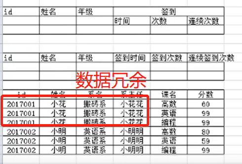
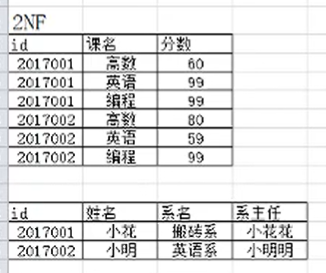
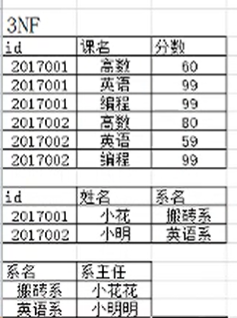

## 1. 每个属性都不可再分（原子性）

每一个字段都是最小的，不包含其他字段。

**问题**：

（1）数据冗余

（2）插入异常

插入新的系名和系主任，其他数据为空，异常。

（3）删除异常

把学生信息删除，系名和系主任也被删除了。

（4）修改异常

把学生的系更改，需要修改多次。

## 2. 在一范式的基础上，消除了非主属性对码的部分函数依赖

**码**：一个表中，可以唯一决定一个元组的属性“集合”。

例如，可以通过（id+课名）确定其他字段。（id, 课名）就叫码。

**函数依赖**：

在属性X确定的情况下，必定能确定Y的值，就说Y函数依赖于X。X--Y

例如，给定一个学号，必定能得到唯一的一个姓名。就说姓名函数依赖于学号。

写作：学号--姓名

学号--系主任

**完全函数依赖：**

（学号，课名）-- 成绩

学号和课名都是X的真子集，但是如果只有学号或者只有课名，不能得到一个唯一的成绩。

所以Y完全函数依赖于X。

**部分函数依赖：**

（学号，课名）-- 姓名

由学号可以得到唯一姓名，但是由课名不能得到唯一的姓名。

所以Y部分函数依赖于X。

**判断是否符合二范式：**

第一步：找出数据表中所有的码。（id, 课名）

第二步：根据第一步的码，找出所有的主属性。id 和课名

第三步：数据表中，除去所有的主属性，剩下的就都是非属性了。姓名、系名、系主任、分数。

第四步：查看是否存在非主属性对码的部分函数依赖。

若不存在，则符合2NF的要求。

**进行拆分：**

**问题解决：**

问题冗余问题解决。

`插入异常`：如果新建一个系，并且有系主任。但是因为还没有学生，所以主键是空的，肯定不能插入。

`删除异常`：如果需要把某个系下面学生信息都情空，那么这个系也就不存在了。

修改异常解决：如果需要把学生的系进行更换，2NF只需要修改一个。

## 3. 在二范式的基础上，消除了非主属性对于码的传递函数依赖

**传递函数依赖：**

如果Y依赖于X，Z又依赖于Y，那么就说Z依赖于X。

例如：系名依赖于学号，系主任依赖于系名，那么系主任传递依赖函数于学号。不满足3NF。

**解决问题：**

插入异常解决：如果新建一个系，并且有系主任，不会出问题。

删除异常解决：如果需要把某个系下面的学生都清空，不会出现异常。

## 优缺点

- 范式的优点：因为相对来说有较少的重复数据，范式化的更新操作要比反范式快。同时范式化需要更少的distinct和order by

- 范式化缺点：通常需要关联，不仅代价昂贵，也可能会使的一些索引无效