## 操作系统的功能和目标

命令接口：允许用户`直接使用`。

程序接口：允许用户通过程序`间接使用`，由一组`系统调用`组成（程序接口=系统调用）。

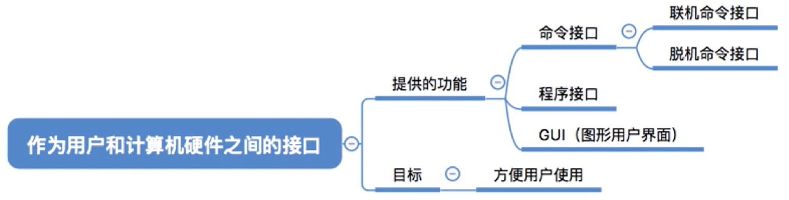

## 操作系统的特征

**并发**：指计算机系统中同时存在着多个运行着的程序。

**共享：**指系统中的资源可供内存中多个并发执行的进程共同使用。分为`互斥共享`（一个时间段只允许一个进程访问该资源）和`同时共享`（一个时间段允许多个进程同时对他们进行访问）。

**并发与共享的关系：**

如果失去并发性，系统中只有一个程序正在运行，则共享性失去存在的意义。

如果失去共享性，不同进程不能同时访问资源，就无法实现并发。

**虚拟：**一个物理上的实体变成若干个逻辑上的。

虚拟技术分为`空分复用技术`（如虚拟存储器技术）和`时分复用技术`（如虚拟处理器）。

## 操作系统的发展阶段

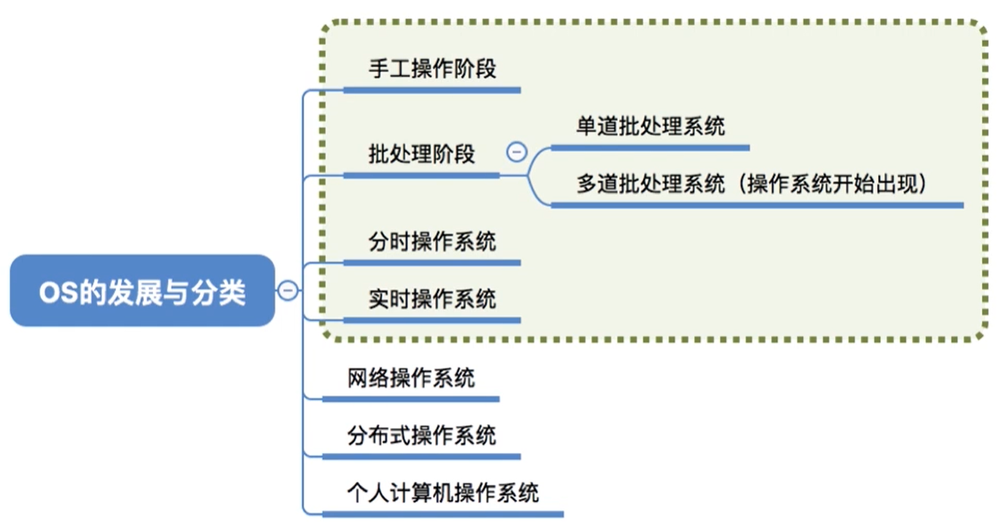

手工操作阶段：打孔机，纸带机

## OS的运行机制和体系结构

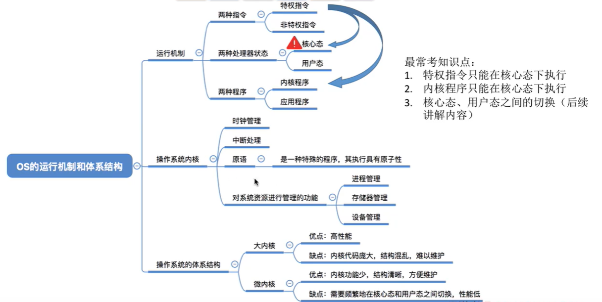

**操作系统的运行机制：**

**两种指令**

特权指令：如内存清零指令。不允许用户程序使用。

非特权指令：如普通的运算指令。

`CPU如何判断当前是否可以执行特权指令？`

**两种处理机状态**

用户态：此时CPU只能执行非特权指令。

核心态：此时特权指令、非特权指令都可以执行。

**两种程序**

`有的程序需要执行特权指令，有的程序不需要`

内核程序：是系统的管理者，既可以执行特权指令，也可以执行非特权指令，运行在核心态。

应用程序：只能执行非特权指令，运行在用户态。

`问题：操作系统的哪些功能应该由内核程序实现呢？`

**操作系统内核：**

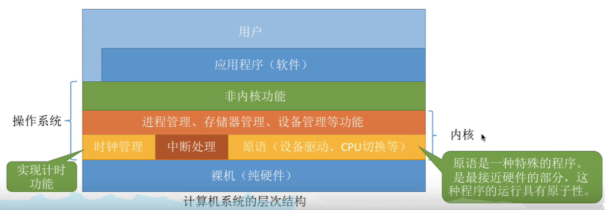

`内核`是计算机配置的`底层软件`，是操作系统最基本、最核心的部分。

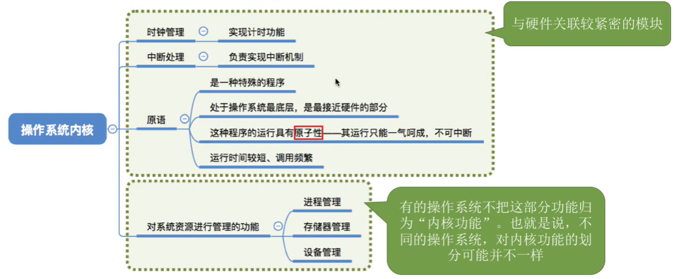

实现操作系统内核功能的那些程序就是`内核程序`。

时钟管理：所有的进程切换、进程调度等管理工作都需要基于计时功能。

原语：是一种特殊的程序，是最接近硬件的部分，这种程序的运行具有原子性。

**操作系统的体系结构：**

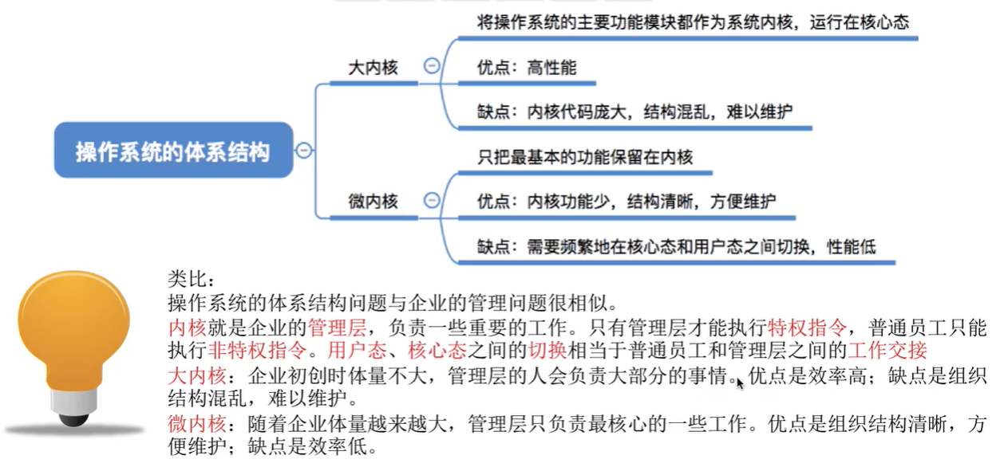

## 用户态和核心态之间的切换

**用户态 -> 核心态：中断**

用户态切换到核心态是通过`中断`实现的，并且中断是`唯一途径`。

发生了中断，意味着需要操作系统介入开展管理工作。

由于操作系统的管理工作（比如进程切换、分配I/O设备等）需要使用特权指令，因此`CPU要从用户态转为核心态`。

**核心态 -> 用户态：执行特权指令**

核心态到用户态的切换是通过`执行一个特权指令`，将程序状态字（PSW）的标志位设置为“用户态”。

## 中断和异常

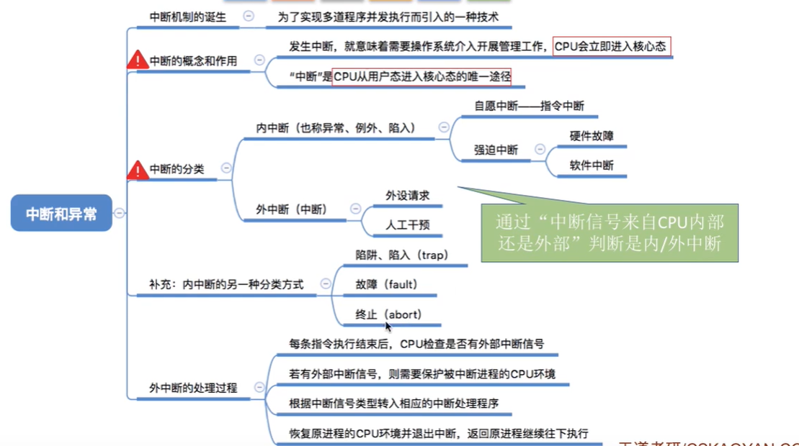

中断的分类：

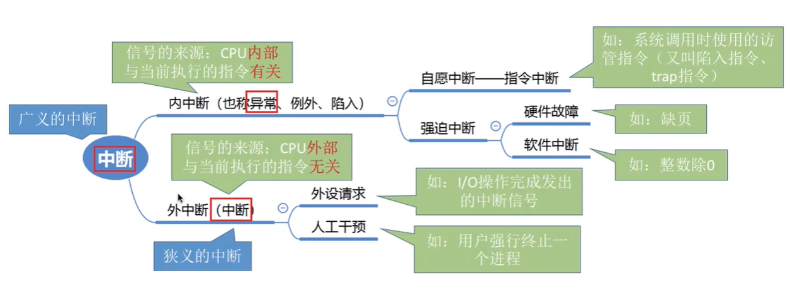

外中断的处理过程：

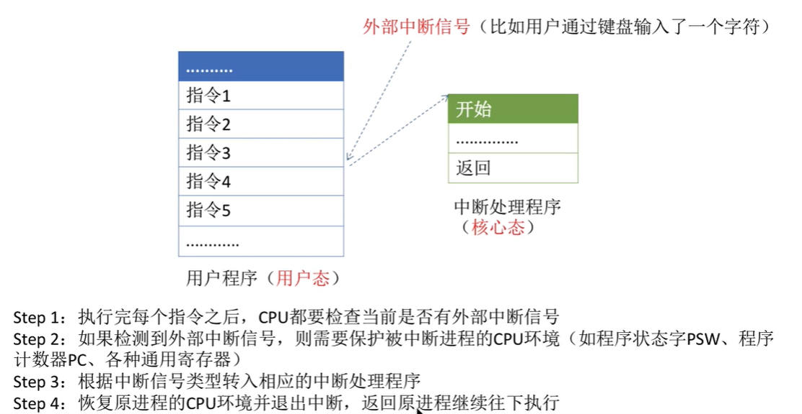

## 系统调用

`系统调用发生在用户态，但是对系统调用的处理发生在核心态。`

`执行陷入指令会产生内中断，是处理器从用户态进入核心态。`

**什么是系统调用，有何作用？**

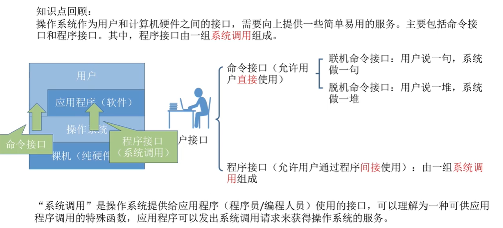

**问题：操作系统为什么要提供“系统调用”功能？**

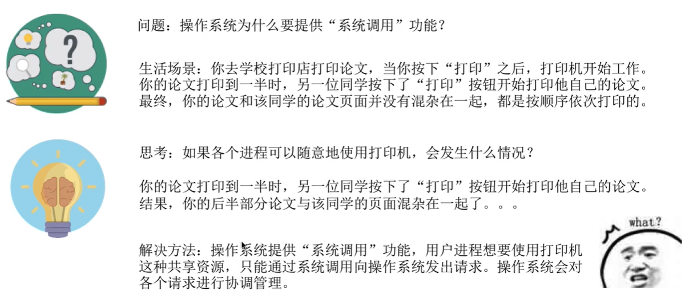

应用程序通过系统调用请求操作系统的服务，系统中的各种共享资源都有操作系统统一管理，因此在用户程序中，`凡是与资源有关的操作（如存储分配、I/O操作、文件管理等），都必须通过系统调用的方式向操作系统提出服务请求，有操作系统代之完成。这样可以保证系统的稳定性何安全性`，防止用户进行非法操作。

**什么操作需要用系统调用来完成？**

凡是与资源相关的操作、会直接影响到其他进程的操作，一定需要操作系统接入，即需要通过系统调用来实现。

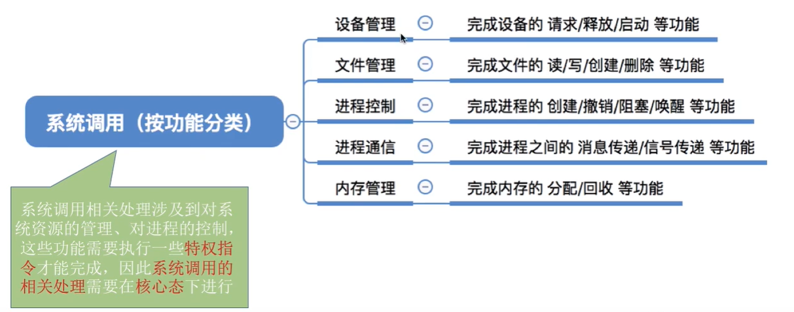

**系统调用与库函数的区别：**

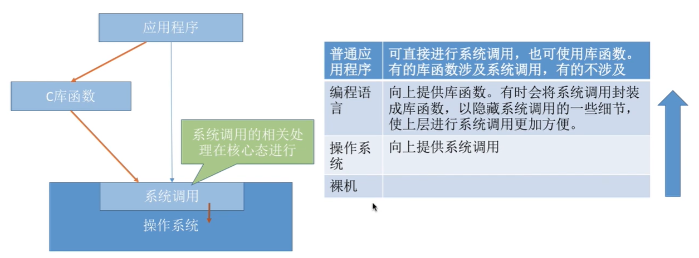

**系统调用背后的过程：**

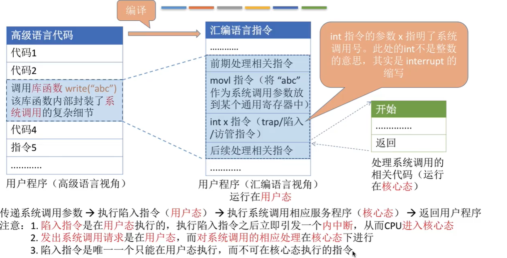