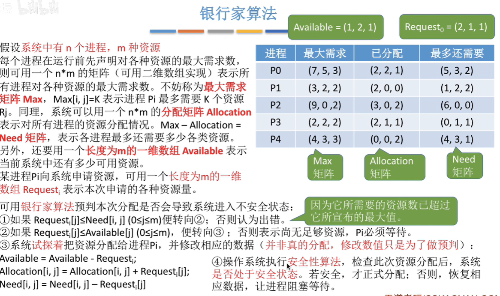
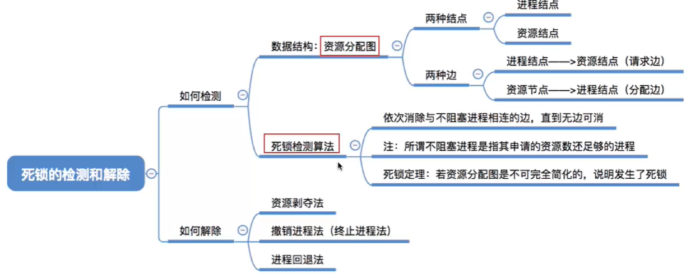
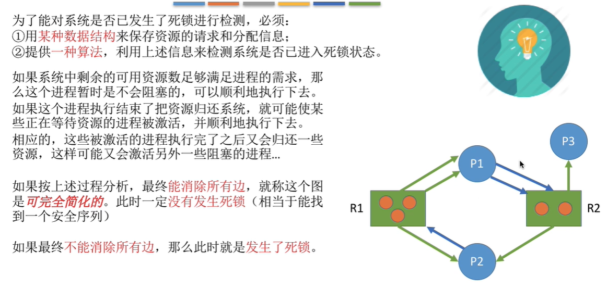

## 什么是死锁

在并发环境下，各进程因竞争资源而造成的一种`互相等待对方手里的资源，导致进程都阻塞，都无法向前推进`的现象，就是“死锁”。

## 进程死锁、饥饿、死循环的区别

**饥饿：**由于进程长期得不到想要的资源，某进程无法向前推进的现象。

**死循环：**某进程执行过程中一直跳不出某个循环的现象。

## 死锁产生的必要条件

必须同时满足以下条件：

**（1）互斥条件：**只有对必须互斥使用的资源的争抢才会导致死锁（如哲学家的筷子、打印机设备）。内存、扬声器这样可以同时让多个进程使用的资源是不会导致死锁的，因为进程不用阻塞等待这种资源。

**（2）不可剥夺条件：**进程所获得的资源在未使用完之前，不能由其他进程强行夺走，只能主动释放。

**（3）请求和保持条件：**进程已经保持了至少一个资源，但又提出了新的资源请求，而该资源又被其他进程占用，此时请求进程被阻塞，但又对自己已有的资源保持不放。

**（4）循环等待条件：**存在一种进程资源的循环等待链，链中的每一个进程已获得的资源同时被下一个进程所请求。（`必要不充分条件`）

## 什么时候会出现死锁

**（1）对系统资源的竞争。**各进程对不可剥夺的资源（如打印机）的竞争可能引起死锁，对可剥夺的资源（CPU）的竞争是不会引起死锁的。

**（2）进程推进顺序非法。**请求和释放资源的顺序不当，也同样会导致死锁。例如，并发执行的进程P1、P2分别申请并占有了资源R1、R2，之后进程P1又紧接着申请资源R2，而进程R2又申请资源R1,两者会因为申请的资源被对方占有而阻塞，从而发生死锁。

**（3）信号量的使用不当也会造成死锁。**如生产者-消费者问题中，如果实现互斥的P操作在实现同步的P操作之前，就有可能导致死锁。

总之，`对不可剥夺资源的不合理分配，可能导致死锁`。

## 死锁的处理策略

**（1）预防死锁：**破坏死锁产生的四个必要条件中的一个或几个。

**（2）避免死锁：**用某种方法防止系统进入不安全状态，从而避免死锁（银行家算法）。

**（3）死锁的检测和解除：**允许死锁的发生，不过操作系统会负责检测出死锁的发生，然后采取某种措施解除死锁。

## 预防死锁

**（1）破坏互斥条件：**

如果把只能互斥使用的资源改造成允许共享使用，则系统不会进入死锁状态。如`spooling技术`，操作系统把独占设备在逻辑上改造成共享设备。

**缺点：**并不是所有的资源都可以改造成可共享使用的资源。并且为了系统安全，很多时候还必须保护这种互斥性。

**（2）破坏不剥夺条件：**

当一个进程请求新资源得不到满足，必须释放保持的所有资源。

当某个进程需要的资源被其他进程所占有的时候，可以由操作系统协助，将想要的资源强行剥夺。这种方式一半需要考虑各进程的优先级。

**缺点：**实现复杂，强行剥夺导致工作失效。这种方法一般只适用于易保存和恢复状态的资源，如CPU。增加系统开销，降低系统吞吐量。可能导致进程饥饿。

**（3）破坏请求和保持条件**

采用`静态分配方法`，进程在运行前一次申请完它所需要的全部资源，在未满足前，不让它投入运行。

**缺点：**有的资源可能只需要很短的时间，因此如果进程的整个运行期间都一直保持着所有资源，就会造成严重的资源浪费，资源利用率极低。也有可能导致某些进程饥饿。

**（4）破坏循环等待条件**

`采用顺序资源分配法`，首先给系统中的资源编号，规定每个进程必须按编号递增的顺序请求资源，编号相同的资源一次申请完。

已持有大编号资源的进程不可能逆向回来申请小编号的资源，从而不会产生循环等待的现象。

**缺点：**

不方便增加新的设备，需要重新分配编号。

进程实际使用资源的顺序可能和编号递增顺序不一致，导致资源浪费。

必须按照规定次序申请资源，用户编程麻烦。

## 避免死锁

**什么是安全序列**

系统按照某种序列分配资源，每个进程都能顺利完成。

如果系统处于安全状态，一定不会发生死锁。

如果系统进入不安全状态，就可能发生死锁。（有进程提前归还资源，可能重新回到安全状态）

**银行家算法**

`银行家算法`的核心思想：在资源分配之前预先判断这次分配是否会导致系统进入不安全状态。

## 死锁的检测和解除

**死锁的检测：**

为了能对系统是否已发生了死锁进行检测，必须：

用`某种数据结构`来保存资源的请求和分配信息；

提供`一种算法`，利用上述信息来检测系统是否已进入死锁状态。

用死锁检测算法`化简资源分配图后，还连着边的哪些进程就是死锁进程`

**死锁的解除：**

**（1）资源剥夺法：**

挂起（暂时放到外存上）某些死锁进程，并抢占它的资源，将这些资源分配给其他的死锁进程。但是应防止被挂起的进程长时间得不到资源而饥饿。

**（2）撤销进程法（终止进程法）：**

强制撤销部分，甚至全部死锁进程，并剥夺这些进程的资源。

实现简单，代价可能很大，因为有些进程功亏一篑，从头再来。

**（3）进程回退法：**

让一个或多个死锁进程回退到足以避免死锁的地步。要求系统记录进程历史信息，设置还原点。