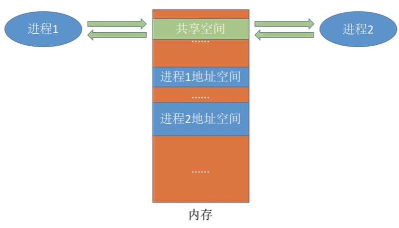

## 进程的状态和转换

**三种基本状态**

运行态：占有CPU，并在CPU上运行。

就绪态：已经具备运行条件，但由于没有空闲CPU，暂时不能运行。

阻塞态：因等待某一事情而暂时不能运行。

**进程状态的转换**

## 进程通信

进程拥有的内存地址空间相互独立。为了保证安全，一个进程不能直接访问另一个进程的地址空间。但是进程之间的信息交换又是必须实现的。

**共享存储**

操作系统为两个进程创建了一块共享空间，但两个进程对共享空间的`访问必须是互斥的`。

基于数据结构的共享限制多、速度慢，低级。

基于存储区的共享在内存中画出一块共享存储区，数据的形式、存放位置都由进程控制，速度更快，高级。

**管道通信**

“管道”是在内存中开辟的一个固定大小的缓冲区。

管道只能采用`半双工通信`，某一时间段内只能实现单向的传输。如果要实现双向同时通信，则需要设置两个管道。

各进程要`互斥`地访问管道。

数据以字符流地形式写入管道，当`管道写满`时，`写进程`的write() 系统调用将被阻塞，等待读进程将数据取走。当读进程将数据全部取走后，`管道变空`，此时`读进程`的read()系统调用将被阻塞。

如果`没写满，就不允许读`，如果`没读空，就不允许写`。

数据一旦被读出，就从管道中被抛弃，这就意味着`读进程最多只能有一个`。

**消息传递**

进程间的数据交换以`格式化的消息`为单位。进程通过操作系统提供的“发送消息/接收消息”两个`原语`进行数据交换。

## 什么是线程，为什么要引入线程

线程是一个`基本的CPU执行单元`，也是程序执行流的最小单位。

有的进程可能需要`同时做很多事`，而传统的进程只能串行地执行一系列程序。为此，引入了“线程”，来增加并发度。

## 引入线程机制后，有什么变化

**资源分配、调度：**

传统进程机制中，进程是资源分配、调度的基本单位。

引入线程后，进程是资源分配的基本单位，线程是调度的基本单位。

**并发性：**

传统进程机制中，只能进程间并发。

引入线程后，各线程间也能并发，提升了并发度。

**系统开销：**

传统进程间并发，需要切换进程的运行环境，系统开销很大。

线程间并发，如果是同一进程内的线程切换，则不需要切换进程环境，系统开销小。

## 线程有哪些重要的属性

线程是处理机调度的单位，每个线程都有一个线程ID，线程控制块（TCB）

同一进程的不同线程间共享进程的资源；由于共享内存地址空间，同一进程中的线程间通信甚至无需系统干预

同一进程中的线程切换，不会引起进程切换；不同进程中的线程切换，会引起进程切换。

切换同进程内的线程，系统开销很小；切换进程，系统开销较大。

## 线程的实现方式

**用户级线程：**

应用程序通过线程库实现。

线程切换可以在`用户态下完成`，无需操作系统干预。

**内核级线程：**

线程切换在`核心态下完成`。

操作系统只看得到内核级线程，因此`只有内核级线程才是处理机分配的单位`。

## 处理机调度

**高级调度（作业调度）：**

按一定原则从外存处于后备队列的作业中挑选一个（或多个）作业，给他们分配内存等必要资源，并`建立相应的进程（PCB）`。

**中级调度（内存调度）：**

暂时调到外存等待的进程状态为`挂起状态，PCB常驻内存`。PCB会记录进程数据在外存中的存放位置，进程状态等信息，操作系统通过内存中的PCB来保持对各个进程的监控、管理。被挂起的进程`PCB会被放到挂起队列中`。

`中级调度就是决定将哪个处于挂起状态的进程重新调入内存`。

一个进程可能会被多次调出、调入内存，因此中级调度发生的频率要比高级调度更高。

**低级调度（进程调度）：**

其主要任务是按照某种方法和策略从就绪队列中选取一个进程，将处理机分配给它。

## 进程调度与切换

**侠义的进程调度：**从就绪队列中选中一个要运行的进程。这个进程可以是刚刚被暂停执行的进程，也可能是另一个进程。后一种情况就需要进程切换。

**广义的进程调度：**包含了选择一个进程和进程切换两个步骤。

**进程切换：**一个进程让出处理机，由另一个进程占用处理机的过程。

`进程切换的过程主要完成了：`

（1）对原来运行进程各种数据的保存

（2）对新的进程各种数据的恢复

（如：程序计数器、程序状态字、各种数据寄存器等处理及现场信息，这些信息一般保存在进程控制块）

`进程调度、切换是有代价的，并不是调度越频繁，并发度就越高`

## 进程调度的时机

**需要进行进程调度与切换的情况**

（1）当前运行的进程`主动放弃`处理机

进程正常终止

运行过程中发生异常而终止

进程主动请求阻塞

（2）当前运行的进程`被动放弃`处理机

分给进程的时间片用完

有更紧急的事需要处理（如 I/O中断）

有更高优先级的进程进入就绪队列

**不能进行进程调度与切换的情况**

（1）在`处理中断的过程中`。中断处理过程复杂、与硬件密切相关，很难做到在中断处理过程中进行进程切换。

（2）进程在`操作系统内核程序临界区`。

（3）在`原子操作过程中`。原子操作不可中断，要一气呵成（如修改PCB进程状态标志，并把PCB放到相应队列）。

## 进程调度的方式

（1）非剥夺调度方式（非抢占方式）

（2）剥夺调度方式（抢占方式）

## 调度算法的评价指标

**周转时间：**

（作业）周转时间 = 作业完成时间 - 作业提交时间

平均周转时间 = 各作业周转时间之和 / 作业数

带权周转时间 = 作业周转时间 / 作业实际运行的时间

平均带权周转时间 = 各作业带权周转时间之和 / 作业数

`对于周转时间相同的两个作业，带权周转时间更小，用户满意度更高。`

**等待时间：**指进程/作业处于等待处理机状态时间之和。

对于进程：等待时间指进程建立后`等待被服务的时间之和`，在等待I/O完成的期间其实进程也是在被服务的，所以不计入等待时间。

对于作业：不仅要考虑`建立进程后的等待时间，还要加上作业在外存后备队列中等待的时间。`

## 调度算法

**FCFS算法**：没有考虑到作业的运行时间，导致了`对短作业不友好`的问题。

**SJF 算法：**`对长作业不友好`，可能造成`饥饿问题`。

**高响应比优先（HRRN, Highest Response Ratio Next）**

**三种算法总结：**

**时间片轮转（RR, Round-Robin）：**更注重响应时间

 

**优先级调度算法：**

**补充：**

优先级分为静态优先级和动态优先级。

**如何合理设置各类进程的优先级？**

系统进程优先级高于用户进程

前台进程优先级高于后台进程

操作系统更`偏好I/O型进程（I/O繁忙型进程）`：I/O设备和CPU可以并行工作。如果优先让I/O繁忙型进程优先运行，则越有可能让I/O设备尽早地投入工作，则资源利用率、系统吞吐量都会得到提升。

**如果采用的是动态优先级，什么时候应该调整？**可以从`公平角度思考`

如果某进程在就绪队列中等待了很长时间，则可以适当提升其优先级。

如果某进程占用处理机运行了很长时间，则可适当降低其优先级。

**FCFS公平，SJF平均等待/周转时间优秀，时间片轮转让各个进程得到及时响应，优先级调度灵活调整各种进程被服务的机会，`能否对各种算法折中权衡？`**

**多级反馈队列调度算法：**

设置多级就绪队列，各级队列`优先级从高到低，时间片从小到大`

新进程到达时`先进入第1级`队列，按FCFS原则排队等待被分配时间片。

若用完时间片进程还未结束，则进程`进入下一级`队列队尾。

如果此时`已经在最下级`的队列，则`重新放回`最上级队列队尾。

只有`第k级队列为空`时，才会`为k+1级队头的进程分配时间片`。

`被抢占的进程重新放回原队列队尾`。

**三种算法总结：**

## 进程同步和进程互斥

解决`进程异步`问题。

**实现对临界资源的互斥访问，需要遵循以下原则**：

空闲让进

忙则等待

有限等待

让权等待：当进程不能进入临界区，应立即释放处理机，防止进程忙等待。

**进程互斥的软件实现方法**

**进程互斥的硬件实现方法**

## 信号量机制实现进程同步、互斥

用户进程可以通过使用操作系统提供的`一对原语`来对信号量进行操作，从而很方便的实现了进程互斥、进程同步。

**信号量机制实现进程互斥：**

**信号量机制实现进程同步：**

## 生产者与消费者问题

## 读者-写者问题

允许多个读者可以同时对文件执行读操作；

只允许一个写者往文件中写信息；

任一写者在完成写操作之前不允许其他读者或写者工作；

写者执行写操作前，应让已有的读者和写者全部退出。

**读进程优先：**

**写进程优先：**

## 哲学家进餐问题

一张圆桌上坐着5名哲学家，每两个哲学家之间的桌子摆一根筷子，桌子的中间是一碗米饭。

哲学家饥饿时，试图拿起左右两根筷子，如果筷子在他人手上，则需等待。

只有同时拿起两根筷子才可以开始进餐，当进餐完毕后，放下筷子继续思考。

**关系分析：**

系统中有5个哲学家进程，5位哲学家与左右邻居对中间筷子的访问是互斥关系。

**整理思路：**

这个问题中只有互斥关系，但与之前遇到的问题不同，每个哲学家进程需要同时持有两个临界资源才能开始吃饭。

如何避免临界资源分配不当造成的`死锁问题`？

## 管程

**为什么要引入管程**

信号量机制存在的问题：编写程序困难、易出错

能不能设计一种机制，让程序员写程序时不需要再关注复杂的PV操作，让写代码更轻松？

**管程的组成：**

共享数据结构

对数据结构初始化的语句

一组用来访问数据结构的过程

**基本特征：**

各外部进程/线程只能通过管程提供的特定入口才能访问共享数据

每次仅允许一个进程在管程内执行某个内部过程

**管程解决生产者消费者问题**

`引入管程的目的无非就是要更方便地实现进程互斥和同步。`

（1）需要在管程中`定义共享数据`（如生产者消费者问题的缓冲区）

（2）需要在管程中定义用于访问这些共享数据的`入口`--其实就是一些函数（如生产者消费者问题中，可以定义一个函数用于将产品放入缓冲区，再定义一个函数用于从缓冲区取走产品）

（3）`只有通过这些特定的入口才能访问共享数据`

（4）管程中有很多入口，但是`每次只能开放其中一个入口`，并且`只能让一个进程或线程进入`（如生产者消费者问题中，各进程需要互斥地访问共享缓冲区。管程地这种特性即可保证一个时间段内最多只有一个进程在访问缓冲区。`这种互斥特性是由编译器负责实现，程序员不用关心`）

（5）可在管程中设置`条件变量及等待唤醒操作以解决同步问题`。可以让一个进程或线程在条件变量上等待。

`Java中类似管程地机制：synchronized`