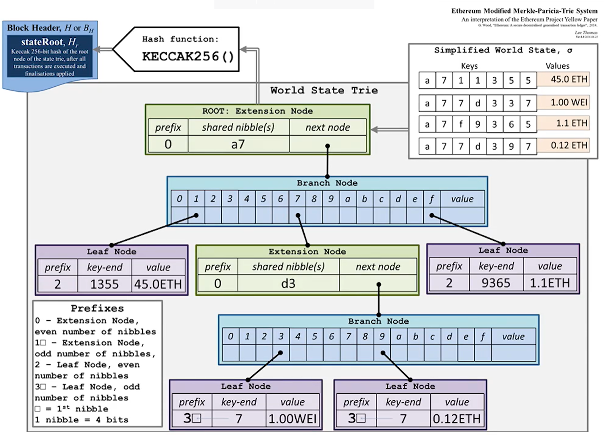
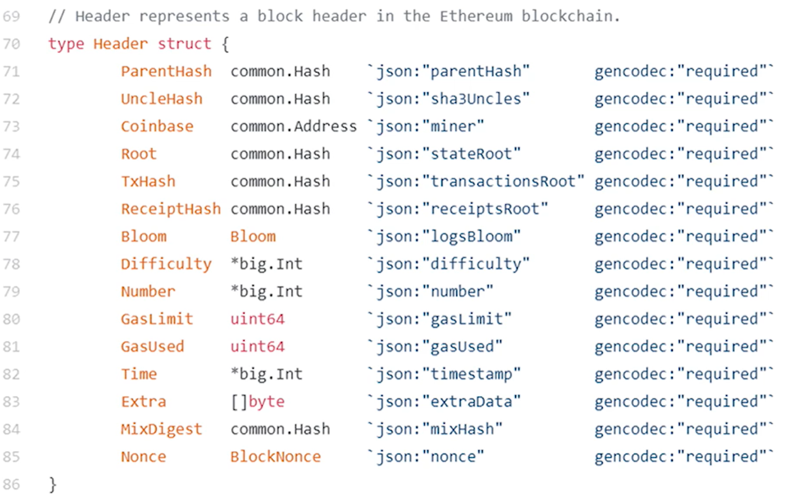
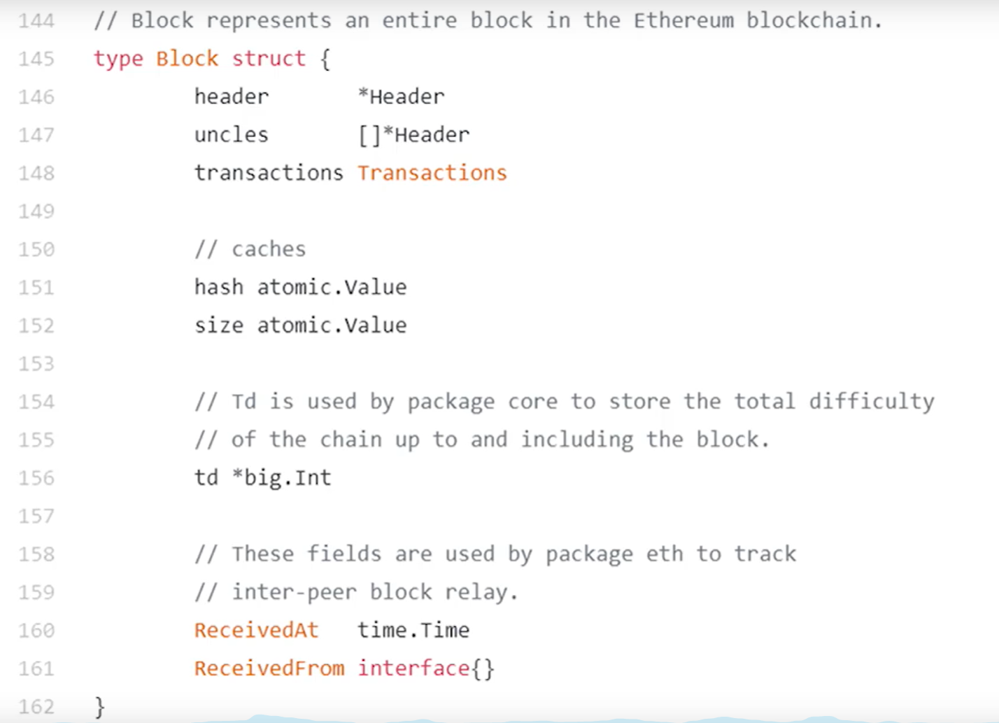
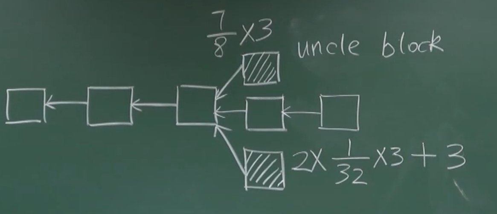
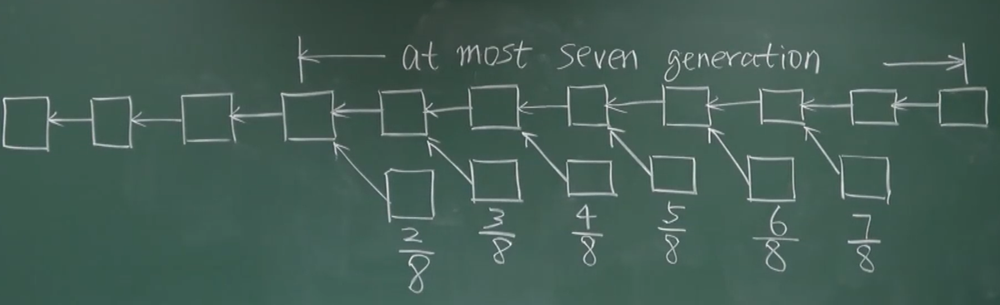
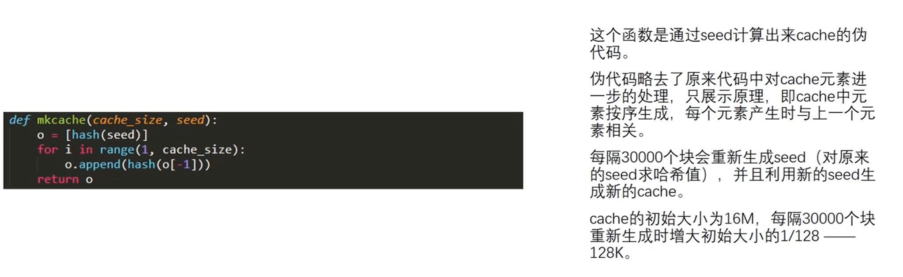
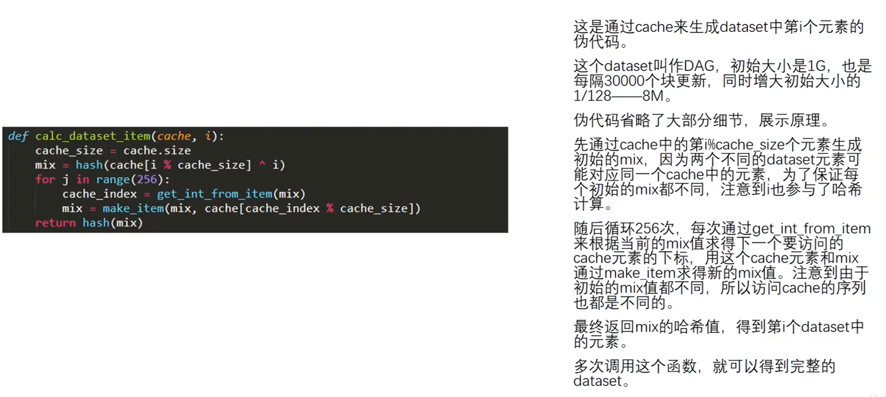
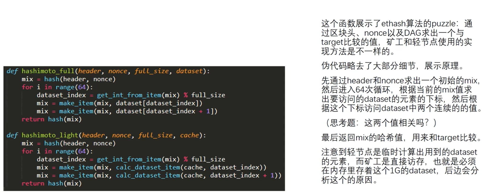
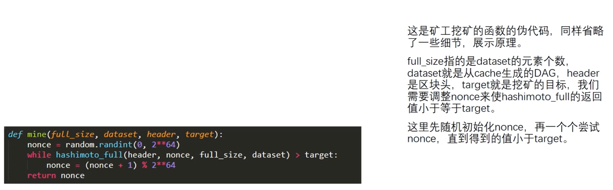
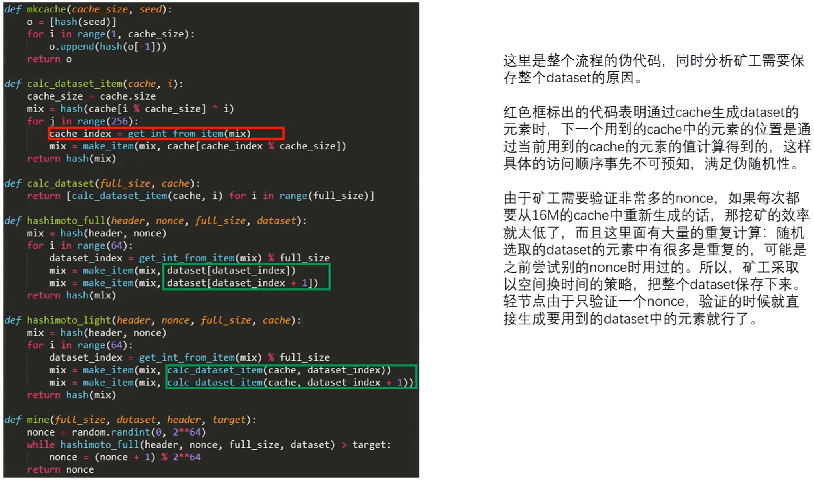

## 与BTC相比，改进

出块时间（10几秒）

ghost

mining puzzle(对内存要求要）

pow -> pos

smart contract（逻辑简单、清晰的合同可以写成合约）

为什么要写成去中心？有什么好处？

没有司法管辖下，用代码执行，代码是不可篡改的，只能按照规则执行。

## 概述：基于账户的分布式账本

比特币用的是基于交易的账本，要知道某个账户的余额只能通过UTXO进行推算。隐私保护好，使用上比较别扭。

以太坊基于账户的账本的**好处**：

转账的时候不用说明币的来源，也不用把剩下的币转给另一个地址。

以太坊这种方式对于`double spending attack`有天然的防御模式。

有什么**坏处**吗？

`replay attack(重放攻击)`

A -> B（10 ETH）交易被写入区块链

假设B是有恶意的，把这个交易又广播了一遍，其他节点以为是一次新的交易，就把A的钱扣了两次。

比特币是不会又replay attack的。

以太坊怎么办？

加一个计数器，记录账户有史以来交易的次数nonce。

A -> B（10 ETH）nonce=21 signed by A 交易被写入区块链

系统中每一个节点不仅要维护A的balance，还要维护nonce的值。

以后有人重放交易就不会再执行了。

**以太坊中有两类账户：**

外部账户（普通账户）：balance nonce

合约账户：不是通过公私钥对控制的，有code、storage、nonce，所有交易只能由外部调用。知道合约地址就可以调用合约。

## 数据结构：状态树、交易树、收据树

要完成：账户地址 -> 账户状态

**用哈希表来实现？**

每次有新的账户插入哈希表里。

查询账户余额直接查询。

`如何提供merkle proof?`

比如我希望他能证明一下他有多少钱？

一种方法是把哈希表的元素组织成一个merkle tree，根哈希值保存在block header中。

当只有一小部分账户状态发生变化，又要重新组织merkle tree，代价太大。

**Modified Merkle Patricia tree（merkle压缩前缀树，状态树）**

系统中每个全节点需要维护的不是一棵MPT，而是每次新建一个区块，都要新建一个MPT，只不过这些状态树的大部分节点都是共享的，只要少数状态变化的节点要新建分支。

**为什么要保留历史状态？干嘛不原地直接改？**

以太坊中临时性的分叉是一种常态。

假设两个分叉，最后有一个胜出，另一个怎么办？回滚！

怎么实现回滚呢？

就是要维护历史记录。

以太坊中的智能合约可以非常复杂，只能保存历史状态才能回滚。

**block header数据结构**

ParentHash：前一个区块区块头的哈希

UncleHash: 叔叔区块的哈希值

Coinbase: 挖出这个区块的矿工的地址

Root：状态树根哈希值

TxHash：交易树哈希值

ReceiptHash：收据树哈希值

Bloom：跟收据树相关

Difficulty：挖矿难度

MixDigest：挖矿相关

Nonce：挖矿时猜的随机数

**block body数据结构**

header：指向block header的指针

uncles：指向叔叔区块的header的指针，多个

transactions：区块中的交易列表

**交易树、收据树**

以太坊智能合约的执行结果比较复杂，增加收据树有利于我们快速查询一些执行的结果。

从数据结构上讲，交易树、收据树用的都是MPT。（猜测为了方便）

交易树和收据树都是把当前区块里的交易和收据组织起来的，而状态树把系统所以账户状态组织一起。

多个区块的状态树是共享节点的。

每个区块的交易树、收据树都是独立的。

`有什么用呢？`

提供merkle proof。证明某个交易被打包到区块里了。证明某个交易的执行结果。

除此之外，以太坊还提供更复杂的功能。比如想找到过去十天，与某个智能合约有关的交易。怎么查？
一种方法，把过去十天所有区块的交易扫描一遍，看看其中有哪些交易是和智能合约相关。复杂度高，轻节点没有交易列表，没有办法扫描。

怎么快速查？

以太坊中引用了Bloom filter这个数据结构。可以高效查找某个元素是不是在一个很大的集合里。

bloom filter给大的集合计算出一个很紧凑的摘要。

就是类似哈希表，对集合中每个元素进行哈希，在对应的位置上取0或者1.

这样我们对一个元素直接取哈希然后判断对应的位置是不是为1就可以判断出来了。

但是可能会出现误报，因为有可能哈希碰撞。

`以太坊中要这个bloom filter有什么用呢？`

每个交易执行完后有一个收据，这个收据里面就有一个bloom filter，记录这个交易的类型，地址等信息。

发布的区块的块头里也有一个总的bloom filter。是区块中所有交易的bloom filter的并集。

回到例子！

首先查找哪个区块的bloom filter有我要的交易的类型。

如果块头里的bloom filter没有的话，这个区块就不是我们想要的。

如果有的话，再去查找区块包含的收据树里面的bloom filter。

如果有，找到对应的交易进行确认。

## 以太坊中的运行过程

可以看成一个交易驱动的状态机

状态是什么？所有账户的状态。

通过交易，驱动系统状态转移。

`状态转移都得是确定性的。`

## 共识机制：GHOST协议

大幅度降低出块时间，网络层传输很长，区块传输时间可能超过出块时间。

临时性的分叉变成常态。

比特币中是最长合法链原则。

以太坊中把分叉的没有最长链的区块称为Uncle block，能得到 7/8 的奖励。

## 挖矿：memory-hard mining puzzle (ethash)

比特币挖矿越来越中心化，与设计初心相违背。

以太坊的挖矿设计目标就是要做到 ASIC resistance

ASIC在内存访问上性能差距小。

设计一个对内存要求高的方法。

## 挖矿难度调整

## 权益证明

## 智能合约

