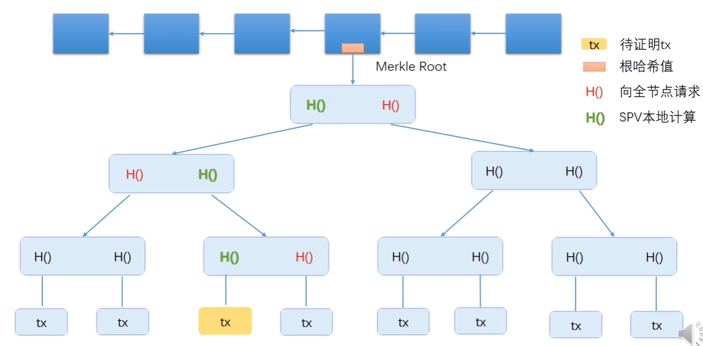

不要被比特币限制了想象力。

## 密码学基础

加密货币不加密，区块链上所有交易、地址都是公开的。

主要用到的密码学知识：哈希、签名

### 哈希（cryptographic hash function）特性: 

（1）collision resistance：

耐碰撞，尽量避免哈希碰撞

**有什么用？**

非常难篡改文件而不被检测，比如验证云存储完整性。

因为，篡改了想不被发现，必须生成同样的哈希，也就是所谓哈希碰撞。

但是，目前没有高效的办法，人为制造哈希碰撞。

但但是，一般来说哈希碰撞是不可避免，因为输入空间无限大，输出是固定大。

（2）hiding:

单向性，哈希的结果不能倒推输入。

（3）两个性质结合，实现 digital commitment (digital equivalent of a sealed envelope)

比如，预测股票结果。

不能把股票结果直接公开，公开的话会影响结果。

可以把预测结果的哈希值，公布。

之后再公布你的预测结果。

（4）比特币中的哈希函数还要求：puzzle friendly

想得到这样一个哈希值：k个0开始的。。

想要得到这个哈希值，`没有捷径，必须一个个试`（跟挖矿相关）。

挖矿很难，验证很容易哦！

### 签名

要讲签名，先讲比特币的账户管理方式

**比特币中怎么开账户呢？**

本地创建一个`公私钥对`，源于非对称加密体系（asymmetric encryption algorithm）。

公钥相当于银行账号。

私钥相当于账户密码。

**要公私钥干嘛呢？**

做签名！

别人怎么知道一笔交易是你发起的？就是私钥签名和公钥验证的过程。

**两个人生成的公私钥对相同怎么办？**

理论上好像可以。

但实际上可能性微乎其微，忽略不计。

`比特币系统中一般是对一个message哈希，然后对哈希签名。`

## 比特币的数据结构

**一个重要的概念：`哈希指针`**

普通的指针：存一个结构体在内存中的地址。

哈希指针：除了保存起始地址之外，还要保存结构体的哈希值。

不光能找到位置，还能检测有没有被篡改。

**区块链和普通链表有什么区别？**

一个区别就是用哈希指针代替了普通指针。

【创世区块】<- 【H()】<- 【H()】<- 【H()】<- 【H()】

每个区块都包含`指向前一个区块的哈希指针`。

取哈希是把整个区块一起取哈希。

通过这个数据结构实现temper-evident log.

比如某个人篡改了某个区块的结果，下个下个所有的哈希都对不上了，都得改。

`只要记住最后一个哈希值，就能检测前面任何一个位置的修改。`

`普通链表改一个元素没关系。`

`区块链改一个，后面得所有都得改。`

**比特币区块中交易的组织形式：Merkle tree**

把Merkle tree的根哈希值存在 block header 中。

block header 不含交易。

block body 含有交易。

`Merkle tree 有什么用？`

提供merkle proof

比特币中有两种节点：全节点（保存整个区块）和轻节点（只保存blocker header）

`如何向轻节点证明某个交易是写入到区块链的？`

找到交易到根节点的路径，这条路径就是merkle proof

（1）轻节点向全节点发出请求，请求能证明该交易在merkle tree的一个merkle proof。

（2）全节点收到请求后，只要把图中三个标为红色的哈希值发给轻节点就行了。

（3）轻节点就可以在本地计算出图中三个标为绿色的哈希值

（4）算出根哈希值后，和block header里面的哈希值对比就知道结果了

## 共识协议和系统实现

**央行如何发行数字货币？**

100元 signed by CB ? 这样可以？

可以用公钥验证，确实是CB发行的。

`这就是个文件，可以复制阿艹...`

这就是传说中的`双花攻击，数字货币所面临的主要挑战。`

改进：央行给每个数字火币一个编号，然后央行维护一个数据库，记录每个编号的数字货币是在谁手里，这样设计可以嘛？

可以防范双花攻击，但任何两人之间都需要经过央行，属于太中心化的方案。

如何设计一个去中心化的数字货币方案？

**比特币如何设计数字货币**

（1）谁来发行货币？

（2）怎么防范双花攻击？

维护一个数据结构，由所有用户共同维护，这个数据结构就是区块链。

每个交易包括输入和输出两部分，输入部分必须包括币的来源和A的公钥，输出部分要给出收款人的公钥的哈希，类似于它的地址。

比如用户A获得铸币权，10个比特币，然后进行转账交易

A->B(5)，A必须对交易签名，并且需要B的地址。

`B需要知道A的什么信息吗？`必须知道A的公钥，所有节点都需要A的公钥去验证签名啊。

`怎么才能知道A的公钥？`铸币交易里有A的公钥的哈希。所以A自己给出的公钥进行哈希再对比，可以判断A的公钥是对的。

A->C(5)，A必须对交易签名

币的来源的指针。

**block header**

version

前一个区块的哈希值（只算块头）

merkle 树根哈希值

target

nonce

**block header**

transaction list

**全节点：**

一直在线

在本地硬盘上维护完整的区块链信息

在内存里维护UTXO集合，以便快速检验交易的正确性

监听比特币网络上的交易信息，验证每个交易的合法性（有没有合法的签名，是不是double spend）

决定哪些交易会被打包到区块里（只要是合法的交易，并且符合交易费，就会被打包进去）

监听别的矿工挖出来的区块，验证其合法性（首先看区块中的每一个交易都要合法，发布的区块是不是符合难度要求，每两周按照比特币协议要求调整挖矿难度，检查区块是在延申最长合法链）

挖矿：

（1）决定沿着哪条链挖下去？

（2）当出现等长的分叉的时候，选择哪一个分叉？（选择最先听到的分叉）

**轻节点**（大部分是轻节点）

不是一直在线。

只保存Block Header。

只保存与自己有关的交易。

只能验证和自己有关的交易的合法性。

无法检测网上发布的的区块的正确性。

可以检查挖矿的难度是否符合要求。

只能检查哪个是最长链，不知道哪个是最长合法链。

**比特币中的共识协议**

有些节点恶意，假设大多数是好的，怎么设计一个共识协议呢？

`直接投票行不行？`

不行，有投票权的问题。

如果投票权有严格定义，比特币创建一个账户容易，不停创建账户，有好多投票权了啊。这个叫`女巫攻击`。

`比特币用的也是投票机制，靠算力投票`

每个节点都可以在本地组装区块，然后开始尝试nonce，看哪一个能满足要求。

如果找到了nonce，它就获得了记账权，就可以将区块写入区块链。

其他节点把block header里的验证，再验证区块里的交易是不是合法的。

挖矿奖励：如果获得记账权，就可以进行铸币。

能造多少币？

一开始50个。

21万个区块之后减半。

**比特币的系统实现**

比特币采用`基于交易的账本模式（transaction-based ledger）`。

但是系统上并没有哪个地方显示哪个账户多少钱？？？

需要交易记录来推算的。

`比特币的全节点要在内存中维护一个UTXO（Unspent Transaction Output）的数据结构。`

区块链上很多交易，有些交易的输出可能已经被花掉了，有些还没有被花掉，所有那些还没有被花掉的交易的输出组成的集合就是UTXO。

一个交易可能有多个输出，比如A的转账交易。

A->B(5), B拿到5个比特币把它花掉了，就不在UTXO里面了。

A->C(3)，C还没花出去，所以这个输出是在UTXO里面的。

UTXO中的每个成员要给出产生这个输出的交易的哈希值，以及它在这个交易里是第几个输出。

`UTXO有什么用？为了快速检测双花攻击。`

检测新发的交易是否合法。查一下UTXO，你想花的币如果在这个集合里面才是合法的，如果不在，这个币要么不存在，要么已经被花过了。

每个交易会消耗一些输出，同时也会产生新的输出。

A->B(5)，B->D(5), 这个新的输出又要保存在UTXO里

A->C(3)

每个交易有多个输入，也有多个输出，所有输入的金额要等于输出的金额。

（total inputs == total outputs）

多个输入可能对于多个地址，每个地址都要提供对应的签名。

有些交易可能total inputs 略微大于 total outputs。

里面的差额作为交易费给获得记账权，发布区块的节点。

`除了transaction-based ledger模式，还有一种，account-based ledger(以太坊用的)`

系统显示每个账户的余额。

相比之下，比特币基于交易的模式隐私保护较好，但也有一定代价。

比如转帐交易中要说明币的来源，比如说你要转给别人10个比特币，谁知道你有没有这10个比特币。没有账户的概念。

以太坊就不存在这个问题。

`新发布的区块在网络中是怎么传播的？`

比特币运行在应用层，运行比特币协议。

底层网络层运行p2p overlay network，所有节点对等。

有一个种子节点，他会告诉你网络中的其他节点。

离开的时候不用通知其他节点，其他节点过一段时间没有听到你的消息，就会把你删掉。

比特币网络的设计原则是`简单鲁棒，而不是高效。`

消息传播在网络中采取flooding，节点收到消息后传给邻居节点，邻居节点可能是随机的。

每个节点要维护一个`等待上链的交易集合`。第一次收到交易，把交易加入集合，并且转发给邻居节点，下一次再收到这个交易就不用再转发了。

如果两个有冲突的交易同时被广播到网络上。

A -> B

A -> C

网络中的节点根据位置的不同，有的先收到A->B，之后收到另一个就是非法的。

## 挖矿算法和难度调整

**挖矿算法**

H(block header) <= target

一个个试nonce，直到符合条件。

一旦有人找到这个nonce，其他人验证非常容易。

**难度调整**

`出块时间太短会有什么问题？`

传播时间>出块时间，会出现很多的分叉。

`以太坊的出块时间15秒，需要设计一个新的共识协议ghost`

`比特币怎么调整区块难度？`

差不多每隔14天(2016个块)调整一次。

target = target * (actual time/expected time)

actual time = 最近2016个区块实际花的挖矿时间

`怎么让所有矿工同时调整目标值？`

计算target写在比特币的代码里。

如果某个节点恶意不调，不调的话你发布的区块诚实的节点不会承认。

## 比特币脚本

## 软分叉和硬分叉

分叉的可能性：

（1）两个节点同时挖到矿，临时性的分叉（state fork）

（2）分叉攻击，人为造成（forking attack）

（3）比特币协议发生改变，软件升级，大部分节点升级了软件，少数节点不支持，产生分叉（protocol fork）

协议修改内容的不同，分为硬分叉，软分叉

**硬分叉：**

例子：比特币的区块大小限制。

有些人认为1M太小，提出增加block size limit

有了发布软件更新，从1M-> 4M

大多数节点都更新了（按算力来算的，不是按账户来算）

这时候，系统运行起来，会有什么结果。

这个分叉是永久性的。

两条平行运行的链，变成社区分裂。

**软分叉：**

假设有人发布软件更新，把区块大小变小了，1M -> 0.5M

大多数是新节点，同意，小部分是旧节点，不同意。

旧节点也认新节点的链，导致这个分叉是临时性的。

导致旧节点白挖了。

## 匿名和隐私保护