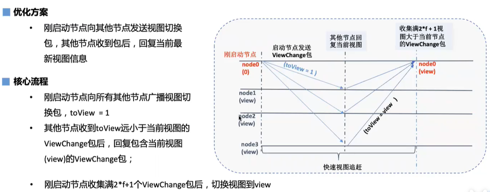

## 什么是PBFT

**PBFT**(Practical Byzantine Fault Tolerance)共识算法可以在`少数节点作恶(如伪造消息)场景中达成共识`，它采用签名、签名验证、哈希等密码学算法确保消息传递过程中的防篡改性、防伪造性、不可抵赖性，并优化了前人工作，将拜占庭容错算法复杂度从指数级降低到多项式级别，在一个由(3*f+1)个节点构成的系统中，`只要有不少于(2*f+1)个非恶意节点正常工作，该系统就能达成一致性`，如：7个节点的系统中允许2个节点出现拜占庭错误。

## 工作原理

leader打包区块，将新区块封装在prepare包内，然后向所有其他节点广播prepare包

其他节点收到prepare包，处理prepare包执行区块，产生区块执行结果，签名后广播签名包

节点收集签名包，收集慢（2*f+1）个签名包后，向其他节点广播commit请求

节点收集满（2*f+1）个commit请求，将区块写入数据库

## Leader异常情况

Leader节点异常？不在线？恶意不响应别人？

为了解决这个问题，引入了`视图切换`的概念。

所有节点都会判断自己的共识有没有超过指定的时间。

如果超过指定时间没有开始新的一轮共识，那么就会触发视图切换。

节点超时会向其他节点广播一个 viewChange 包。toView = view + 1

当收集满（2*f+1）个相同的包后，将视图切换为toView

这个时候就会进行`Leader的切换`！

## 性能问题

打包->共识->打包->共识过程，`leader轮流串行打包，共识的时候，打包线程不工作。`

解决方案：下一轮共识leader收到prepare包，提前打包区块。

交易验签：节点收到prepare包后，进行验签，`交易越多，验签开销越大`。

## 存储问题

落盘空块浪费存储空间

## 可用性问题

新节点刚启动无法快速与其他节点达成一致视图

## 节点类型

- **Leader/Primary**: 共识节点，负责将交易打包成区块和区块共识，每轮共识过程中有且仅有一个leader，为了防止leader伪造区块，每轮PBFT共识后，均会切换leader；
- **Replica**: 副本节点，负责区块共识，每轮共识过程中有多个Replica节点，每个Replica节点的处理过程类似；
- **Observer**: 观察者节点，负责从共识节点或副本节点获取最新区块，执行并验证区块执行结果后，将产生的区块上链。

其中Leader和Replica统称为共识节点。

## 视图

PBFT共识算法使用视图view记录每个节点的共识状态，`相同视图节点维护相同的Leader和Replicas节点列表。当Leader出现故障，会发生视图切换`，若视图切换成功(至少2*f+1个节点达到相同视图)，则根据新的视图选出新leader，新leader开始出块，否则继续进行视图切换，直至全网大部分节点(大于等于2*f+1)达到一致视图。

