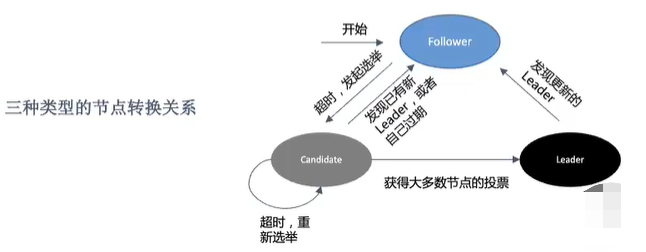
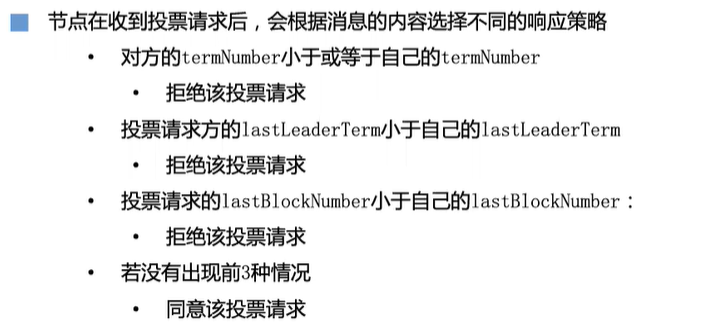
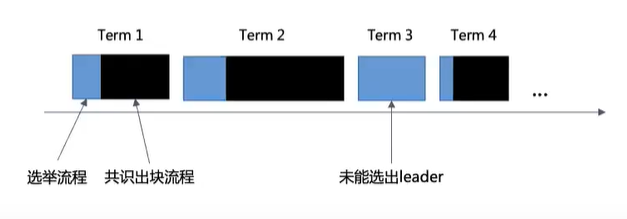

## Raft 3种节点

**Leader:** 负责从自己的交易池中取出交易、构造待共识区块并将待共识区块复制至其他节点。

**Candidate:** 由Follower转换而来，可以参与Leader节点竞选。

**Follower:** 参与Candidate投票，接收Leader节点的心跳包及区块数据。

## 节点转换

所有节点启动时都是 Follower 状态；

Follerer 节点在一段时间内如果没有收到 Leader 的心跳，则从 Follower 切换到Candidate, 发起选举;

如果收到超过一半的赞成票（含自己的一票）则切换到 Leader 状态；

如果发现其他节点已更新，则主动切换到 Follower。

**投票过程：**

投票期间，所有的Candidate节点都会向其它节点广播自己的term信息。

其他节点收到了term，拿本地的term与之对比，如果这个term比它本地大，那么它就会投这个candidate一票。

当获得的选票超过一半的时候，就会切换成leader。

## 任期

Raft 算法将时间划分为不定长度的任期（Terms），任期为连续的数字，`在共识过程中起到逻辑时钟的作用`。

每一个节点都会保存一个用于记录当前节点已知的最新任期 termNumber，节点间互相通信时都会带上这个序号。

若一个节点发现另一个节点的termNumber，则更新自己的termNumber。

