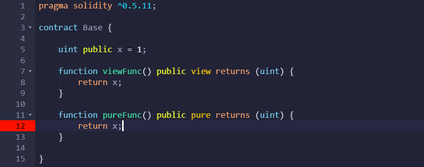
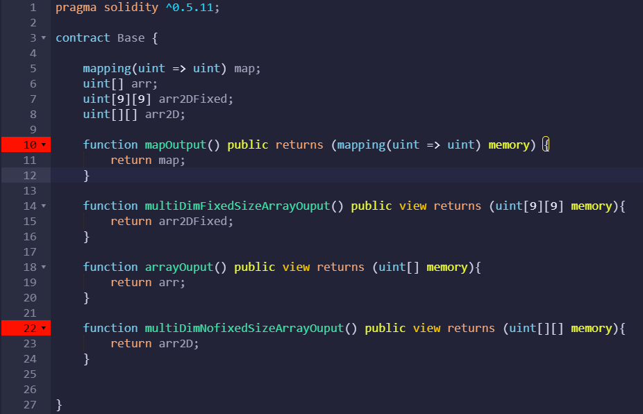

## 函数和状态变量可见性

函数可以指定为任意一种，`默认为public`

状态变量不能设置为external, `默认是internal`

**private：**

变量或函数声明为private，意味着`只能在内部访问`，子合同和其他合同无法访问它。


**internal：**

当状态变量或函数声明为internal时，这可以在`合同本身和子合同中访问`，其他合同无法访问它。

**public：**

状态变量或函数声明为public，`可以被任何合同和账户访问`。

**external:**

如果函数声明为external，这个函数`只能被其他合同和账户访问,不能从内部调用。`


## storage & memory

**storage:** 函数外部生命的状态变量会存储在区块链上。

**memory:** 函数内部声明的变量的生命周期只在函数调用期间，不会存储在区块链上。

## view & pure

view functions `do not modify state`

pure functions `do not modify state and do not read state`

a pure function `can only call other pure funcion`.



## Funciton input & output

**Invalid Inputs & Output for public functions:**

- `{}` map
- `[][]` multi-dimensional arrays (unfixed size)

**Input:**


**Output:**



## Function Modifiers

function modifiers 是有用的`函数修饰符`，是`可重用的代码`，可以在`代码之前或之后`执行modifiers的功能。

可以`使代码更具可读性`。

**How to write function modifiers**

初始代码：


modifier代码：


## 继承

**1) 简单的继承和重写父类方法**

```java
pragma solidity ^0.5.11;

contract A {
    function getContractName() public pure returns (string memory) {
        return "Contract A";
    }
}

contract B is A{
    function getContractName() public pure returns (string memory) {
        return "Contract B";
    }
}
```

**2) 多重继承**

```java
pragma solidity ^0.5.11;

contract A {
    function foo() public pure returns (string memory) {
        return "Contract A";
    }
}

contract B {
    function foo() public pure returns (string memory) {
        return "Contract B";
    }
}

contract C is A, B{
    // 继承的是B的foo
}
```

