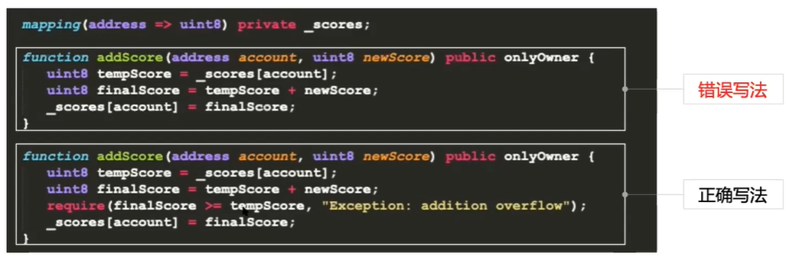
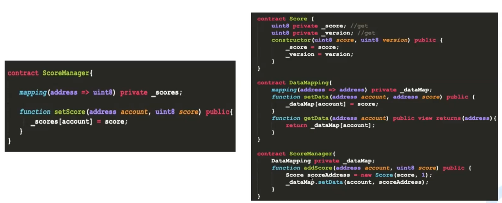
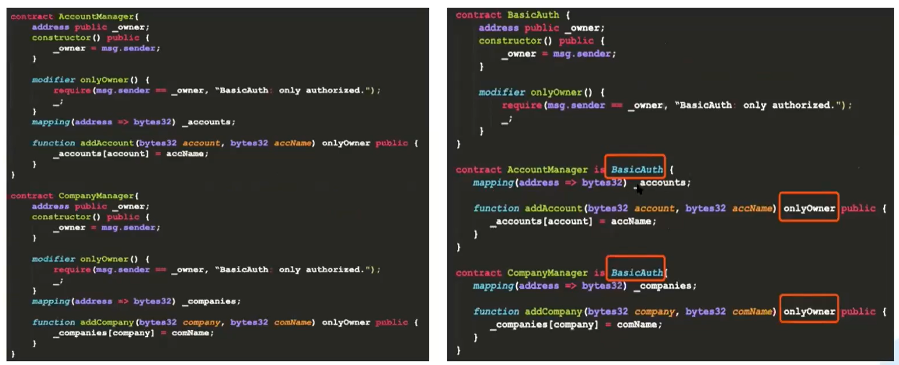

## 智能合约交易执行流程

交易构建 -> 交易签名 -> 交易广播 -> 交易打包 -> 交易执行 -> 交易共识 -> 出块落盘

交易构建阶段：`合约部署`时依赖合约的BIN编码，`函数调用`依赖智能合约的ABI。

## Solidity合约

**修饰符：**用于某些条件或者权限的校验。

**函数事件：**记录方法调用过程中执行的情况，方便智能合约监控。

**优点：**用户多，应用广泛，逐渐成熟稳定，功能强大。

**缺点：**学习成本、交易在EVM内串行执行，`性能较差，内存开销大`，数据和逻辑相对耦合，不便于合约升级和存储扩容。

## CRUD 智能合约

`为了提升区块链的容量和性能`，FISCO BCOS设计了一套CRUD操作的接口，让存储操作更加简单方便。

**优点：**

类似数据库操作，学习门槛低

通过预编译引擎，可并行执行，性能高

数据和逻辑分离，便于合约升级及存储扩容

**缺点：**

支持平台有限

业务场景有限制，适合做一些逻辑简单的业务，比如存证

## 合约安全（基础和命脉）

技巧一：`隐私数据加密上链`

技巧二：`合理设置状态变量和函数的可见范围`

技巧三：`函数权限及变量边界检查`

技巧四：利用安全工具，对合约进行安全扫描，如Security, Mythx, Slither

## 合约性能（系统可用性重要指标）

技巧一：减少不必要的计算

技巧二：减少不必要的数据

技巧三：减少跨合约调用

利用不同的数据组装形式

巧用继承，减少跨合约调用

技巧四：空间换时间

技巧五：紧凑状态变量打包

技巧六：注意函数修饰符，减少不必要的执行

## 合约可扩展性（系统业务变更和升级有效手段）：

技巧一：逻辑与数据分离

技巧二：抽象通用逻辑

技巧三：模块化编程，单一职责模式

