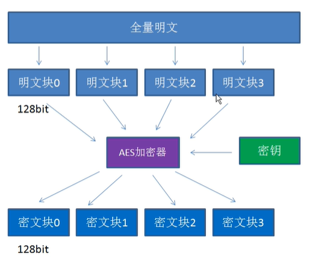
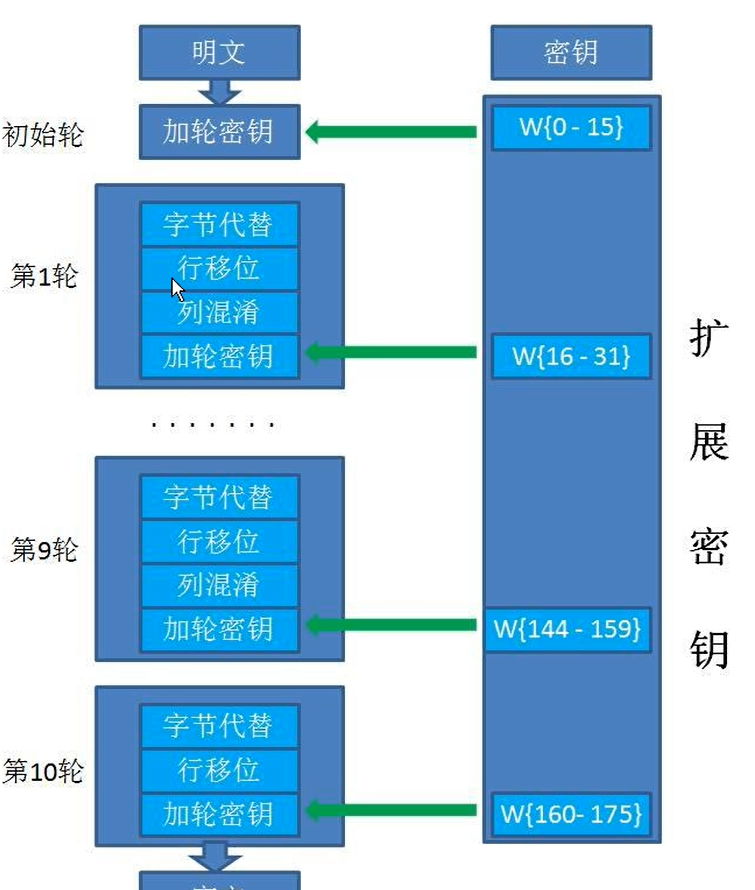
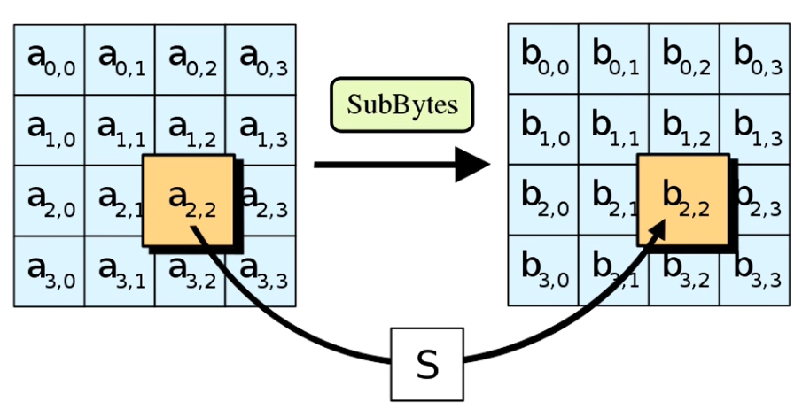
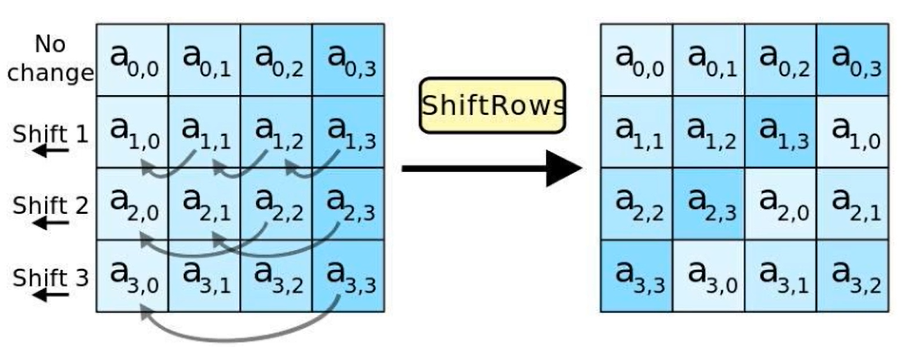
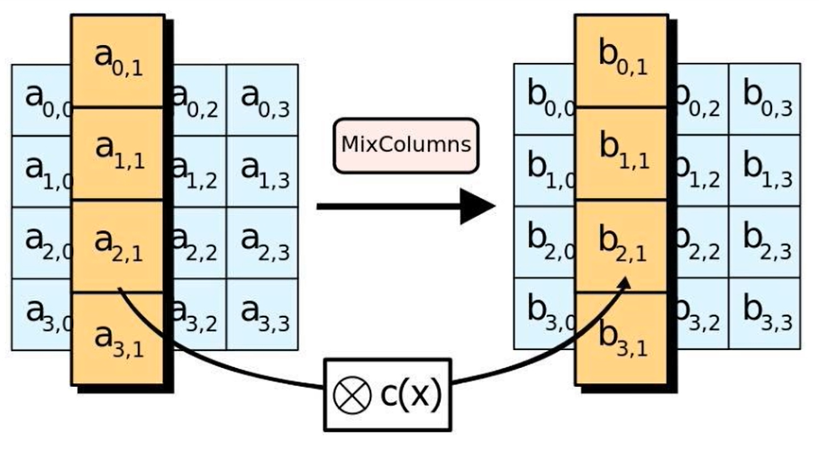
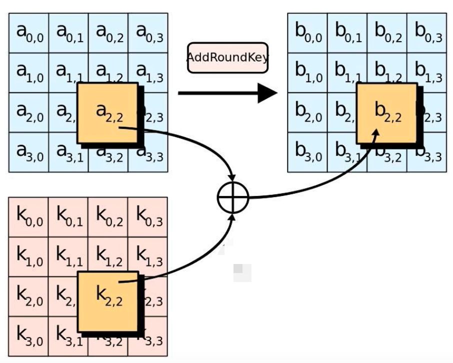

## 什么是AES

AES (Advance Encryption Standard) 是取代其前任标准 (DES) 而成为新标准的一种`对称加密算法`。2000年从众多候选算法中选出了`Rijndael`作为AES。

AES是一种分组密码算法，`分组长度为128比特`，密钥长度可以以32比特为单位再128比特到256比特的范围内进行选择。不过在AES的规格中，`密钥长度只有128、192和256比特三种`。`密钥的长度不同，推荐加密论数也不同`。

## 加密过程

（1）把明文按照128 bit 拆分成若干个明文块。

（2）按照选择的填充方式来填充最后一个明文块。

（3）每一个明文块利用AES加密器和密钥，加密成密文块。

（4）拼接所有的密文块，成为最终的密文结果。

## 分组加密

AES算法在对明文进行加密的时候，把明文拆分成一个个独立的明文块，每一个明文块长度128bit。

经过AES加密器处理之后，生成一个个独立的密文块，这些密文块拼接在一起，就是最终的AES加密结果。



## 明文填充

如果分组后最后一个明文块长度只有64bit，不足128bit，那么需要对明文块进行`填充`。

AES有许多不同的填充算法，举出几种典型的填充算法。

**（1）PKCS5Padding（默认）**

如果明文块少于16个字节（128 bit），在明文块末尾补足相应数量的字符，且每个字节的值等于缺少的字符数。

比如明文：(1, 2, 3, 4, 5, a, b, c, d, e) 缺少6个字节，

则补全为(1, 2, 3, 4, 5, a, b, c, d, e, `6, 6, 6, 6, 6, 6`)

**（2）ISO10126Padding**

如果明文块少于16个字节，在明文块末尾补足相应数量的字节，最后一个字符值等于缺少的字符数，其他字符填充随机数。

比如明文：(1, 2, 3, 4, 5, a, b, c, d, e) 缺少6个字节，

则`可能`补全为(1, 2, 3, 4, 5, a, b, c, d, e, `6, c, 3, g, &, 6`)

需要注意的是，如果在AES加密的时候使用了某一种填充方式，`解密的时候也必须采用同样的填充方式`。

## 工作模式

AES的工作模式，体现在把明文块加密成密文块的处理过程中。AES提供了五种不同的工作模式：`ECB、CBC、CTR、CFB、OFB`。

同样，如果在加密的时候使用了某一种工作模式，`解密的时候也必须采用同样的工作模式`。

**（1）ECB (Electronic Codebook Book) 电码本模式**

最简单的工作模式，在该模式下，每一个明文块的加密是`完全独立，互不干涉`的。

**好处**：简单，有利于并行计算

**缺点：**相同的明文块经过加密会变成相同的密文块，因此安全性较差。

**（2）CBC (Cipher Block Chaining) 密码分组链接模式**

引入了一个新的概念：初始向量IV（Initialization Vector）

它的作用和MD5的“加盐”有些类似，目的是防止相同的明文块加密成相同的密文块。

在每一个明文块加密前都会让明文块和一个值先做异或操作。IV作为初始化变量，参与第一个明文块的异或，后续的每一个明文块`和它前一个明文块所加密出的密文块做异或`。

**好处：**安全性更高

**坏处：**无法并行计算，增加了复杂度。

**（3）CTR (Counter) 计算器模式**

**（4）CFB (Cipher FeedBack) 密码反馈模式**

**（5）OFB (Ouput FeedBack) 输出反馈模式**

所有工作模式的差别体现在宏观上，即明文块与明文块之间的关联。AES加密器的内部处理流程都是相同的。

## Java 如何调用

AES算法在 Java 的 javax.crypto包里有很好的封装。

```java
import javax.crypto.*;
import javax.crypto.spec.SecretKeySpec;
import java.io.UnsupportedEncodingException;
import java.security.InvalidKeyException;
import java.security.NoSuchAlgorithmException;
import java.security.SecureRandom;

public class AES {
    public static void main (String[] args) throws NoSuchAlgorithmException, NoSuchPaddingException, UnsupportedEncodingException, InvalidKeyException, BadPaddingException, IllegalBlockSizeException {
        String password = "12345";
        String content = "i love you!!!!!!";

        KeyGenerator kgen = KeyGenerator.getInstance("AES"); // 创建AES的KEY生产者
        kgen.init(128, new SecureRandom(password.getBytes())); // 利用用户密码作为随机数初始化
        SecretKey secretKey = kgen.generateKey(); // 根据用户密码，生成一个密钥
        byte[] enCodeFormat = secretKey.getEncoded(); // 返回基本编码格式的密钥
        SecretKeySpec key = new SecretKeySpec(enCodeFormat, "AES"); // 转换为AES专用密钥
        Cipher cipher = Cipher.getInstance("AES/CBC/NoPadding"); // 创建加密器
        byte[] byteContent = content.getBytes("utf-8");

        cipher.init(Cipher.ENCRYPT_MODE, key);
        byte[] result = cipher.doFinal(byteContent); // 加密
    }
}
```

**说明：**

我们在调用封装好的AES算法时，表面上使用的key并不是真正用于AES加密解密的密钥，而是用于生成真正密钥的`“种子”`。

填充明文时，如果明文长度原本就是16字节的整数倍，那么除了NoPadding以外，`其他的填充方式都会填充一组额外的16字节明文块`。

## AES算法底层原理框架



AES加密不是一次把明文变成密文，而是先后`经过很多轮加密`。

**具体分成多少轮呢？**

初始轮（Initial Round）1次

普通轮 （Rounds）N次

最终轮（Final Round）1次

**除去初始轮，各种Key长度对应的轮数如下：**

AES128：10轮

AES192：12轮

AES256：14轮

**不同阶段的Round有不同的处理步骤**

`初始轮`只有一个步骤：

加轮密钥（AddRoundKey）

`普通轮`有四个步骤：

字节代替（SubBytes）

行移位（ShiftRows）

列混淆（MixColumns）

加轮密钥（AddRoundKey）

`最终轮`有三个步骤：

字节代替（SubBytes）

行移位（ShiftRows）

加轮密钥（AddRoundKey）

## 字节代替（SubBytes）



16字节得明文块在每一个处理步骤中都被排列成4*4的二维数组。

所谓字节代替，就是`把明文块的每一个字节都替换为另外一个字节`。替换规则依据一个被称为S盒（Subtitution Box）的16*16大小的二维常量数组。

## 行移位（ShiftRows）



第一行不变

第二行循环左移1个字节

第三行循环左移2个字节

第四行循环左移3个自己

## 列混淆（MixColumns）



这一步，输入数组的每一列要和一个名为修补矩阵（fixed matrix）的二维常量数组做矩阵相乘，得到对应的输出列。

## 加轮密钥（AddRoundKey）



这一步是`唯一利用到密钥的一步`，128 bit的密钥也同样被排列成4*4的矩阵。

让输入数组的每一个字节a[i, j] 与密钥对应位置的字节k[i, j] 异或一次，就生成了输出值b[i, j]。

`加密的每一轮所用到的密钥并不相同。涉及到扩展密钥的概念（KeyExpansions）`。

## 扩展密钥 （KeyExpansions）

AES用长度 4 * 4 * （10+1）字节的数组W来存储所有轮的密钥。

W[0-15]等同于原始密钥的值。

后续每一个元素W[i] 都是由W[i-4]和W[i-1]计算而来，知道数组W的所有元素都赋值完成。

## AES的解密流程

解密流程基本是把加密流程倒置过来，顺组变为最终轮->普通轮->初始轮。

扩展密钥的使用顺序也和加密相反。