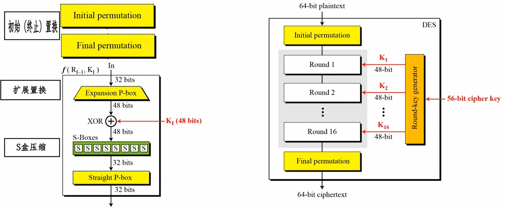
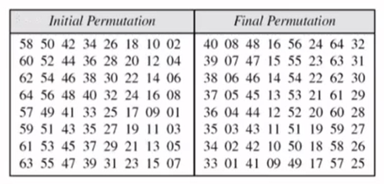
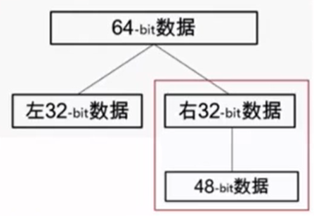
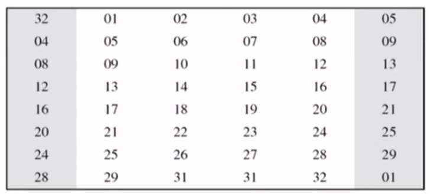
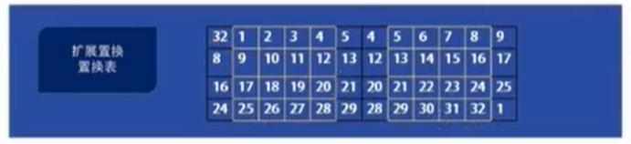
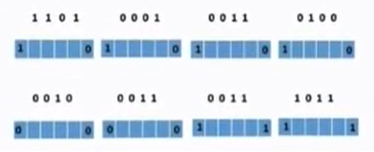
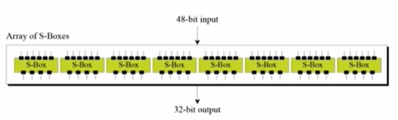
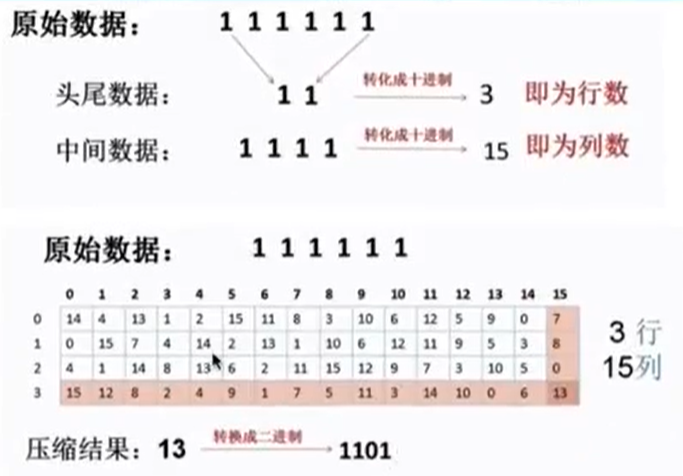
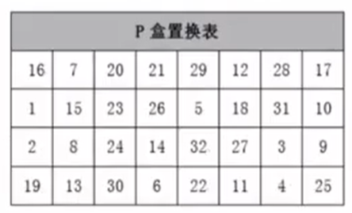

## 什么是DES

DES(Data Encryption Standard) 是1977年美国联邦信息处理标准中采用的一种`对称加密`。现在已经能够被暴力破解了。

DES是以64比特的明文为一个单位来进行加密的，这个64比特的单位称为分组，`将64比特明文加密成64比特密文，密钥长度是64比特`，但每隔7比特会设置一个用于错误检查的比特，因此`实质上其密钥长度是56比特`。

## DES 加密过程

初始(终止)置换 -> 扩展置换 -> S盒压缩

[b站视频链接](https://www.bilibili.com/video/BV1QW411B7A4/?spm_id_from=333.788.videocard.0)

当n个64位明文数据块都经过DES加密处理后，串联输出密文

**（1）初始置换和终止置换**

**初始置换和终止置换表**

初始和终止置换其实都是按照两张表的规则来置换的。具体的规则是按照这两张表，把划分好的`64位进行重新排序`，如把第58位放到第一位等。

**（2）扩展置换**

经过初始置换的64位数据被分为左右32位数据，对`其中一边的数据进行扩展置换`得到48位的数据。

**扩展置换表**

**具体操作**

**（3）S盒压缩**

经过扩展的48位明文和48位密钥进行`异或处理`后再使用`8个S盒压缩处理`后得到32位数据，实际上就是把48位的输入等分成8块，每块6位输入压缩为4位输出。

**具体压缩过程**

如，原始数据111111，取第一位和最后一位组成一组数据再转为10进制，即为行数。然后取中间四位转换位10进制数，即为列数，根据行数和列数即可在压缩表中找到对应的压缩数，再把该S盒压缩处理压缩数转换为二进制输出，则完成了6位到4位的压缩过程，其他组的压缩过程全部完全一样。

经过32位的压缩输出，`再经过一次P盒置换`，就得到一轮运算中的最后输出。

## 什么是3DES

DES已经不安全，3DES(triple-DES)是为了增加DES的强度，`将DES重复3次`所得到的一种密码算法。

**特点：**

**加密过程：**加密 -> 解密 -> 加密

（1）解密过程是已解密的方式进行加密

（2）密钥长度 24 bytes

（3）数据分组长度没有变：8 bytes

**解密过程：**解密 -> 加密 -> 解密

