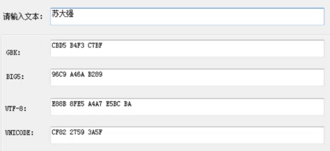

## 为什么需要编码和解码
在计算机世界，各种信息都是以二进制的形式存在。

比如文字在电脑中的存储：
编码：从文字到0、1的映射
解吗：从0、1到文字的映射

## 什么是字符和字符集
字符，就是各种文字和符号的总称。
字符集，就是多个字符的集合。

常见的字符集有：ASCII字符集、GB2312字符集、BIG5字符集、GB18030字符集、Unicode字符集等。

## 字符编码

ASCII ：美国人发明的，128个字符，但不能表示汉字。

GB2312 (中国的国家标准第2312条)：只能识别中文简体，英文一个字节，中文两个字节。

GBK: 是上面的扩展，汉字编码标准之一 , 一个汉字需要两个字节编码。

BIG-5: 通行于台湾、香港的繁体字编码方案。也是双字节编码方案。

Unicode： 统一码、万国码。统一了所有语言的编码。它可以根据不同需求以UTF-8、UTF-16、UTF-32等方式编码。

UTF-8: 互联网的普及强烈要求一种统一的编码方式，UTF-8就是互联网上使用最广的一种Unicode实现方式，它是一种变长的编码方式，它可以使用1-4个字节表示一个符号，根据不同的符号而改变字节长度。一个汉字需要三个字节表示。

## UTF-8 编码规则

（1） 对于单字节符号，字节的第一位设为0，后面7位为这个符号的Unicode码。因此，对于英语字母，UTF-8编码和ASCII码是相同的。

（2）对于n字节的符号（n>1），第一个字节的前n位都设为1，第n+1位设为0，后面字节的前两位一律设为10。剩下的没有提及的二进制位，全部为这个符号的Unicode码。