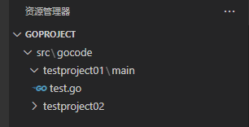

## 程序结构：



## 开始写代码：第一个HelloWorld:

```go
package main // 声明文件所在的包，每个go文件必须有归属的包
import "fmt" // 引入程序中需要用的包，为了使用包下的函数
func main() { // main 主函数 程序的入口
	fmt.Println("Hello RichRunRun!") // 在控制台打印输出一句话
}
```