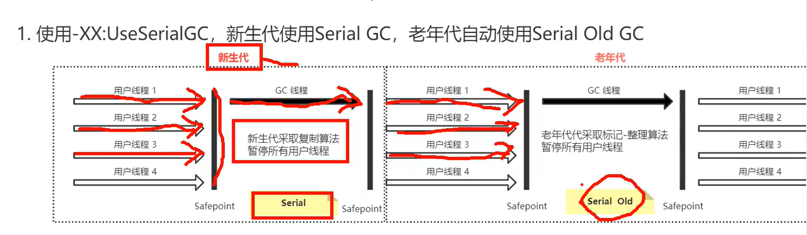

## 什么是可回收垃圾对象？
当一个对象没有引用指向它的时候。
> Object obj = new Object();
> obj = null;

## 如何找到垃圾对象
1. 引用计数法

  每个对象有一个引用计数属性，新增一个引用时计数加1，引用释放时计数减1，计数为0时可以回收。

  `可能会出现A引用了B，B引用了A，永远无法被回收`。

  效率非常高，java不采用。

  

2. 可达性分析算法

  从GC Roots开始向下搜索，搜索所走过的路径称为引用链。当一个对象到GC Roots没有任何引用链相连时，则证明此对象是不可用的，那么虚拟机就判断是可回收对象。

## GC ROOTs对象是哪些对象

`虚拟机栈`中引用的对象

`本地方法栈`中引用的对象

方法区中`静态属性`引用的对象

方法区中`常量`引用的对象

## 强引用、软引用、弱引用、虚引用

（1）强引用：

直接创建一个对象：Object obj = new Object(); 

在栈帧有效的作用域内，是永远不会被回收的。

（2）软引用：

指被SoftReference类实现的引用。

特征是当系统有足够的内存的时候，它能够存活。

当系统内存不足，垃圾回收的动作到来时，它会被回收释放内存。

（3）弱引用

指被WeakReference实现的引用，它只能存活到下一次垃圾回收发生之前。

如果进行垃圾回收，那么一定会被回收。

（4）虚引用

指被PhantomReference类实现的引用，无法通过虚引用来获取到一个对象实例。

被用来跟踪对象引用被加入到队列的时候。

## 垃圾回收算法有哪些
（1）. Mark-Sweep（标记清除算法）- 位置不连续，产生碎片

   

（2）. Copying（复制算法）- 没有碎片，浪费空间

   

（3）. Mark-Compact（标记整理）- 没有碎片，效率偏低

   

（4）`分代回收算法`

所有新对象都在Eden区生成，当Eden区填满之后，将会触发一次新生代的垃圾回收，称之为`minor GC`。这时候直接将存活对象直接复制到两个survivor区中的任何一个，然后将Eden区直接清空即可完成这次回收。

Survivor中有一些对象会在下次minor GC被标记为垃圾，这时候将Eden区和Survivor区存活对象复制到另一个Survivor区，之后清空前面两个区。

新生代每发生一次minor GC，对象存活的年龄加一，达到阈值后送到老年代。

某些场景下，经历minor GC后，依然存活了大量对象，以至于`Survivor区根本不够容纳这些对象，这些对象也将直接进入老年代。`

有些大数组或者特别大的字符串，直接创建在老年代中。

老年代发生的GC称为`major GC`。

`什么时候会触发major GC呢？`

`年轻代用复制算法`的原因？

因为新生代对象生存时间比较短，80%都是要回收的对象，采用标记-清除算法则内存空间碎片化严重，采用复制算法可以灵活高效，且便与整理空间。

`老年代用标记清除算法或者标记整理算法：`

存活对象效率比较高，没有额外空间进行分配

`为什么要分代、分区？`

[IBM](https://www.nowcoder.com/jump/super-jump/word?word=IBM)的研究表明绝大多数对象都是朝生夕死的

`为什么新生代是8：1：1`

 GC是统计学测算出当内存使用超过98%以上时，内存就应该被minor gc时回收一次。

但是实际应用中，我们不能较真的只给 他们留下2%，换句话说当内存使用达到98%时才GC 就有点晚了，应该是多一些预留10%内存空间，这预留下来的空间我们称为S区（有两个s区 s1 和 s0），S区是用来存储新生代GC后存活下来的对象，而我们知道新生代GC算法使用的是复制回收算法。

所以我们实际GC发生是在，新生代内存使用达到90%时开始进行，复制存活的对象到S1区，要知道GC结束后在S1区活下来的对象，需要放回给S0区，也就是对调(对调是指，两个S区位置互换,意味着再一次minor gc 时的区域 是eden 加，上一次存活的对象放入的S区)，既然能对调，其实就是两个区域一般大。这也是为什么会再有个10%的S0区域出来。这样比例就是8:1:1了!!

## 常见的垃圾收集器

（1）Serial 新生代 串行

在垃圾收集的时候，只允许单个垃圾回收线程执行，其他的所有用户线程都得停下来，新生代采用复制算法，老年代采用标记整理算法。

（2）parNew 新生代 多线程版本的Serial

只负责新生代的收集，当CPU核心数多的时候适用

（3）Paraller Scaver 新生代

希望垃圾回收达到一个可控制吞吐量的一个状态。

（4）`CMS老年代` （Concurrent Mark Sweep）

中文：并发标记清除

过程：初始标记->并发标记（耗时）->重新标记->并发清除（耗时）

初始标记：仅仅标记GC ROOTS能直接连到哪些对象，加入扫描栈中，这个过程会有STW

并发标记：根据入栈的对象进行递归的扫描遍历，并发执行

重新标记：因为用户线程和收集线程同时执行，之前标记的东西可能不准确，这个过程是`STW`的

并发清除：标记清除

缺点：并发占用CPU，程序的执行线程少导致变慢。无法清除浮动垃圾，只能等到下一次清除。

（5）G1

