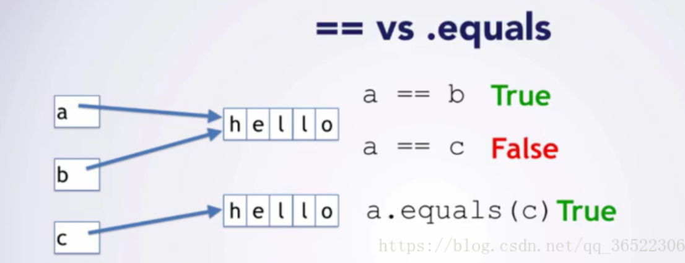
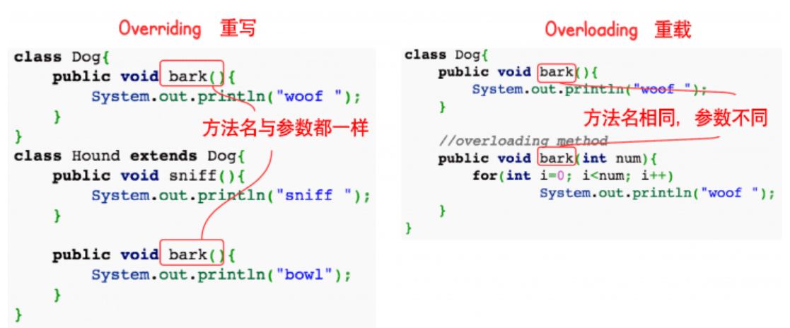
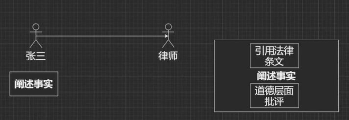

##  面向对象与面向过程
面向过程更注重事情的每一个步骤和顺序。直接高效。
面向对象更注重事情有哪些参与者、以及各自需要什么。易于复用、扩展和维护。

## 面向对象的三大特性
**封装**：封装的意义在于明确标识出允许外部使用的所有成员函数和数据项
内部细节对外部调用透明，外部调用无需修改或者关心内部实现

**继承**：继承基类的方法，并做出自己的改变和扩展
子类共性的方法或者属性直接使用父类的，不需要自己再定义，只需扩展自己的个性化

**多态**：基于对象所属类的不同，外部对同一个方法的调用，实际执行的逻辑不同
多态的三个条件：继承，方法重写，父类引用指向子类对象

> 父亲类型 变量名 = new 子类对象；
> 变量名.方法名();

##  JDK、JRE、JVM三者区别和联系
JDK: java开发工具，给开发人员用的，`JDK包含JRE`

JRE: java运行时环境，给运行Java程序的用户用的

JVM: 虚拟机，解释class文件编程机器码给机器学习

## 什么是字节码？采用字节码的好处是什么？

**java中的编译器和解释器**

java中引入了虚拟机的概念，即在机器和编译程序之间加入了一层抽象的虚拟的机器。

这台虚拟的机器在任何平台上都提供给编译程序一个共同的接口。

编译程序只需要面向虚拟机，生成虚拟机能够理解的代码，然后由解释器来将虚拟机代码转换为特定系统的机器码执行。

在java中，这种供虚拟机理解的代码叫做字节码（.class）

java源代码 -> 编译器 -> jvm可执行的字节码 -> jvm ->jvm中的解释器 -> 机器可执行的二进制机器码 -> 程序运行。

**采用字节码的好处**

在一定程度上解决了传统解释型语言执行效率低的问题，同时又保留了解释型语言可移植的特定。

## [List] List和Set的区别

List: `有序`，按对象进入的顺序保存对象，`可重复`，`允许多个Null元素对象`，可以使用Iterator取出所有元素，在逐一遍历，还可以使用get(int index)获取指定下标的元素
Set: `无序`，`不可重复`，`最多允许一个Null元素对象`，取元素时`只能用Iterator接口`取得所有元素，再逐一遍历各个元素

## [List] ArrayList 和 LinkedList区别

ArrayList: 基于`动态数组, 默认大小是10，扩容系数1.5`，连续内存存储，适合下标访问。
扩容机制：因为数组长度固定，超出长度时需要新建数组，然后将老数组的数据copy到新数组。

LinkedList: 基于`双向链表，不用扩容`，可以存储在分散的内存中，适合做数据插入和删除操作，不适合查询。
需要逐一遍历时必须使用Iterator而不能使用for循环，因为每次for循环体内通过get(i)取得某一元素时都需要对List重新进行遍历，性能消耗极大。

场景：使用尾插法并指定初始容量使用ArrayList可以极大提升性能

## [List] Vector 和 ArrayList 的区别

**相同：**都实现了List接口

**不同：**

	Vector: 线程安全，速度慢，扩容增长成2倍速
	ArrayList: 线程不安全，速度快，1.5倍增长

**Vector为什么用的少？**

	线程安全，牺牲了速度
	扩容大，需要连续存储空间比较大
	数组结构，插入，删除比较慢

## [Map] HashMap

（1）存储结构：entry的数组，entry<key, value>，entry本身也是一种链表结构，jdk8长度大于等于8变成红黑树.

（2）存储逻辑：根据计算hash值放到对应位置

（3）扩容方案：自身容量扩大以被，成倍数增长。

**底层实现：数组+链表**

计算key的hash值，二次hash然后对数组长度取模，对应到数组下标

如果没有产生hash冲突，则直接创建Node存入数组

如果产生hash冲突，先进行equals比较，相同则取代该元素，不同，则判断链表高度插入链表，链表高度达到8，并且`数组长度到64则转变为红黑树`，长度低于6则将红黑树转回链表

## [Map] LinkedHashMap


## [Map] TreeMap

## [Map] HashTable

## [Map] HashMap 和 HashTable 的区别？底层实现是什么？
**相同：**都实现了Map，用来存储<key, value>

**区别：**

	HashMap:线程不安全，速度快，key可以等于null
	HashTable:线程安全，速度慢，key等于null直接报错

## [Map] ConcurrentHashMap

## [Set] HashSet 如何检查重复

对象加入HashSet时，首先计算对象的HashCode。

如果HashCode对应的位置有值，会调用equals方法判断两个对象是否相同。

如果两者相同，HashSet就不会让其加入。

如果两者不同，就会重新散列到其他位置。

##  == 和 equals

如果是`基本类型`（int、short、long、float、double、byte、char、boolean），等号比较的是数值。

如果是`引用类型`（对象），等号是判断两个实例是不是指向同一个内存空间。

equals可以重写,自己定义比较规则，例如String、Integer是判断两个实例所指向的内存空间的值是不是相同

如果不写，就是比较引用地址是否相同。



> String str1 = "Hello"; // 在堆中的常量池中分配内存
> String str2 = new String("Hello");  // 堆中分配内存, 栈中存内存地址
> String str3 = str2; //引用传递


## hashCode 和 equals

**hashCode**: 散列，通过计算哈希值`快速`找到位置。获取哈希值，返回一个int整数，哈希值的作用是确定对象在哈希表中的索引位置。

**equals**: 比较两个对象是否相同，相同是自己定义的，可以定义内容相同，可以定义地址相同。


## String、StringBuffer、StringBuilder区别 
String：final修饰，`不可变`，每次操作都会产生新的String对象

StringBuffer和StringBuilder都是在`原对象`上操作

StringBuffer是`线程安全`的，StringBuilder是`线程不安全`的

StringBuffer方法都是synchronized修饰的

**性能**：StringBuilder > StringBuffer > String

**场景**：

经常需要修改字符串内容使用后面两个

优先使用StringBuilder，多线程使用共享变量时使用StringBuffer

## 重载和重写的区别

|          | 重载         | 重写                                                         |
| -------- | ------------ | :----------------------------------------------------------- |
| 定义     | **一个类中** | **子类对父类**                                               |
| 方法名   | 必须相同     | 必须相同                                                     |
| 参数     | 可以不同     | 必须相同                                                     |
| 返回值   | 可以不同     | 可以不同，但是改变后的类型应该是原类型的子类型               |
| 访问权限 | 可以不同     | 不能比父类低。比如父类public,子类不能为protected，`父类方法访问修饰符为Private则子类就不能重写该方法`。 |
| 异常范围 |              | 范围小于等于父亲                                             |
| 其他     |              | `声明为final的方法不能被重写`，`声明为static的方法不能被重写` |



**重载**：发生在同一个类中，方法名必须相同，参数类型不同，个数不同、顺序不同、方法返回值和访问修饰符可以不同，发生在编译时。

**重写**：发生在父子类中，方法名、参数必须相同。返回值范围小于等于父类，抛出的异常范围小于等于父类，访问修饰符范围`大于`等于父类，如果父类方法访问修饰符为Private则子类就不能重写该方法。

## 接口和抽象类的区别
**什么是抽象类**

并不是所有的类都是用来描绘对象的，如果一个类中没有包含足够的信息来描绘一个具体的对象，这样的类就是抽象类。

`抽象类不能实例化对象`，其他功能还在：成员变量、成员方法、构造方法都和普通类一样。

`抽象类必须被继承`，才能被使用。

**什么是接口

接口，在Java中是一个抽象类型，是抽象方法的集合。

一个类通过实现接口的方式，从而继承接口的抽象方法。

`接口无法被实例化，但是可以被实现。`

一个实现接口的类，必须实现接口内所描述的所有方法。

`接口与类的区别

接口不能用于实例化对象.

接口没有构造方法。

接口中所有的方法必须是抽象方法。

接口不能包含成员变量，除了static和final变量。

**区别**

（1）关系角度

一个类只能继承一个抽象类，而一个类却可以实现多个接口。

（2）从成员方法角度

抽象类中的方法可以有方法体，接口中的方法不行。

抽象类既可以存在普通成员方法，又可以存在抽象成员方法，而接口中只能存在

public abstract()方法。

（3）从成员变量角度

抽象类中的成员变量可以是各种类别的，而接口中的成员变量只能是public static final类型的

（4）静态代码块和静态方法

抽象类可以有，接口不能有。

**注***：JDK 1.8 以后，接口里可以有静态方法和方法体了。*

（5）继承角度

在Java中，类的多继承是不合法，但接口允许多继承。

`public interface Hockey extends Sports, Event`

## final 有什么作用
**简述final作用**

修饰类：表示类不可以被继承

修饰方法：表示方法不可被子类重写，但是可以重载

修饰变量：

​	基本类型：值不能变

​	引用类型：地址不能变

（1）修饰成员变量：在声明的时候就需要复制，或者代码块中赋值，或者构造器赋值

> final int b = 0;

（2）修饰静态成员变量（类变量）：在声明的时候就需要赋值，或者静态代码块赋值。
> final static int a = 0;

（3）修饰局部变量：局部变量只声明没有初始化，不会报错，在使用之前一定要赋值。

（4）修饰基本类型数据和引用类型数据：

如果是基本类型数据的变量，则其数值一旦在初始化后就不能更改；

> final int[] array = {1, 2, 3, 4};
> array[2] = -3; // 合法
> array = null; // 非法，对array不能重新赋值

如果是引用类型的变量，则在对其初始化之后就不能再让其指向另一个对象，但是引用的值是可变的。
> final Person p = new Person(25);
> p.setAge(24); // 合法
> p = null; // 非法

**为什么局部内部类和匿名内部类只能访问局部final变量**

内部类和外部类是出于同一个级别的，内部类不会因为定义在方法中就随着方法的执行完毕就被销毁。

当外部类的方法结束时，局部变量就会被销毁了，但是内部类对象可能还存在。

内部类对象访问了一个不存在的变量？

为了解决这个问题，将局部变量赋值一份作为内部类的成员变量，当局部变量死亡后，内部类仍可以访问它。

将局部变量设置为final，保证了内部类的成员变量和方法的局部变量的一致性。


## Java 中的Math.round(-1.5)等于多少

等于-1，向右取整
..., -3, -2, -1, 0, 1, 2, 3, ...

## 枚举
**（1）为什么使用枚举？

使用枚举的地方会有更强的类型约束，编译器帮我们检查入参类型，规避潜在风险。

**（2）枚举的常用方法**

```java
enum UserState {
    NORMAL, LOCKED, DISABLE;
}
public class Test{

    public void test(UserState state) {
    }
    
    public static void main(String[] args) {
        UserState state1 = UserState.NORMAL;
        UserState state2 = UserState.LOCKED;
        UserState state3 = UserState.DISABLE;
        // 1.
        System.out.println(state1.ordinal()); // 返回下标0
        System.out.println(state2.ordinal()); // 返回下标1
        System.out.println(state3.ordinal()); // 返回下标2

        // 2.
        System.out.println(state1.name()); // 返回NORMAL

        // 3.
        UserState state4 = UserState.valueOf("NORMAL"); // 根据一个字符串返回一个枚举对象
    }
}
```

**（3）枚举的扩展**

```java
enum UserState {
    NORMAL("ADMIN", 1001),
    LOCKED("USER", 1002),
    DISABLE("OTHER", 1003);

    // 自定义属性值
    private final String roleName;
    private final Integer stateCode;

    // 自定义构造方法
    UserState(String roleName, Integer stateCode) {
        this.roleName = roleName;
        this.stateCode = stateCode;
    }

    // 自定义方法
    public String getRoleName() {
        return this.roleName;
    }
}
```

**（4）专用于枚举的集合类**

```java
EnumSet enumSet = EnumSet.of(UserState.DISABLE, UserState.LOCKED);
if (enumSet.contains(UserState.LOCKED)) {
	System.out.println("yes");
}

EnumMap enumMap = new EnumMap(UserState.class);
enumMap.put(UserState.LOCKED, 1);
```

## java的动态代理
代理类扩充本体实现它的功能，同时更加灵活，功能更加丰富。

**（1）静态代理**



```java
interface Speaker{
    public void speak();
}

class ZhangSan implements Speaker {
    @Override
    public void speak() {
        System.out.println("我老婆打我");
    }
}

class Lawer implements Speaker {
    private ZhangSan zhangSan = new ZhangSan();

    @Override
    public void speak() {
        System.out.println("引用法律条文");
        zhangSan.speak();
        System.out.println("打人不对");
    }
}
public class Test{

    public static void main(String[] args) {
        Speaker speaker = new Lawer();
        speaker.speak();
    }
}
```
**（2）动态代理**

在运行期间动态地创建代理类

```java
import java.lang.reflect.InvocationHandler;
import java.lang.reflect.Method;
import java.lang.reflect.Proxy;

interface Speaker{
    public void speak();
}

class ZhangSan implements Speaker {
    @Override
    public void speak() {
        System.out.println("我老婆打我");
    }
}

class Lisi {
    public void speak() {
        System.out.println("我老婆也打我");
    }
}

class LawerProxy implements InvocationHandler {

    private Object obj = new Object();

    public LawerProxy(Object obj) {
        this.obj = obj;
    }

    @Override
    public Object invoke(Object proxy, Method method, Object[] args) throws Throwable {
        if (method.getName().equals("speak")) {
            System.out.println("引用法律条文");
            method.invoke(obj, args); // 反射
            System.out.println("打人不对");
        }
        return null;
    }
}


public class Test{

    public static void main(String[] args) {
        // JDK动态代理， 如果某一个类没有实现接口，它无法实现动态代理
        LawerProxy lawerProxy = new LawerProxy(new ZhangSan());
        Speaker speaker = (Speaker) Proxy.newProxyInstance(Test.class.getClassLoader(), new Class[]{Speaker.class}, lawerProxy);
        speaker.speak();

        // CGLib_动态代理，可以为没有实现接口的类实现代理
        // 第三方jar包

    }
}
```

## java中的异常体系
顶级父类：Throwable

Throwable下有两个子类Exception和Error

Error是程序无法处理的错误，程序被迫停止运行

Exception不会导致程序停止，分为RunTimeException运行时异常和CheckedException编译检查异常

## 守护线程
为所有非守护线程（用户线程）提供服务的线程；
任何一个守护线程都是整个JVM中所有非守护线程的保姆；


## 字符串常量放哪里？堆。类文件常量池放哪里？元空间

## 值传递和引用传递的区别
**java中只有值传递**

（1）值传递：

值传递是指在调用函数时将实际参数复制一份传递到函数中，这样在函数中如果对参数进行修改，将不会影响到实际参数。

**缺点**：因为是直接复制，所以这种方式在传递时如果数据量非常大的话，效率底下。

所以java在传递数据量很小的数据是值床底，比如java中的各种基本数据类型。

（2）引用传递：

引用传递就是把内存地址传过去，操作的是原数据。