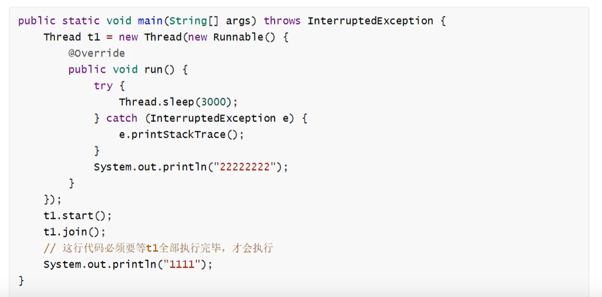
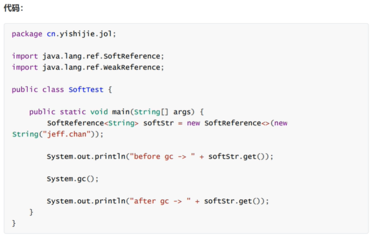
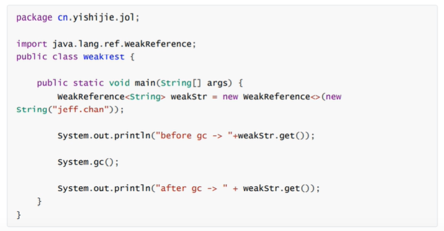

##  面向对象与面向过程
面向过程更注重事情的每一个步骤和顺序。直接高效。
面向对象更注重事情有哪些参与者、以及各自需要什么。易于复用、扩展和维护。

## 面向对象的三大特性
**封装**：封装的意义在于明确标识出允许外部使用的所有成员函数和数据项
内部细节对外部调用透明，外部调用无需修改或者关心内部实现

**继承**：继承基类的方法，并做出自己的改变和扩展
子类共性的方法或者属性直接使用父类的，不需要自己再定义，只需扩展自己的个性化

**多态**：基于对象所属类的不同，外部对同一个方法的调用，实际执行的逻辑不同
多态的三个条件：继承，方法重写，父类引用指向子类对象

> 父亲类型 变量名 = new 子类对象；
> 变量名.方法名();

##  JDK、JRE、JVM三者区别和联系
JDK: java开发工具，给开发人员用的，`JDK包含JRE`
JRE: java运行时环境，给运行Java程序的用户用的
JVM: 虚拟机，解释class文件编程机器码给机器学习

##  == 和 equals

如果是`基本类型`（int、short、long、float、double、byte、char、boolean），等号比较的是数值。

如果是`引用类型`（对象），等号是判断两个实例是不是指向同一个内存空间。

equals可以重写,自己定义比较规则，例如String、Integer是判断两个实例所指向的内存空间的值是不是相同

如果不写，就是比较引用地址是否相同。


> String str1 = "Hello"; // 在堆中的常量池中分配内存
> String str2 = new String("Hello");  // 堆中分配内存, 栈中存内存地址
> String str3 = str2; //引用传递

## hashCode 和 equals
**hashCode**: 散列，通过计算哈希值`快速`找到位置。获取哈希值，返回一个int整数，哈希值的作用是确定对象在哈希表中的索引位置。
**equals**: 比较两个对象是否相同，相同是自己定义的，可以定义内容相同，可以定义地址相同。

## HashSet 如何检查重复
对象加入HashSet时，首先计算对象的HashCode。
如果HashCode对应的位置有值，会调用equals方法判断两个对象是否相同。
如果两者相同，HashSet就不会让其加入。
如果两者不同，就会重新散列到其他位置。

## HashMap 和 HashTable 的区别？底层实现是什么？
**相同：**都实现了Map，用来存储<key, value>
**区别：**
	HashMap:线程不安全，速度快，key可以等于null
	HashTable:线程安全，速度慢，key等于null直接报错

## 聊一聊HashMap
（1）存储结构：entry的数组，entry<key, value>，entry本身也是一种链表结构，jdk8长度大于等于8变成红黑树.
（2）存储逻辑：根据计算hash值放到对应位置
（3）扩容方案：自身容量扩大以被，成倍数增长。
**底层实现：数组+链表**
计算key的hash值，二次hash然后对数组长度取模，对应到数组下标
如果没有产生hash冲突，则直接创建Node存入数组
如果产生hash冲突，先进行equals比较，相同则取代该元素，不同，则判断链表高度插入链表，链表高度达到8，并且数组长度到64则转变为红黑树，长度低于6则将红黑树转回链表

## final 有什么作用
**简述final作用**
修饰类：表示类不可以被继承
修饰方法：表示方法不可被子类重写，但是可以重载
修饰变量：
	基本类型：值不能变
	引用类型：地址不能变
（1）修饰成员变量：在声明的时候就需要复制，或者代码块中赋值，或者构造器赋值

> final int b = 0;

（2）修饰静态成员变量（类变量）：在声明的时候就需要赋值，或者静态代码块赋值。
> final static int a = 0;

（3）修饰局部变量：局部变量只声明没有初始化，不会报错，在使用之前一定要赋值。

（4）修饰基本类型数据和引用类型数据：
如果是基本类型数据的变量，则其数值一旦在初始化后就不能更改；
> final int[] array = {1, 2, 3, 4};
> array[2] = -3; // 合法
> array = null; // 非法，对array不能重新赋值

如果是引用类型的变量，则在对其初始化之后就不能再让其指向另一个对象，但是引用的值是可变的。
> final Person p = new Person(25);
> p.setAge(24); // 合法
> p = null; // 非法

**为什么局部内部类和匿名内部类只能访问局部final变量**

内部类和外部类是出于同一个级别的，内部类不会因为定义在方法中就随着方法的执行完毕就被销毁。

当外部类的方法结束时，局部变量就会被销毁了，但是内部类对象可能还存在。

内部类对象访问了一个不存在的变量？

为了解决这个问题，将局部变量赋值一份作为内部类的成员变量，当局部变量死亡后，内部类仍可以访问它。

将局部变量设置为final，保证了内部类的成员变量和方法的局部变量的一致性。


## 操作字符串有哪些类？区别？ 
**String、StringBuffer、StringBuilder**
String：final修饰，`不可变`，每次操作都会产生新的String对象
StringBuffer和StringBuilder都是在`原对象`上操作
StringBuffer是`线程安全`的，StringBuilder是`线程不安全`的
StringBuffer方法都是synchronized修饰的

**性能**：StringBuilder > StringBuffer > String
**场景**：
经常需要修改字符串内容使用后面两个
优先使用StringBuilder，多线程使用共享变量时使用StringBuffer

## Java 中的Math.round(-1.5)等于多少
等于-1，向右取整
..., -3, -2, -1, 0, 1, 2, 3, ...

## Vector 和 ArrayList 的区别
**相同：**都实现了List接口
**不同：**
	Vector: 线程安全，速度慢，扩容增长成2倍速
	ArrayList: 线程不安全，速度快，1.5倍增长

**Vector为什么用的少？**
	线程安全，牺牲了速度
	扩容大，需要连续存储空间比较大
	数组结构，插入，删除比较慢

## 枚举
**（1）为什么使用枚举？**
使用枚举的地方会有更强的类型约束，编译器帮我们检查入参类型，规避潜在风险。

**（2）枚举的常用方法**

```java
enum UserState {
    NORMAL, LOCKED, DISABLE;
}
public class Test{

    public void test(UserState state) {
    }
    
    public static void main(String[] args) {
        UserState state1 = UserState.NORMAL;
        UserState state2 = UserState.LOCKED;
        UserState state3 = UserState.DISABLE;
        // 1.
        System.out.println(state1.ordinal()); // 返回下标0
        System.out.println(state2.ordinal()); // 返回下标1
        System.out.println(state3.ordinal()); // 返回下标2

        // 2.
        System.out.println(state1.name()); // 返回NORMAL

        // 3.
        UserState state4 = UserState.valueOf("NORMAL"); // 根据一个字符串返回一个枚举对象
    }
}
```

**（3）枚举的扩展**

```java
enum UserState {
    NORMAL("ADMIN", 1001),
    LOCKED("USER", 1002),
    DISABLE("OTHER", 1003);

    // 自定义属性值
    private final String roleName;
    private final Integer stateCode;

    // 自定义构造方法
    UserState(String roleName, Integer stateCode) {
        this.roleName = roleName;
        this.stateCode = stateCode;
    }

    // 自定义方法
    public String getRoleName() {
        return this.roleName;
    }
}
```

**（4）专用于枚举的集合类**

```java
EnumSet enumSet = EnumSet.of(UserState.DISABLE, UserState.LOCKED);
if (enumSet.contains(UserState.LOCKED)) {
	System.out.println("yes");
}

EnumMap enumMap = new EnumMap(UserState.class);
enumMap.put(UserState.LOCKED, 1);
```

## java的动态代理
代理类扩充本体实现它的功能，同时更加灵活，功能更加丰富。

**（1）静态代理**


```java
interface Speaker{
    public void speak();
}

class ZhangSan implements Speaker {
    @Override
    public void speak() {
        System.out.println("我老婆打我");
    }
}

class Lawer implements Speaker {
    private ZhangSan zhangSan = new ZhangSan();

    @Override
    public void speak() {
        System.out.println("引用法律条文");
        zhangSan.speak();
        System.out.println("打人不对");
    }
}
public class Test{

    public static void main(String[] args) {
        Speaker speaker = new Lawer();
        speaker.speak();
    }
}
```
**（2）动态代理**
在运行期间动态地创建代理类

```java
import java.lang.reflect.InvocationHandler;
import java.lang.reflect.Method;
import java.lang.reflect.Proxy;

interface Speaker{
    public void speak();
}

class ZhangSan implements Speaker {
    @Override
    public void speak() {
        System.out.println("我老婆打我");
    }
}

class Lisi {
    public void speak() {
        System.out.println("我老婆也打我");
    }
}

class LawerProxy implements InvocationHandler {

    private Object obj = new Object();

    public LawerProxy(Object obj) {
        this.obj = obj;
    }

    @Override
    public Object invoke(Object proxy, Method method, Object[] args) throws Throwable {
        if (method.getName().equals("speak")) {
            System.out.println("引用法律条文");
            method.invoke(obj, args); // 反射
            System.out.println("打人不对");
        }
        return null;
    }
}


public class Test{

    public static void main(String[] args) {
        // JDK动态代理， 如果某一个类没有实现接口，它无法实现动态代理
        LawerProxy lawerProxy = new LawerProxy(new ZhangSan());
        Speaker speaker = (Speaker) Proxy.newProxyInstance(Test.class.getClassLoader(), new Class[]{Speaker.class}, lawerProxy);
        speaker.speak();

        // CGLib_动态代理，可以为没有实现接口的类实现代理
        // 第三方jar包

    }
}
```


## 重载和重写的区别

|          | 重载         | 重写                                                         |
| -------- | ------------ | :----------------------------------------------------------- |
| 定义     | **一个类中** | **子类对父类**                                               |
| 方法名   | 必须相同     | 必须相同                                                     |
| 参数     | 可以不同     | 必须相同                                                     |
| 返回值   | 可以不同     | 可以不同，但是改变后的类型应该是原类型的子类型               |
| 访问权限 | 可以不同     | 不能比父类低。比如父类public,子类不能为protected，`父类方法访问修饰符为Private则子类就不能重写该方法`。 |
| 异常范围 |              | 范围小于等于父亲                                             |
| 其他     |              | `声明为final的方法不能被重写`，`声明为static的方法不能被重写` |


**重载**：发生在同一个类中，方法名必须相同，参数类型不同，个数不同、顺序不同、方法返回值和访问修饰符可以不同，发生在编译时。
**重写**：发生在父子类中，方法名、参数必须相同。返回值范围小于等于父类，抛出的异常范围小于等于父类，访问修饰符范围`大于`等于父类，如果父类方法访问修饰符为Private则子类就不能重写该方法。

## 接口和抽象类的区别
**什么是抽象类**
并不是所有的类都是用来描绘对象的，如果一个类中没有包含足够的信息来描绘一个具体的对象，这样的类就是抽象类。
`抽象类不能实例化对象`，其他功能还在：成员变量、成员方法、构造方法都和普通类一样。
`抽象类必须被继承`，才能被使用。

**什么是接口**
接口，在Java中是一个抽象类型，是抽象方法的集合。
一个类通过实现接口的方式，从而继承接口的抽象方法。
`接口无法被实例化，但是可以被实现。`
一个实现接口的类，必须实现接口内所描述的所有方法。

`接口与类的区别`
接口不能用于实例化对象。
接口没有构造方法。
接口中所有的方法必须是抽象方法。
接口不能包含成员变量，除了static和final变量。


**区别**
（1）关系角度
一个类只能继承一个抽象类，而一个类却可以实现多个接口。

（2）从成员方法角度
抽象类中的方法可以有方法体，接口中的方法不行。
抽象类既可以存在普通成员方法，又可以存在抽象成员方法，而接口中只能存在public abstract()方法。

（3）从成员变量角度
抽象类中的成员变量可以是各种类别的，而接口中的成员变量只能是public static final类型的

（4）静态代码块和静态方法
抽象类可以有，接口不能有。

**注***：JDK 1.8 以后，接口里可以有静态方法和方法体了。*

（5）继承角度

在Java中，类的多继承是不合法，但接口允许多继承。

`public interface Hockey extends Sports, Event`


### List和Set的区别
List: 有序，按对象进入的顺序保存对象，可重复，允许多个Null元素对象，可以使用Iterator取出所有元素，在逐一遍历，还可以使用get(int index)获取指定下标的元素
Set: 无序，不可重复，最多允许一个Null元素对象，取元素时只能用Iterator接口取得所有元素，再逐一遍历各个元素


### ArrayList 和 LinkedList区别
ArrayList: 基于动态数组，连续内存存储，适合下标访问。
扩容机制：因为数组长度固定，超出长度时需要新建数组，然后将老数组的数据copy到新数组。

LinkedList: 基于链表，可以存储在分散的内存中，适合做数据插入和删除操作，不适合查询。
需要逐一遍历时必须使用Iterator而不能使用for循环，因为每次for循环体内通过get(i)取得某一元素时都需要对List重新进行遍历，性能消耗极大。

场景：使用尾插法并指定初始容量使用ArrayList可以极大提升性能


### 什么是字节码？采用字节码的好处是什么？
**java中的编译器和解释器**
java中引入了虚拟机的概念，即在机器和编译程序之间加入了一层抽象的虚拟的机器。
这台虚拟的机器在任何平台上都提供给编译程序一个共同的接口。

编译程序只需要面向虚拟机，生成虚拟机能够理解的代码，然后由解释器来将虚拟机代码转换为特定系统的机器码执行。

在java中，这种供虚拟机理解的代码叫做字节码（.class）

java源代码 -> 编译器 -> jvm可执行的字节码 -> jvm ->jvm中的解释器 -> 机器可执行的二进制机器码 -> 程序运行。

**采用字节码的好处**
在一定程度上解决了传统解释型语言执行效率低的问题，同时又保留了解释型语言可移植的特定。

### java类加载器
jvm的启动是通过引导类加载器（bootstrap class loader）创建一个初始类（initial class）来完成的，这个类是由jvm的具体实现指定的。

jdk自带有三个类加载器：bootstrap classloader、extclassloader、appclassloader

### java中的异常体系
顶级父类：Throwable
Throwable下有两个子类Exception和Error
Error是程序无法处理的错误，程序被迫停止运行
Exception不会导致程序停止，分为RunTimeException运行时异常和CheckedException编译检查异常

### GC如何判断对象可以被回收
（1）引用计数法：每个对象有一个引用计数属性，新增一个引用时计数加1，引用释放时计数减1，计数为0时可以回收。
可能会出现A引用了B，B引用了A，永远无法被回收。
效率非常高，java不采用。

（2）可达性分析：从GC Roots开始向下搜索，搜索所走过的路径称为引用链。当一个对象到GC Roots没有任何引用链相连时，则证明此对象是不可用的，那么虚拟机就判断是可回收对象。

### 线程的生命周期，线程有哪些状态
创建、就绪、运行、阻塞和死亡
**阻塞：**
（1）等待阻塞：运行的线程执行wait()方法，该线程会释放占用的所有资源，JVM会把该线程放入“等待池”中。进入这个状态后，是不能自动唤醒的，必须依靠其他线程调用notify或notifyAll方法才能被唤醒。

（2）同步阻塞：运行的线程在获取对象的同步锁时，若该同步锁被别的线程占用，则JVM会把该线程放入“锁池”中。

（3）其他阻塞：运行的线程执行sleep或join方法，或者发出了I/O请求时，JVM会把该线程置为阻塞状态。当sleep状态超时、Join等待线程终止或者超时、或者I/O处理完毕时，线程重新进入就绪状态。

### sleep()、wait()、join()、yield() 的区别
（1）锁池
所有需要竞争同步锁的线程都会放在锁池中。
（2）等待池
线程拿到锁，wait()， 线程会放到等待池当中，释放锁，不会取竞争同步锁。
只有调用了notify()或notifyAll()后等待池的线程才会开始取竞争锁。

sleep时Thread类的静态本地方法，wait则是Object类的本地方法。
sleep方法不会释放lock，但是wait会释放。
sleep不依赖于同步器synchronized，但是wait需要依赖
sleep不需要被唤醒，但是wait需要
sleep一般用于当前线程休眠，wait则用于多线程之间的通信

yield()执行后线程直接进入就绪状态

join()执行后线程进入阻塞状态，下图主线程Main中调用线程t1的join(), 那main会进入阻塞队列，直到线程t1结束或中断线程



### 19. 说说你对线程安全的理解
应该叫内存安全，因为堆是共享内存，可以被所有线程访问
目前主流操作系统都是多任务的，即多个进程同时运行。
为了保证安全，每个进程只能访问分配给自己的内存空间。
在每个进程的内存空间中都会有一块特殊的公共区域，堆。
进程内所有线程都可以访问到该区域，这就是造成问题的潜在原因。

> 当多个线程访问一个对象时，如果不用进行额外的同步控制或者其他的协调操作，调用这个对象的行为都可以获得正确的结果，我们就说这个对象是线程安全的。

**堆**是进程和线程共有的空间，分为全局堆和局部堆。
全局堆就是所有没有分配的空间。
局部堆就是用户分配的空间。
堆在操作系统对进程初始化的时候分配，运行过程中也可以向系统要额外的堆，但是用完了要还给操作系统，不然就是内存泄漏。

> java中，堆是java虚拟机管理的内存中最大的一块，是`所有线程共享的一块内存区域`，在虚拟机启动时创建。堆所在的内存区域的唯一目的就是存放对象实例，几乎所有的对象实例以及数组都在这里分配内存。

**栈**是`每个线程独有的`。保存其运行状态 和局部自动变量。
栈在线程开始的时候初始化，每个线程的栈相互独立，因此栈是线程安全的。
操作系统在切换线程的时候会自动切换栈。

### 20. Thread、Runable的区别
Thread，类，继承关系；和Runable，接口，实现关系

### 21. 守护线程
为所有非守护线程（用户线程）提供服务的线程；
任何一个守护线程都是整个JVM中所有非守护线程的保姆；

### 22. ThreadLocal的原理和使用场景

定义：提供线程局部变量；一个线程局部变量在多个线程中，分别有独立的值（副本）。

实现：Java中用哈希表实现。

ThreadLocal是JDK包提供的，它提供线程本地变量，如果创建一乐ThreadLocal变量，那么访问这个变量的每个线程都会有这个变量的一个副本，在实际多线程操作的时候，操作的是自己本地内存中的变量，从而规避了线程安全问题。

每个Thread对象都含有一个ThreadLocalMap类型的成员变量threadLocals
它存储本线程中所有ThreadLocal对象及其对应的值

### 23. 字符串常量放哪里？堆。类文件常量池放哪里？元空间

### 24. 强引用、软引用、弱引用、虚引用？

（1）强引用：

直接创建一个对象：Object obj = new Object(); 

在栈帧有效的作用域内，是永远不会被回收的。

（2）软引用：

指被SoftReference类实现的引用。

特征是当系统有足够的内存的时候，它能够存活。

当系统内存不足，垃圾回收的动作到来时，它会被回收释放内存。



（3）弱引用

指被WeakReference实现的引用，它只能存活到下一次垃圾回收发生之前。

如果进行垃圾回收，那么一定会被回收。



（4）虚引用

指被PhantomReference类实现的引用，无法通过虚引用来获取到一个对象实例。

被用来跟踪对象引用被加入到队列的时候。

### 25. 并发之同步与锁

synchronized

Lock: 可以tryLock(), condition可以多个


### 27. java怎么实现单例模式

### 28. JWT (JSON WEB TOKEN)

### 29. 值传递和引用传递的区别
**java中只有值传递**
（1）值传递：
值传递是指在调用函数时将实际参数复制一份传递到函数中，这样在函数中如果对参数进行修改，将不会影响到实际参数。

**缺点**：因为是直接复制，所以这种方式在传递时如果数据量非常大的话，效率底下。
所以java在传递数据量很小的数据是值床底，比如java中的各种基本数据类型。

（2）引用传递：
引用传递就是把内存地址传过去，操作的是原数据。