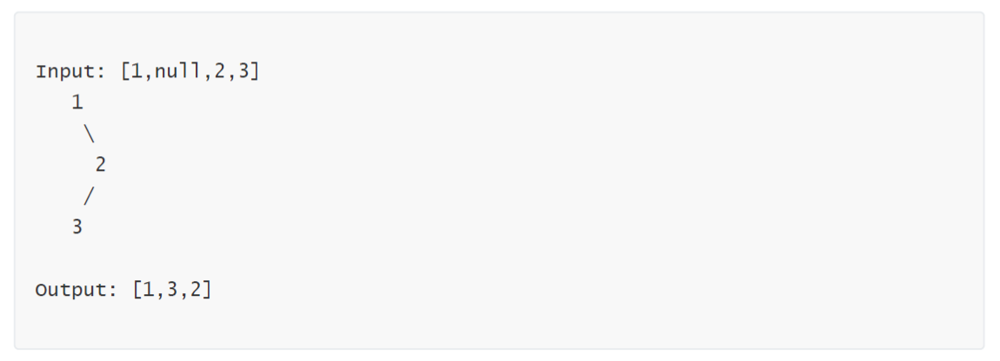

二叉树的中序遍历用递归法很简单，但是用迭代法呢？

## 题目
94. Given a binary tree, return the inorder traversal of its nodes' values.

## Example



## 迭代法的思路
1. 利用栈。
2. 当前节点只要有左子树，左子树入栈。
3. 没有左子树了，因为是中序遍历，当前节点先出栈。当前节点有右子树，右子树入栈，重复2。

## 代码
```java
class Solution {

    public List<Integer> inorderTraversal(TreeNode root) {
        List<Integer> list = new ArrayList<Integer>();
        
        Stack<TreeNode> stack = new Stack<TreeNode>();

        while (root != null || !stack.empty()) {

            while (root != null) {
                stack.push(root);
                root = root.left;
            }

            root = stack.pop();
            list.add(root.val);
            root = root.right;
        }
        return list;
    }
}
```

## 复杂度

- 时间复杂度：O(n)。n为节点个数。因为遍历过程中每个节点都会被访问一次而且只会被访问一次。
- 空间复杂度：O(n)。空间复杂度取决于栈的深度，当二叉树为一条链情况下最差。


