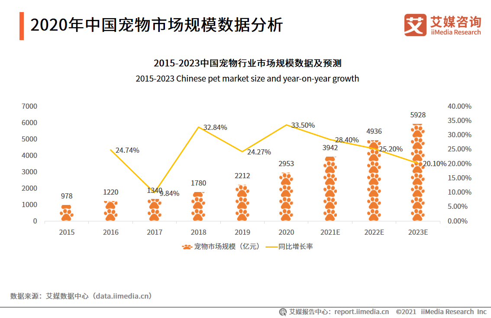
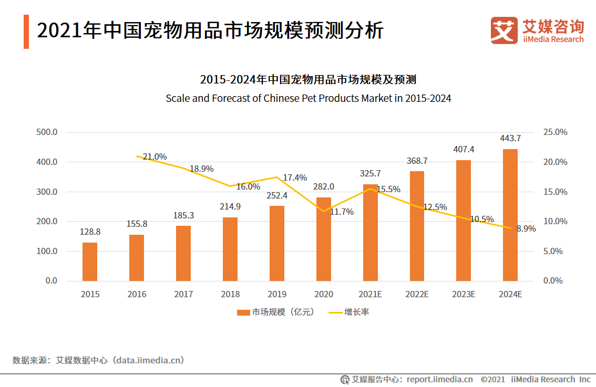
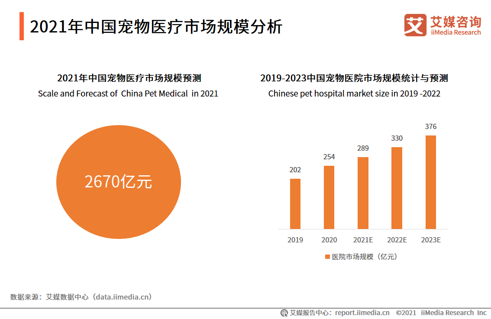
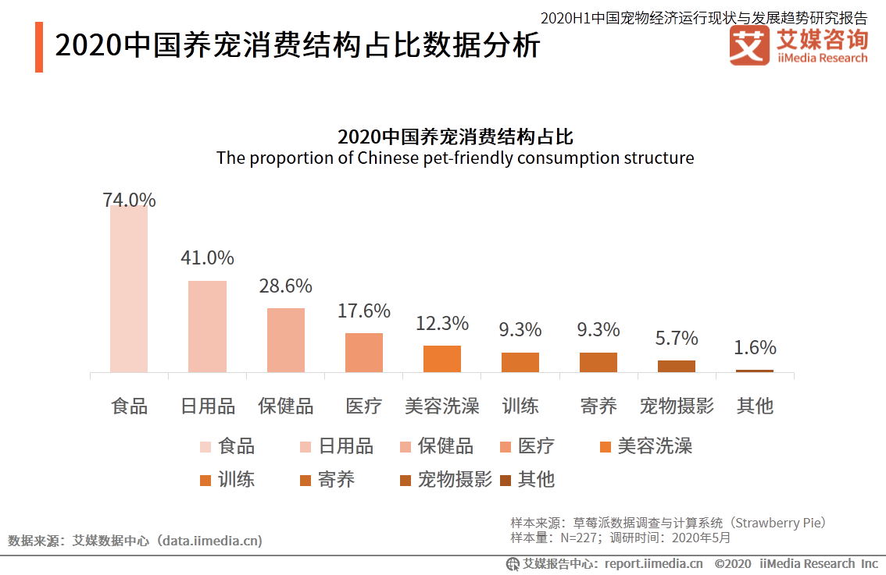
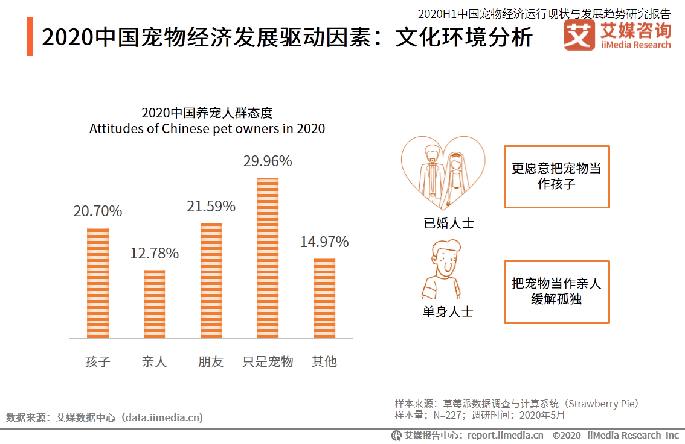
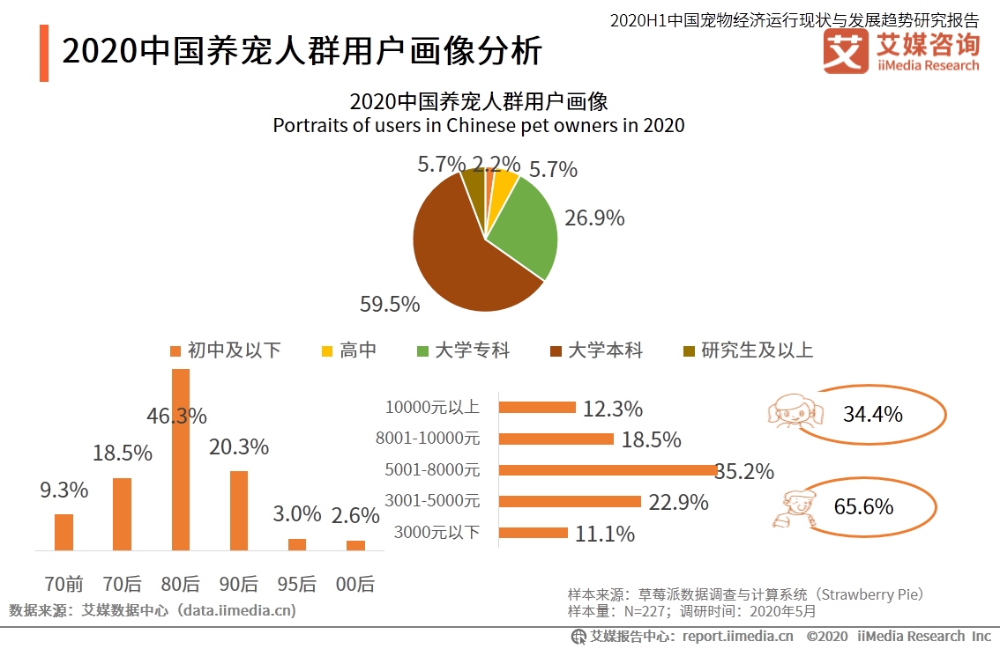
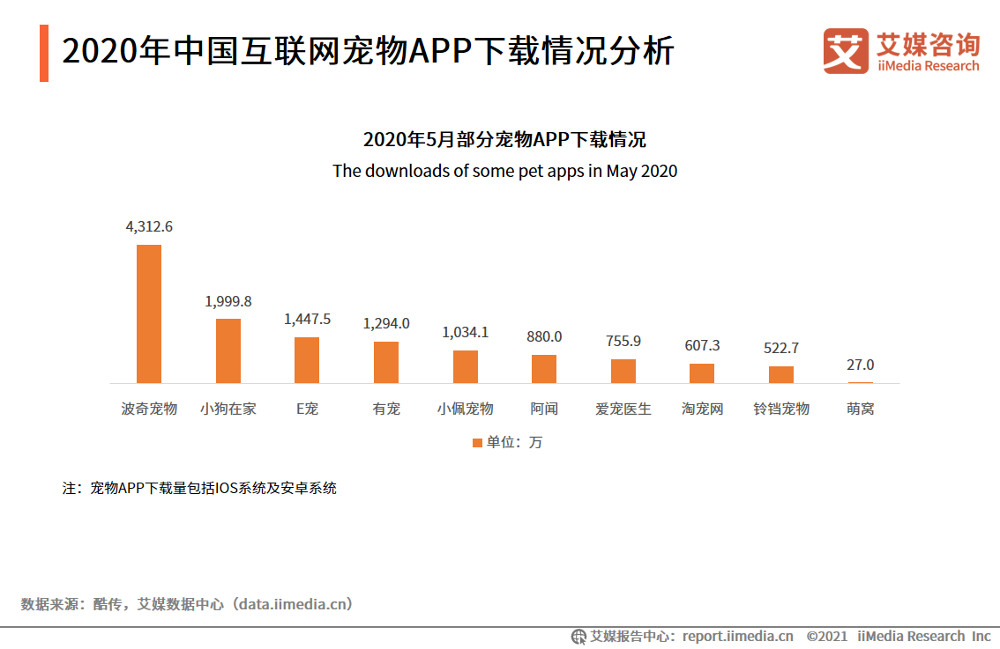
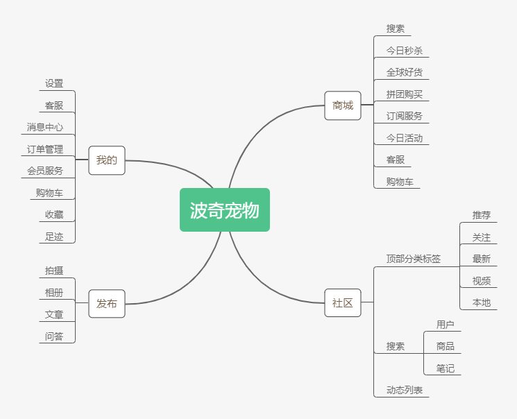
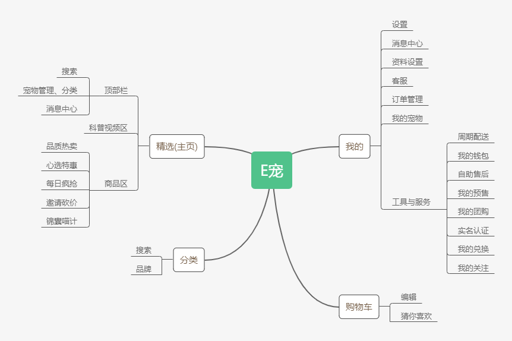

## 一、目的

通过市场数据了解宠物电商APP市场的行业现状、竞争格局以及未来的发展趋势，通过分析竞品明确行业需求，了解产品的主要功能和运营策略。

## 二、市场分析

### （1）市场规模

**中国宠物行业市场规模**

iiMedia Research(艾媒咨询)的数据显示，2015-2020年中国宠物市场规模呈持续增长态势，2020年市场规模为2953亿元，同比增长33.5%，随着社会发展使得养宠观念不断推广普及，市场的规模化发展使得宠物市场延伸服务不断完善，宠物市场发展前景较为乐观，预计到2023年，中国宠物行业市场规模将达到5928亿元。

**中国宠物用品市场规模**

在宠物经济的带动下，宠物用品细分领域市场已随之兴盛起来。随着企业自主设计研发能力、品牌影响力的增强，一批能够满足消费者需求的宠物特色产品将成为带动宠物市场发展的增量。届时中国宠物用品市场将进一步扩大，到2024年，中国宠物用品市场规模将达到443.7亿元，同比增长8.9%。

**中国宠物医疗市场规模**

数据显示，2021年中国宠物医疗市场规模将增至2670亿元，其中宠物医院市场规模在2019年约202亿元，2023年预计达到376亿元。艾媒咨询分析师认为，随着宠物数量的增加，未来宠物医疗市场发展空间巨大,年均超过10%的增幅。

### （2）行业现状

**养宠消费结构**

iiMedia Research(艾媒咨询)数据显示，从养宠消费结构上看，宠物食品消费是最大的养宠支出;而日用品、保健品分居第二、第三，依次占比：74.0%、41.0%、28.6%。服务类消费虽然种类较多但是相对低频，宠物医疗在服务消费中占比最高，达17.6%，其次是美容洗澡，达12.3%，再次是训练、寄养。艾媒咨询分析师认为，从养宠消费结构整体上看商品购买相对刚需，商品消费超过服务消费。

### （3）用户分析

**用户养宠需求分析**

iiMedia Research(艾媒咨询)数据显示，超过50%的宠物主将宠物视为自己的孩子、亲人、朋友;其中已婚人士更愿意把宠物当作自己的孩子;单身人士把宠物当作亲人来缓解孤独。艾媒咨询分析师认为，空巢老人、空巢青年等社会结构的改变，以及家庭养宠观念的进步，都令宠物的情感价值得到提升，成为驱动宠物经济发展的重要力量。

**2020中国养宠人群用户画像分析**

养宠人群呈现年轻化特征，80后、90后人群占比分别达到了46.3%、20.3%。中国城镇养宠人群收入较高，月收入在8000元以上占比约三分之一。且养宠人群呈现高学历特征，教育程度在本科、研究生及以上的养宠人群占比分别为59.5%和5.7%。养宠人群特征一定意义上彰显了宠物主可观的消费潜力。

## 三、竞品选择

**2020年中国互联网宠物APP下载情况分析**

从互联网宠物APP累计用户下载量来看，波奇宠物以4312.6万的下载量居于榜首，是第二名小狗在家的两倍，E宠排名第三。

波奇宠物和E宠两款APP都是为爱宠人士打造的宠物电商APP，下载量都排名前三，所以我们选取这两个进行竞品分析。

## 四、竞品分析

### 1. 战略层

**产品定位和商业模式**

| APP      |      | 波奇宠物                                           | E宠                                             |
| -------- | ---- | -------------------------------------------------- | ----------------------------------------------- |
| Slogan   |      | 全面关爱宠物生活                                   | 品质养宠 尽在E宠                                |
| 产品定位 |      | 打造“社区+电子商务+服务”三位一体的全方位互联网平台 | 提供有保障的产品和有品质的服务                  |
| 商业模式 |      | 商城、会员                                         | 商城、会员、广告                                |
| 产品特点 |      | “购物+社交”的电商平台，以社交为主，购物为辅        | “购物+咨询”的电商平台，以购物功能为主，咨询为辅 |

**产品简介**

波奇宠物：波奇宠物是波奇网旗下专为爱宠人士，养宠家庭开发的一款宠物用品商城APP，为狗狗、猫猫、水族精选了上万款宠物必备用品，涵盖猫粮、狗粮、鱼虾龟粮、宠物零食玩具、宠物日用洗护、宠物保健医疗、宠物用品周边等。

E宠：E宠是专为爱宠人士和养猫养狗家庭打造的宠物综合平台，集宠物商城、宠物市场、宠物知识、养宠工具等于一体，全方位满足铲屎官的养宠需求，是铲屎官必备的一站式宠物喂养小帮手，已成为超过500万铲屎官的口碑选择！

**用户群体**

波奇宠物：喜欢社交的宠物家长

E宠：喜欢简单、品质购物的宠物家长

### 2. 范围层

**功能对比**

| 主要功能 | 波奇宠物 | E宠  |
| :------: | :------: | :--: |
| 登录注册 |    1     |  1   |
| 商品列表 |    1     |  1   |
| 商品详情 |    1     |  1   |
| 商品评论 |    1     |  1   |
| 商品分类 |    1     |  1   |
|  购物车  |    1     |  1   |
|   收藏   |    1     |  1   |
| 浏览记录 |   `1`    |  1   |
| 订单管理 |    1     |  1   |
|   客服   |    1     |  1   |
|   社区   |    1     | `0`  |
| 在线问诊 |   `0`    |  1   |
|   测评   |    1     | `0`  |
| 宠物起名 |   `0`    |  1   |
|   签到   |    1     |  1   |
|   会员   |    1     |  1   |
| 宠物保险 |   `0`    |  1   |
| 宠物公益 |   `1`    |  1   |
|   搜索   |    1     |  1   |

### 3. 结构层

