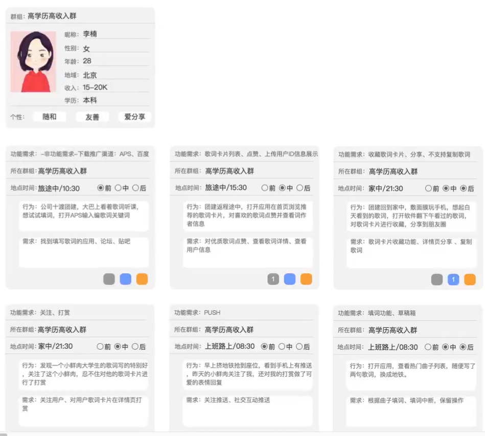
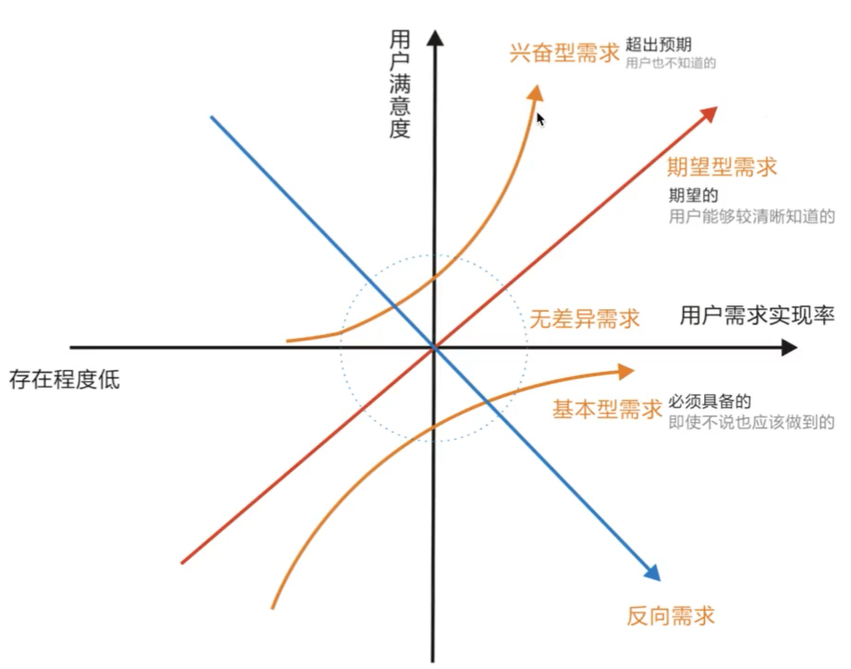
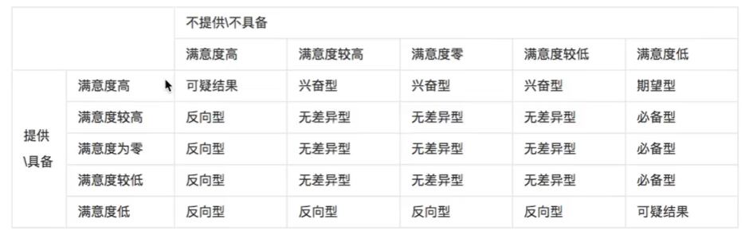

多维分析报告，知道产品目标下的用户群体，能拿到真实的用户静态标签之后，我们来做用户画像。

## 用户群体分类

核心用户：用户群体普遍规模大，忠诚度高，方便培养成社群核心，具备反哺平台能力，能为平台创造价值实现盈利。

次要用户：乐于参与但创造价值能力有限。

小众用户：忠诚度不到，留恋平台某一功能，活跃度低。

负面用户：行为言论主要针对平台缺陷功能提出问题或疑惑。

仅仅通过一张静态标签的几个简单场景就可以获取大量产品功能，配合运营团队将所有画像和场景补全后，可能梳理出成百上千的产品功能，我们需要先整理需求的分类，再对优化和兴奋序曲转化的功能做需求真伪的判断。

## **如何划分需求层次**

通过KANO模型分类，定性分析模型，主要用来识别用户对新功能的接受度。

| 问题                                                         | 满意度高 | 较高 | 0    | 较低 | 低   |
| ------------------------------------------------------------ | -------- | ---- | ---- | ---- | ---- |
| 如果有什么功能，评价？                                       |          |      |      |      |      |
| 如果没有，评价？                                             |          |      |      |      |      |
|  |          |      |      |      |      |

但再冷启动过程中，我们不可能将每个功能都按照上面的方法分类，我们也需要设计一个简单的模型，通过几个重要的维度去自主的判断，这里不会重点考虑运营及技术实现的难度与成本。这些维度如：

1. 功能是否必要？没有功能A，流程能否闭环？
2. 用户交互成本高低？
3. 用户记忆成本高低？
4. 用户情绪变化？
5. 。。。

## **整理需求**

`基础需求`

| 核心 | 次要                                   | 小众 | 负面 |
| ---- | -------------------------------------- | ---- | ---- |
|      | 歌词卡片列表、点赞、上传用户ID信息展示 |      |      |
|      | 发布、发布同时@粉丝、粉丝列表          |      |      |
|      |                                        |      |      |

`优化需求`

| 核心 | 次要               | 小众 | 负面 |
| ---- | ------------------ | ---- | ---- |
|      | 收藏歌词卡片、分享 |      |      |
|      | 关注、打赏         |      |      |
|      | PUSH               |      |      |

`基础需求`

| 核心 | 次要                                   | 小众 | 负面 |
| ---- | -------------------------------------- | ---- | ---- |
|      | 歌词卡片列表、点赞、上传用户ID信息展示 |      |      |
|      | 发布、发布同时@粉丝、粉丝列表          |      |      |
|      |                                        |      |      |

`兴奋需求`

| 核心 | 次要           | 小众 | 负面 |
| ---- | -------------- | ---- | ---- |
|      | 草稿箱         |      |      |
|      | 智能无音乐填词 |      |      |
|      |                |      |      |

