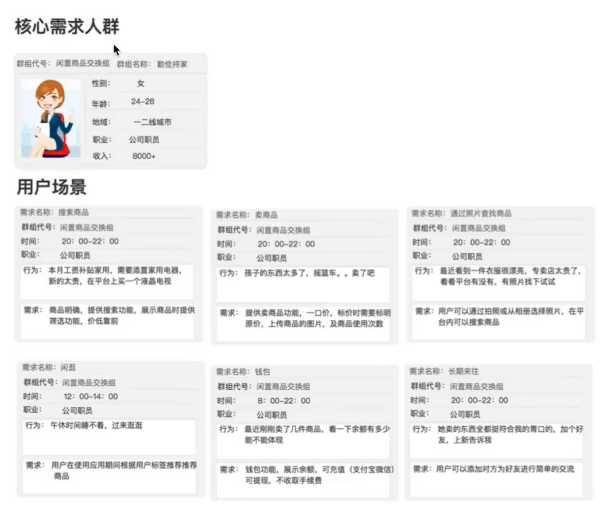

创建用户角色是为范围层做功能提炼的一个重要方法。目的是为了能够结合竞品分析确定自身产品的基本功能和特色服务。

从认识画像（角色）、创建画像、搭建场景和提炼功能及划分优先级5个部分进行讲解。

## 1. 什么是用户角色

用户角色是从用户群体抽象出来的典型用户，描绘用户需求，帮助不同角色在研发过程中站在用户角度思考。

用户画像是基于用户真实信息和真实操作构成的。画像驱动产品的迭代。

冷启动阶段没有用户，没有任何功能，我们需要创建用户角色，帮助产品人员站在用户的角度上思考问题，通过用户角色去不断地丰富产品地有效功能。

## 2. 静态标签

静态标签就是用户某些固定的属性，如性别、年龄、地域、职业、收入、喜好等。

总结：利用寻找到的目标用户群，挖掘每一个用户的人口属性、行为属性、社交属性、心理特征、兴趣爱好等数据，经过不断叠加、更新，抽象出完整的信息标签，组合并搭建出一个立体的用户虚拟模型，即用户角色。

## 3. 动态场景

一个完整的用户画像是静态标签+动态场景组成，常见的两种动态标签有：网站/应用行为属性和社交网络行为。

