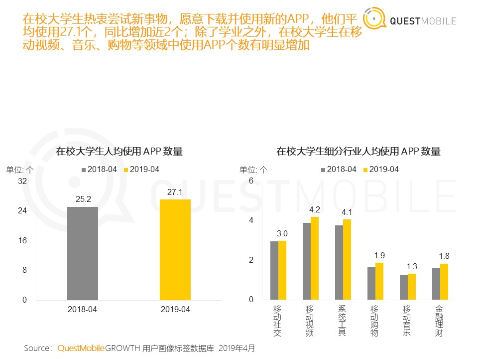
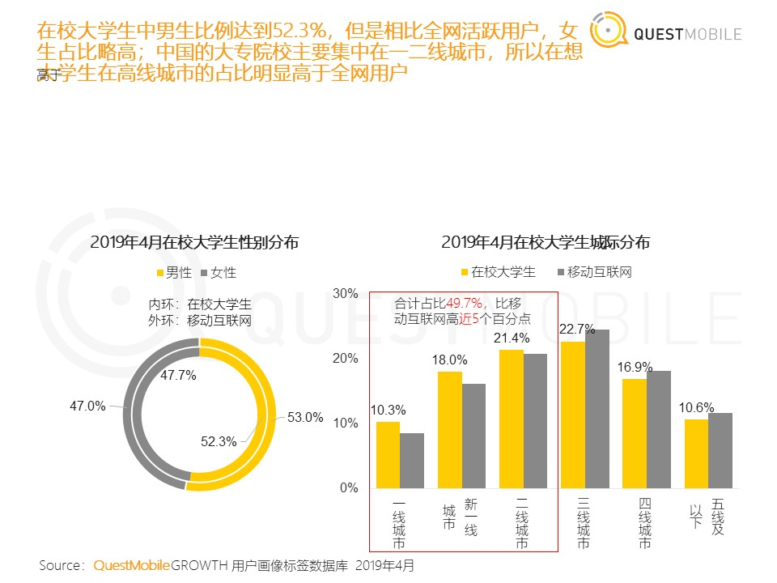
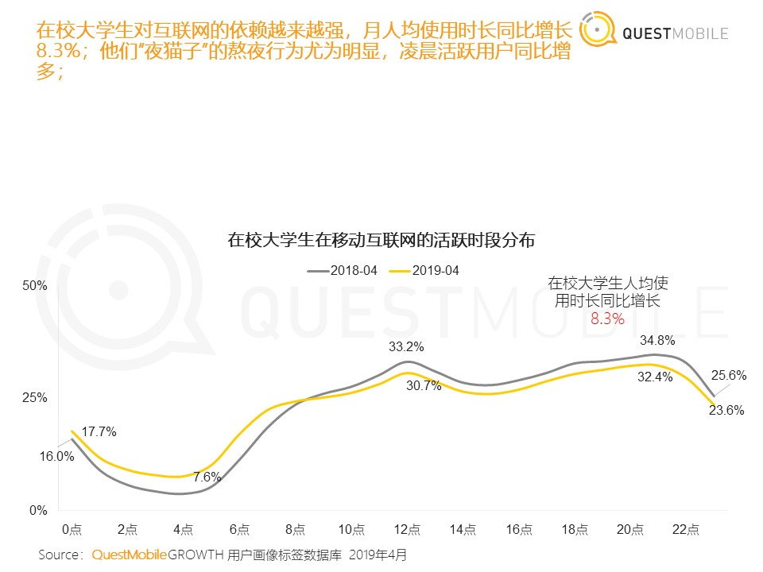
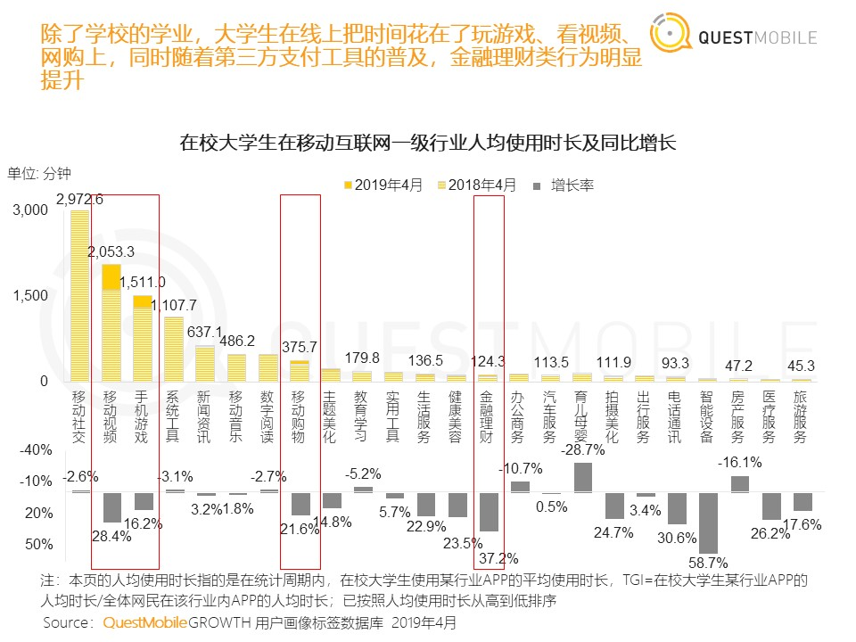
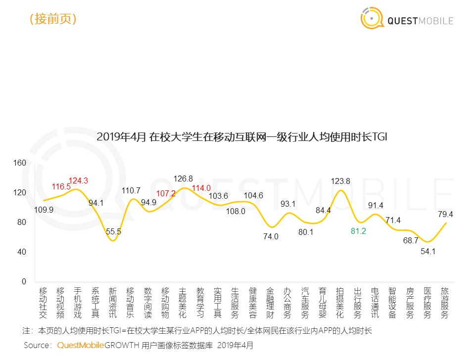
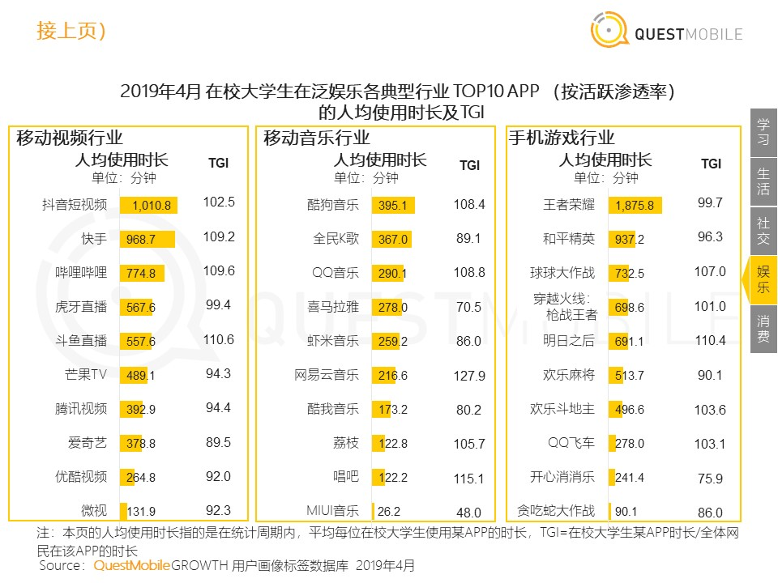
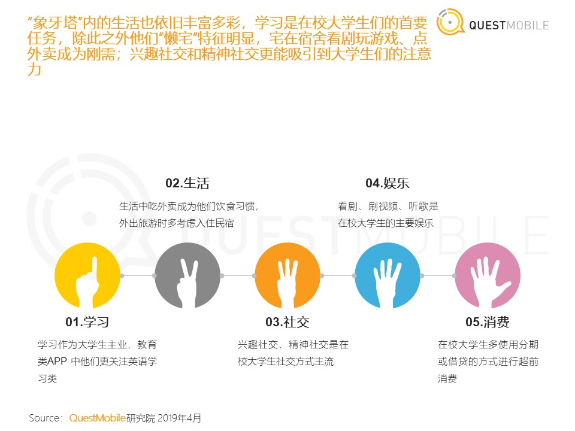

在了解如何平衡产品三环后，回到项目之中。在立项之前，一定要看行业的多维度分析报告，看这些报告的意义在什么呢？

多维度报告的价值就是结合真实的行业数据来为即将立项的点子找出充足的可行性或不可行证据。

多维度的行业分析报告可以帮助我们更加清晰地认识市场环境、商业价值。通过数据的展现形式来规避0-1项目冷启动过程中可能出现地假核心用户和伪需求。更有力地说服上游的战略层团队。

## 提出问题

关于“飞花令”，提出一系列疑问，比如：

1. 大学生是不是我们的核心群体？如何判断？
2. 在校大学生人均每个月使用APP数量是多少？主要为哪些类别的应用？
3. 如果大学生是我们的核心群体，我们如何让他们去使用我们的产品？
4. 如何从用户性别上做功能归类，在校大学生男女比例是不是1：1？
5. 如果产品上线了每天推送几次？推给哪些用户？什么时间推？在校大学生活跃时间是几点到几点？
6. 大学生在移动社交和移动音乐上的人均使用时长可以代表全体用户么？
7. 音乐类APP全民K歌的生产内容形式和我们接近，那么它的人均使用时长是多少分钟？
8. 如果加入付费功能，定价多少合理？
9. 在线音乐类应用市场有没有下行趋势？
10. 有没有必要做会员服务？会员服务还能带来哪些用处？
11. 用户主要集中在一二线城市吗？
12. 建用户画像和使用场景时，常见场景有哪些？

## 分析报告解决问题

QuestMobile数据显示，2018年，国内在校大学生规模突破2800万。这些人主要分布在一二线城市，尝鲜能力强，2019年4月，平均使用27.1个APP，视频、音乐、购物个数都在增加，月人均使用时长同比增加8.3%，而且线上消费能力高，手机以中高端为主。

**在校大学生人均使用APP情况**

2019年4月，在校大学生人均使用APP数量为27个，其中社交3个，音乐1.3个。

**2019年4月大学生性别分布和城际分布**

2019年4月男生比例53%，女性比例47%。所以我们的产品更多的功能以及付费的方案应该围绕着男性开展。

**在校大学生移动互联网的活跃时段分布**

在校大学生活跃时间段为12:00-14:00和20:00-22:00，19年相比18年人均使用时长同比增加8.3%。

**在校大学生在移动互联网一级行业人均使用时长及同比增长**

移动社交人均使用时长下降2.6%，引动音乐增长1.8%。

**2019年4月在校大学生在移动互联网一级行业人均使用时长TGI**

在校大学生移动音乐人均使用时长TGI>100%，该群体可以代表基本用户属性特征。

**2019年4月在校大学生在泛娱乐各典型行业TOP-100-APP的人均使用时长及TGI**

全民K歌人均使用时长367分钟/周。

**大学生常用应用前5大类**

社交和娱乐在大学生常用应用前5大类第三第四。

## 总结

立项之前必须要通过多维度的分析报告来佐证点子所在行业的市场价值、商业价值和人口数行特征，同时结合报告中的公开数据可以在后边工作开展中更精确的锁定核心用户群体，优化产品功能，提升产品整体的运营效果以达到加强用户体验的目的。

