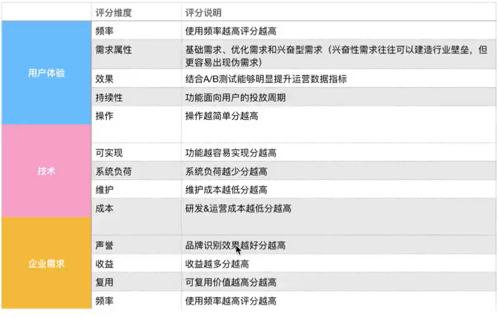
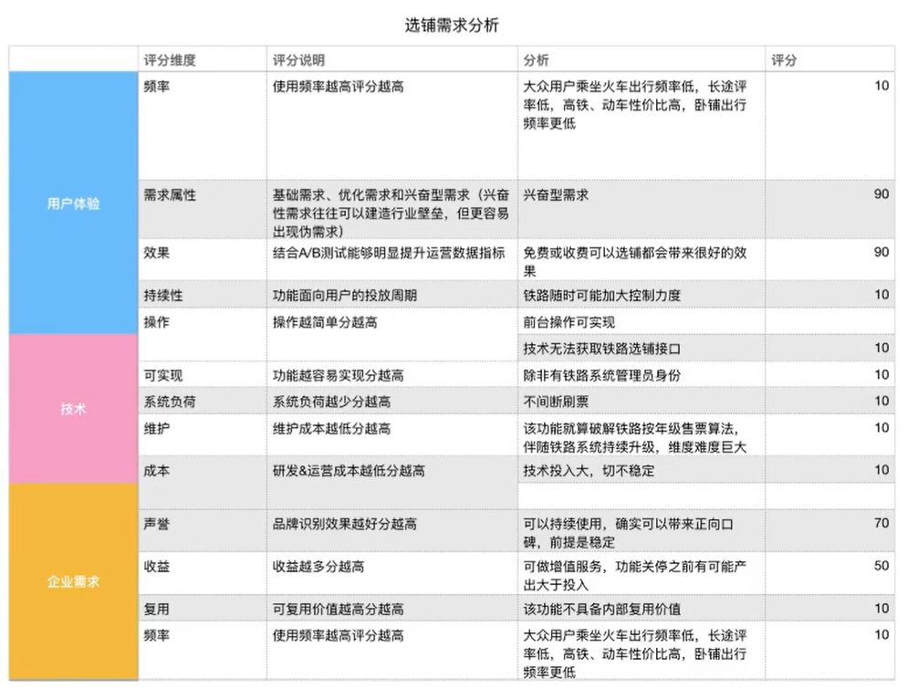

往往挖掘用户需求的本质确实是很有难度的，我们从三部分判断需求的真伪，“三环判断需求”、“基于用户功能需求真伪模型”和“深度挖掘需求本质”。

## 三环判断需求

三环分别代表了用户、企业和技术，我们将某个需求具象到所属的需求类别，结合最终评分确定该需求是否具备功能实现的价值。

案例：铁路订票软件收到大量的用户建议，加入长途列车可选卧铺上下铺功能，这是一条真需求吗？

该需求属于用户端发来的需求，通过12个维度来分析各个维度的相关评分结果。

该需求最终得分严重小于设定的最低分数阈值，在现阶段为伪需求。

## 基于用户功能需求真伪模型

我们将能够产出产品功能的需求分为三个层次：基础型需求、优化型需求、兴奋型需求。

C端用户的需求来源有多种维度和渠道，而在0-1冷启动阶段，通过用户画像（用户角色）我们可以获得大量用户需求。

兴奋型需求最可能是伪需求，适合用以上维度判断。

## 深度挖掘需求本质

很多时候用户的需求一般是一种抱怨或诉求，往往反馈我们的是一个问题，我们如何通过表面的现象去挖掘问题的本质？

在工作场景中结合“石川图”挖掘深层次的需求。

其形状很像鱼骨，是一种透过现象看本质的分析方法。

问题的特性总是收到一些因素的影响，我们通过头脑风暴找出这些因素 ，并将她们与特征值一起，按相互关联性整理而成的层次分明、条理清楚，并标出重要因素。

头脑风暴：讨论，使项目小组聚焦于问题的原因。