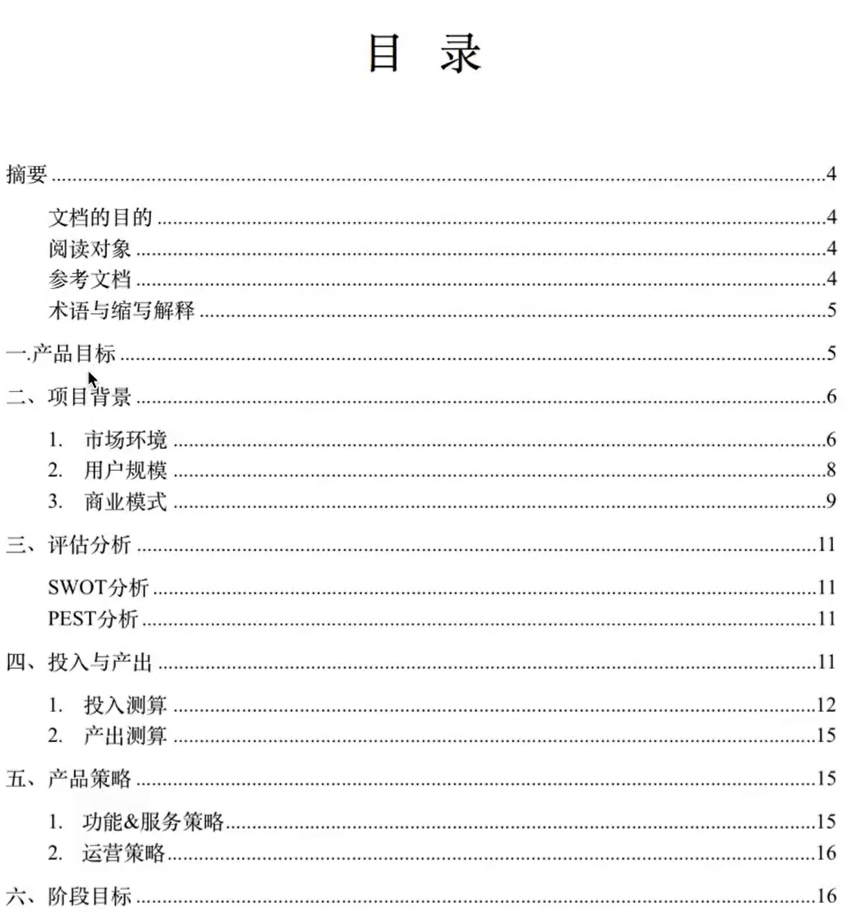
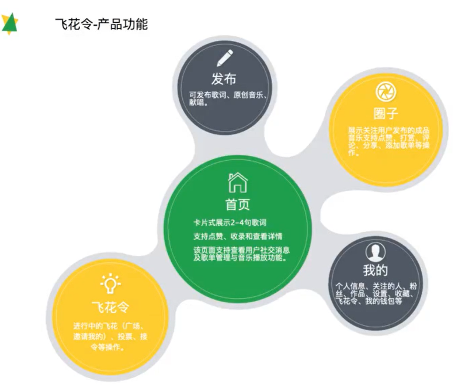

在多维度分析报告之后，我们已经有了足够充分的数据了，现在进入了立项阶段，此阶段需要获得企业高层的认可后才能正式立项，我们需要一份商业需求文档BRD。

商业需求文档是基于商业目标或价值所描述的产品需求内容文档。其核心的用途就是用于产品在投入研发之前，由企业高层作为决策评估的重要依据。其内容涉及市场分析、销售策略、盈利预测等，一般比较短小精炼，没有产品细节。

通过阅读对象、文档结构、撰写文档的注意事项和文档的可读性提高方法四个维度来学习如何撰写BRD文档。

## 阅读对象

1. 战略背景（例：CEO首席执行官）

   关注点：是否符合战略规划、市场成长性、是否有利于布局、风险是否可控、董事会态度

2. 资本背景 （例：CFO财务总监）

   关注点：收益预测、营收增长率，技术意识相对较弱

3. 技术背景 （例：CTO技术总监）

   关注点：功能模块、实现难度，商业意识相对较弱

4. 运营背景 （例：COO）

   关注点：如何推广、竞争对手、外部环境、营销资源，财务和技术意识相对较弱

**总结**

在了解BRD文档结构之前，应先弄清楚文档的阅读对象，其关注点。考虑文档能否解决他们所提出的问题。

## 文档结构

哪能赚钱，怎么赚钱，赚多少钱。

围绕这三个问题我们可以给出BRD文档结构的三大重点：

市场有多大？

投入要多少？

产出有多少？

从产品目标、项目背景、评估分析、投入产出、产品策略和阶段目标六个维度去详细做出解释说明。

项目背景下的用户规模如何让阅读者相信数据的真实性？

用户规模决定市场需求，甚至产品价值，只有足够的用户规模才能支持一款产品的成功。一般来说，用户的规模都可以从一些权威报告中获取关键数据。

产品的策略下运营策略是指什么？

产品策略不仅仅是产品的本身功能和服务，还要延展到产品的运营与销售。通过哪些渠道进行营销？通过什么样的模式进行营销？结合这些营销策略，在产品设计上也应该有便于实施这些营销策略的体现。

`产品功能示例配图`

## 注意事项

1. 简单、明了、易懂

2. 客观数据为主，多讲市场机遇，盈利方式

3. 风控&解决方案

   可能存在的各种风险做足解决方案，引导走向正向的结果。引用适当的方法来论证市场价值，如PEST或SWOT

4. 论文形式

   需要写作能力与天赋

5. 客观数据维度与实效性

**总结**

商业需求文档在撰写时和面向用户做产品一个道理，尽可能的清晰、简单，自身点子的价值要合理的融合到市场、投入和产出相关数据中。

## 文档的可读性提高方法

关于提高文档可读性，主要从文档形式、图文结合和制图制表三个方面来了解。

1. 文档形式

   一般使用PPT或WORD文档的形式展示商业需求文档，篇幅要保障短小、精炼。

2. 图文结合

   3D文档、竞品分析、行业报告等相关文档报告类产出一定要避免大篇幅文字段落，无论阅读对象是谁，尽可能多做图文结合操作，让重点数据更直观。

3. 制图制表

   撰写BRD要学会使用辅助工具软件制表，使用环形图、柱状图、折线图、雷达图等，增强文档的专业性。