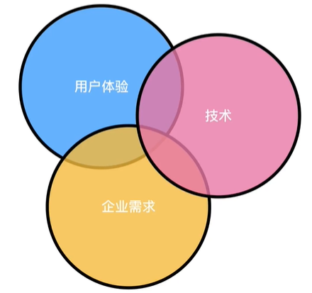

结合用户体验5要素，将每个层面配套的产出从0-1应用到一款产品中。

首先是战略层的产出，战略层的产品目标主要由三部分组成，产品点子、产品目标拆解和产品三环分析。

## 一、产品点子锁定

项目名称：飞花令

项目介绍：“不只旋律让你心动”，“飞花令”是一款基于社交场景的线上“歌词填写”优质内容生产平台。该项目主要功能为获取版权的“音乐”重新填词，同时鼓励草根音乐人作曲。

## 二、产品目标拆解

产品目标不是一句SLOGAN可以概括的，可以围绕`商业目标、品牌识别和成功标准`三个维度来制定。

### 1. 商业目标

首先是`商业目标`，商业目标应该站在企业的角度去分析和制定。

> "商业目标应该是明确定义成功的条件，而不是定义通过成功的路径"----《用户要素》

产品存在的意义主要是两个方面，一个是帮助企业赚钱，一个是帮助企业省钱。

在战略层定商业目标更多是对盈利方向先有一个规划，由于没有到范围层和结构层，很多能够帮助产品实现变现的功能并没有梳理出来，**无法用数据指标形式来设定商业目标**。

结合“飞花令”，设定产品商业目标。现阶段先不考虑如何用内容运营帮助企业省钱，首要的商业目标就是实现变现。

作为一个平台首先想到的赢利点就是佣金分成（根据悬赏与打赏的金额按照百分比抽成），同时作为内容制造平台，流量变现是平台最直接的收益方式。

所以商业目标基础变现模式为佣金分成，长远目标为通过海量用户实现流量变现。

那么**实现商业目标的具体条件则是（部分）**：

1. 优质的用户-【基础目标】
2. 优质的内容-【基础目标】
3. 海量高活跃度的核心与次要用户-【长远目标】

### 2. 品牌识别

对商业目标确定了一个基本的盈利方向后，我们来到了品牌识别。简单来讲就是如何烙印品牌，控制人类的思维。

“飞花令”如何做品牌识别呢？除了漂亮且识别率高的商标和色调外，我们更多的要通过几个关键词为产品在用户脑海里形成烙印。

首先一想到“歌词”大家会想到林夕和方文山，“飞花令”产品的主要功能就是为音乐填词，所以“歌词”可以作为我们的TOP1关键词。

**品牌识别关键词**：

1. 原创歌词：歌词、原创都能突出产品的竞争力
2. 制造音乐：填词、改词最终还是要呈现音乐
3. 用武之地：每个人都在这里有用武之地

### 3. 成功标准

关于产品目标最后一个维度就是`成功标准`，成功标准需要一些可以追踪的指标，在产品上线后用来显示是否满足了我们自己的目标和用户需求。

好的成功标准不仅影响项目各阶段的决策，也为衡量用户体验工作价值提供了具体的依据。

成功的标准应该考虑哪些数据指标呢？可以是用户下载量、注册量、停留时间、活跃用户数、留存率还是用户平均收益ARPU (100个用户有一个人付费了100元，ARPU=1元)。

其中，用户评分可以作为一个成功标准的关键指标，因为从企业的角度上分析，用户评分的高低可以客观的看出用户体验的好坏，同时也可以根据低分用户的反馈发现产品的自身问题。

回到“飞花令”，产品投入大概多少钱？不盈利情况下能坚持多久？用户量达到多少或者每天广告收益能达到多少算成功？在这里给出`运营的常见参考维度`，在“多维度行业报告分析”后再回来给出数值指标。

1. 活跃用户数：每家定义不同。7天内3天登陆过账号便可成为活跃用户。
2. 新增活跃用户数：
3. 流失活跃用户数：上期（7-14天）有过登录，但本期（最近14天）未登录的用户数。
4. 回流活跃用户数：上期（7-14天）未登录，但本期（最近14天）有登录的用户数。
5. 活跃用户流失率：（本月流失活跃用户数/上月活跃用户数）* 100%
6. 活跃用户充值率：（本月活跃付费用户/本月活跃用户数）* 100%
7. 活跃用户在线时长：当期（7天）所有活跃用户在线时长总和/当期活跃用户数
8. 付费用户在线时长
9. 新增活跃用户充值率：

### 4. 总结

不成功就是死，盈利就是商业目标，商业目标下的腾讯系产品就是品牌识别，最后通过数据指标来衡量成功标准，同时数据指标也会对我们后期每一版本的迭代重心带来影响。

## 三、产品三环分析

产品三环就是用户体验、企业需求和技术三环组成。一款应用不可能只有一位产品经理，应该是一个团队来保持三环的平衡。

首先我们来分析`用户体验`。

从“可用”到“实用”到“好用”，用户体验可以涵盖某个产品使用前、使用中和使用后的整体感受。品质+营销+服务成就口碑，不断形成循环。

接着是`企业需求`。常见的企业需求四大来源包括商业需求、干系人需求、过渡性需求、解决方案需求。

常见商业需求：流量变现（下载收费，广告收费，导流）、佣金分成（电商平台、团购与优惠券、游戏开发平台）、增值服务（游戏道具、会员）、收费服务（企业邮箱）。

最后是`技术`。主要就是“沟通”，沟通的主要内容如下：

1. 功能解释：产品经理面向开发团队做功能解释
2. 沟通协调：需要勇气和技巧，协调之前要有计划，之后要有结果（跟进项目）。团队之间每一次跨部门沟通都需要提前做好充足的准备，以及做好最坏的打算，如果沟通失败的补救方案是什么？
3. 技术讨论：召集技术人员，确定功能是否可以实现，如果不能实现的解决方案是什么？可以采用替代方案，或者通过产品逻辑调优，再或者通过第三方解决方案，如阿里云、腾讯云。
4. 项目推进：产品经理需要逆向排期保障产品准时上线。

在与技术团队沟通时要多注意技巧，同时要不断的强化自身对技术实现可能性的认识。

**跨部分沟通**：前提是内部输出意见一致，沟通前清晰罗列目标，站在对方角度列出可能会问的点，以及对策。

**和领导沟通：**明确目标、站在领导的角度、收集支撑材料数据做决策依据。

### 总结：
产品经理应平衡三环，保障用户体验同时，还有保障企业内部活下去，以及所有的功能都要限制在技术或第三方可以实现的前提下。