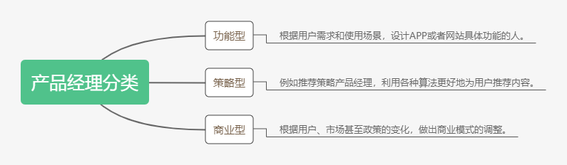

# 初来驾到，请问产品经理是干嘛的
小白不禁发问，产品经理到底是做什么的？

> 在互联网行业，简单的说，产品经理的工作就是发现需求，设计互联网产品，然后解决需求的过程。

虽然没有严格的限定，从一个小白的角度，可以将产品经理大致分为以下三类，每一类对应着不同的工作内容。

## 功能型产品经理

第一类是功能型产品经理，简单而言，就是根据用户的某种需求，去设计一个具体的功能。

比如说微信的`悬浮窗`功能。

微信初期，用户在阅读公众号文章时存在一个很明显的`痛点`，就是很容易被聊天消息打断。

用户需要退出文章去处理其他事情，等处理完成之后需要找到公众号再找到那篇文章。

很多用户干脆忘了自己之前在读什么，根本不会回来了。

对于文章作者而言，文章读完率影响也很大。

产品经理需要找到问题的`本质`，而不是像路人一样提出一个肤浅的解决方案。

这个问题的本质就是微信实在是太庞大了，庞大到像一个操作系统，堆砌了各种各样的功能，产生了多任务切换的问题。

于是从PC端的操作系统寻找灵感。

使用“最小化”的思路，在系统层级允许用户把各种任务最小化在悬浮窗内。

这样就能保证，无论在任何页面，都可以轻松跳回之前阅读的那篇文章。

悬浮窗添加之后，提升了上亿用户的使用效率，间接促进了公众号文章的阅读时长，对创作者也非常友好。

## 策略型产品经理

策略型产品经理使用不同的策略使产品有更好的用户体验。

我们常常在淘宝看到的推荐商品就出自他们之手。

有时候在和朋友的聊天过程中提到了某个商品，转眼就会在自己的淘宝首页出现。

这是怎么做到的呢？难道是数据盗窃吗？

其实是因为产品经理使用了“协同过滤”策略，才出现了这种“被窃听”的假象。

我们的好友关系早已被淘宝这些平台方所掌握。

方式有很多种。比如朋友之间分享商品。

当你们聊天之后，你的朋友去淘宝搜了某款商品，淘宝的推荐算法就会把商品推荐给你了。

## 商业型产品经理

这是最有头脑的一批人，也是最容易破坏商业和用户体验之间平衡的人。

还是举个例子。

很久以前旅游公司机票部门的主要收入来源是代理费，但最近几年，航空公司给的代理费越来越少，导致机票部门机票血崩。

于是商业型产品经理成为全村的希望。

舞台已经搭好，“默搭保险”这个项目站在了舞台的中央，成为了新的营收方式。

它强迫用户在机票的费用中增加了几十块的保险费用，让公司进入了“躺着赚钱”的阶段。

这种畸形但有效的收入方式，很快成为行业标准做法。

但是这种方式只注重短期利益，破化了商业和用户体验之间的平衡，很难持续发展下去。

**我们不禁感叹，在不断寻找新的商业模式的过程中，我们或多或少会走过大数据杀熟这种弯路，但最终还是必须回到`用户价值`这个关键点上来。**

`思考如何在满足用户需求的同时，为公司创造收入`。

## 总结

产品经理的职责所在，在于提供价值，这个价值一方面是满足用户的需求，一方面是为公司创造盈利。

二不可分，二不可少，缺少任何一个的产品一定不会长久，也难以长久。

最后说说我自己，既然选择产品经理这个职位，就需要有一种产品使命感。

在这个互联网的时代，这样的选择可能成功，可能失败，可能辉煌，可能辛酸。

但当走出校门的时候，能遇到这样的行业，将会是多么幸运。

能够进入社会后一直陪伴这个行业成长，是我未来想做的事。

