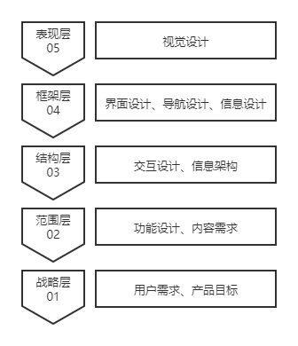
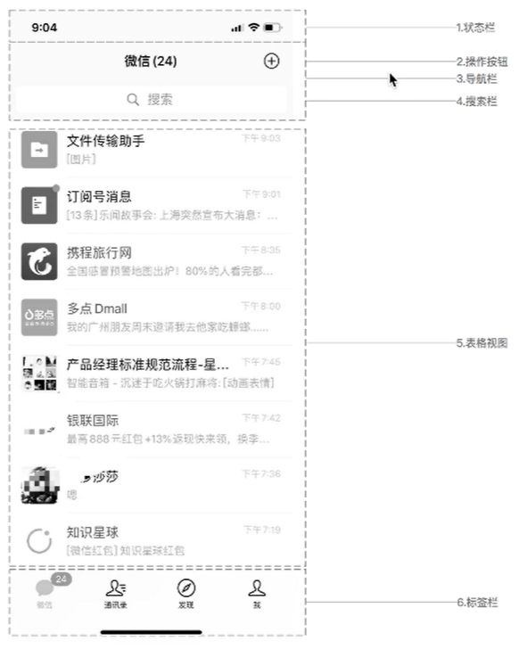
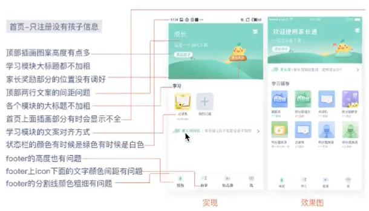

用户体验5要素可以引导一个项目从0-1冷启动，从无到有的过程。它由多个层次组成、自下而上，从抽象到具体，从概念到完成。

做产品分析和竞品分析，都会通过5要素来分析一款应用或网站的整体素质。

从底层开始，战略层，即做一件事情的目的和意义

范围层，功能有没有对用户体验的影响

结构层更贴近用户，跳到某个页面交互设计是否合理。

框架层，这个页面的界面设计和导航设计。

表现层，最接近用户视觉和用户体验的一层，包括每个细节的设计。

## 战略层

战略层主要包含“用户需求”和“产品目标”两个关键维度。

首先要考虑我们面对的是哪些用户群体，他们的需求是什么？

锁定了用户群体之后，我们的产品目标是什么？

就像“拼多多”，在“战略层”做出了大胆的改变，直接下沉到3-4线城市，瞄准的就是中国3亿经济能力并不突出的中下层收入用户群体。

所以拼多多的用户需求就是“买东西要少花钱”。

产品的目标则是“社交+电商实现流量变现”。

## 范围层

通过战略层我们已经根据用户的需求确定了产品的目标，范围层考虑的是要为用户实现哪些功能？“内容需求”和“功能说明”就是范围层的两个重要维度。

“内容需求”是什么？就像微信，在即时通信的基础上，用户需要通过社交来分享自己的生活状态，这就是基于内容上的需求。

通过用户对内容的需求，我们要根据需求的紧急和重要程度划分优先级，逐步将内容需求转换成产品的功能。

在范围层根据需求一一规划产品功能，同时我们还需要给出功能说明。范围层虽然不是直接在表现层对用户产生影响，但是功能的完善与是否满足用户的基础需求、优化需求和兴奋需求也是非常关键的。

| 序号 | 提交人 | 提交时间 | 分类     | 需求描述     | 需求来源 | 功能描述     | 功能名称 | 需求优先级 |
| ---- | ------ | -------- | -------- | ------------ | -------- | ------------ | -------- | ---------- |
| 1    |        |          | 用户需求 | 消息查看功能 | 用户分析 | 消息查看功能 | 消息查看 | A          |
| 2    |        |          | ...      | ...          | ...      | ...          | ...      | ...        |
| 3    |        |          |          |              |          |              |          |            |

## 结构层

可能会有成千上万个需求，这么多的需求我们应该如何分类，并建立从属关系？这就需要到结构层了。

结构层主要包含了产品结构、信息结构、页面结构和交互流程，简单的概括就是将已经梳理的功能与相关信息字段以页面层级的关系展示出来。

## 框架层

往结构层需要定制最优最科学的功能交互层级排布，而框架层则需要根据产品结构图绘制原型，撰写交互说明。

框架层主要由界面、导航和信息设计组成，需要绘制原型和撰写交互说明。

工作难点在于页面的基本框架是否合理，往往布局方案没有最佳或者最科学，只能是适应当前版本做到最优。比如说“微信”的几个页面框架。

## 表现层

表现层就是面向顾客视觉层面的用户体验。

在小公司，由产品经理对应用高保真页面做提交程序部门前的视觉走查工作。

视觉走查可以分为面向设计团队和技术开发团队两大下游团队关于页面一致性、色彩与图标设计合理性及是否符合移动手机系统、客户端和网站WEB规范等，在页面设计和开发中能够时终保持较高的视觉展示规格。

